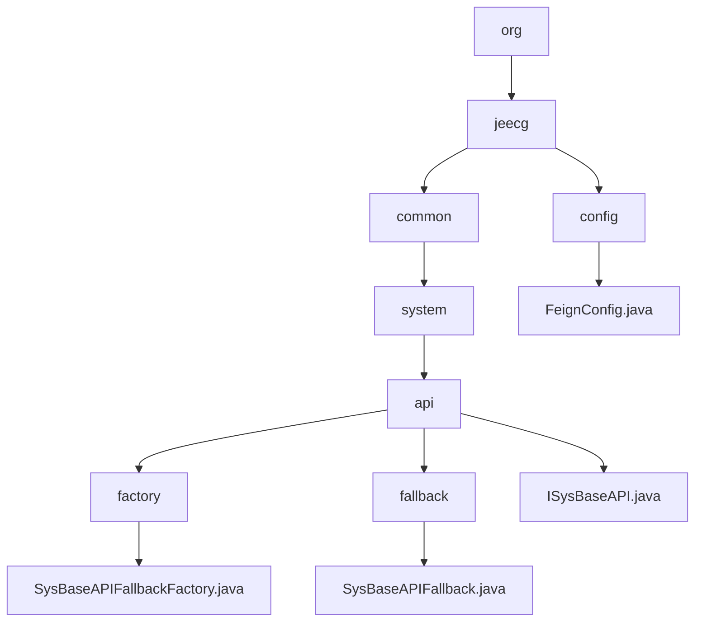

# 基础信息

|      |      |
|------|------|
| 名称 | org |
| 编码语言 | .java |
| 代码路径 | JeecgBoot/jeecg-boot/jeecg-module-system/jeecg-system-api/jeecg-system-cloud-api/src/main/java/org |
| 包名 | JeecgBoot.jeecg-boot.jeecg-module-system.jeecg-system-api.jeecg-system-cloud-api.src.main.java.org |
| 概述说明 | 该模块通过`SysBaseAPIFallbackFactory`和`SysBaseAPIFallback`实现系统基础API容错，确保异常时系统稳定运行。 |

# 说明

## 概述
该代码模块主要围绕系统基础API的容错机制展开，旨在增强系统在异常情况下的稳定性和可靠性。模块的核心组件包括`SysBaseAPIFallbackFactory`和`SysBaseAPIFallback`，它们共同实现了在系统基础API调用失败时的回退机制。`SysBaseAPIFallbackFactory`负责创建带有异常信息的回退实例，而`SysBaseAPIFallback`则处理具体的失败情况，并记录相关日志。通过这些设计，模块确保系统在遇到异常时仍能提供基本的服务或错误处理机制。

## 主要业务场景
1. **系统基础API调用失败时的回退处理**：当系统基础API调用失败时，`SysBaseAPIFallbackFactory`会生成一个包含异常信息的回退实例，确保系统在异常情况下仍能继续运行，并提供基本的服务或错误处理机制。
2. **系统消息发送失败的处理**：`SysBaseAPIFallback`类专门用于处理系统消息发送失败的情况，并在失败时记录相关日志，确保系统能够及时捕捉和处理此类异常。
3. **接口调用的容错机制**：在接口实现中，`SysBaseAPIFallback`的其他方法在调用时返回`null`或空值，确保不会产生意外的副作用或错误，从而提供一个可靠的备用机制。

### 包内部结构视图

该流程图展示了从`org`目录开始的层级结构，最终指向多个Java文件。`org`目录下包含`jeecg`，`jeecg`下分为`common`和`config`，`common`下进一步分为`system`，`system`下包含`api`，`api`下分为`factory`、`fallback`和`ISysBaseAPI.java`，`factory`和`fallback`分别指向`SysBaseAPIFallbackFactory.java`和`SysBaseAPIFallback.java`，`config`下指向`FeignConfig.java`。

# 文件列表 File List

| 名称   | 类型  | 说明 |
|-------|------|-------------|
| [jeecg](jeecg/_module.md) | package | 该模块通过`SysBaseAPIFallbackFactory`和`SysBaseAPIFallback`实现系统基础API容错，确保异常时系统稳定运行。 |

