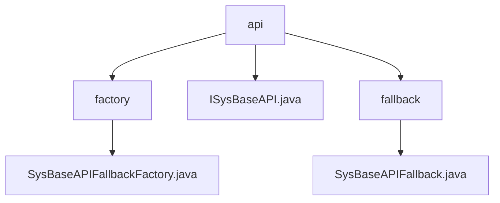

# 基础信息

|      |      |
|------|------|
| 名称 | api |
| 编码语言 | .java |
| 代码路径 | JeecgBoot/jeecg-boot/jeecg-module-system/jeecg-system-api/jeecg-system-cloud-api/src/main/java/org/jeecg/common/system/api |
| 包名 | JeecgBoot.jeecg-boot.jeecg-module-system.jeecg-system-api.jeecg-system-cloud-api.src.main.java.org.jeecg.common.system.api |
| 概述说明 | SysBaseAPIFallbackFactory创建异常回退实例，增强系统容错。SysBaseAPIFallback处理消息发送失败，记录日志并返回空值。 |

# 说明

## 概述
该代码模块主要围绕系统基础API的容错机制展开，旨在增强系统在异常情况下的稳定性和可靠性。模块的核心组件包括`SysBaseAPIFallbackFactory`和`SysBaseAPIFallback`，它们共同实现了在系统基础API调用失败时的回退机制。`SysBaseAPIFallbackFactory`负责创建带有异常信息的回退实例，而`SysBaseAPIFallback`则处理具体的失败情况，并记录相关日志。通过这些设计，模块确保系统在遇到异常时仍能提供基本的服务或错误处理机制。

## 主要业务场景
1. **系统基础API调用失败时的回退处理**：当系统基础API调用失败时，`SysBaseAPIFallbackFactory`会生成一个包含异常信息的回退实例，确保系统在异常情况下仍能继续运行，并提供基本的服务或错误处理机制。
2. **系统消息发送失败的处理**：`SysBaseAPIFallback`类专门用于处理系统消息发送失败的情况，并在失败时记录相关日志，确保系统能够及时捕捉和处理此类异常。
3. **接口调用的容错机制**：在接口实现中，`SysBaseAPIFallback`的其他方法在调用时返回`null`或空值，确保不会产生意外的副作用或错误，从而提供一个可靠的备用机制。

### 包内部结构视图

该流程图展示了Jeecg系统API模块的层级结构。根节点为`api`，它包含三个子节点：`factory`、`ISysBaseAPI.java`和`fallback`。`factory`节点下有一个文件`SysBaseAPIFallbackFactory.java`，而`fallback`节点下有一个文件`SysBaseAPIFallback.java`。整个结构清晰地反映了API模块中各个组件之间的关系。

# 文件列表 File List

| 名称   | 类型  | 说明 |
|-------|------|-------------|
| [ISysBaseAPI.java](ISysBaseAPI.md) | file | 输入内容为空，无法生成概要描述。 |
| [fallback](fallback/_module.md) | package | SysBaseAPIFallback实现ISysBaseAPI，处理消息发送失败并记录日志，其他方法返回null或空值。 |
| [factory](factory/_module.md) | package | SysBaseAPIFallbackFactory实现FallbackFactory，生成带异常的ISysBaseAPI回退实例。 |

