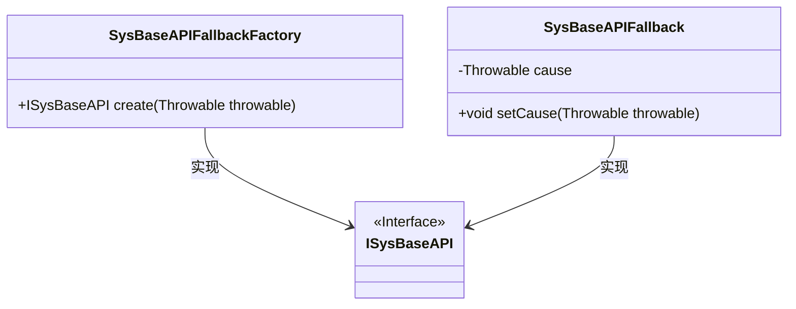
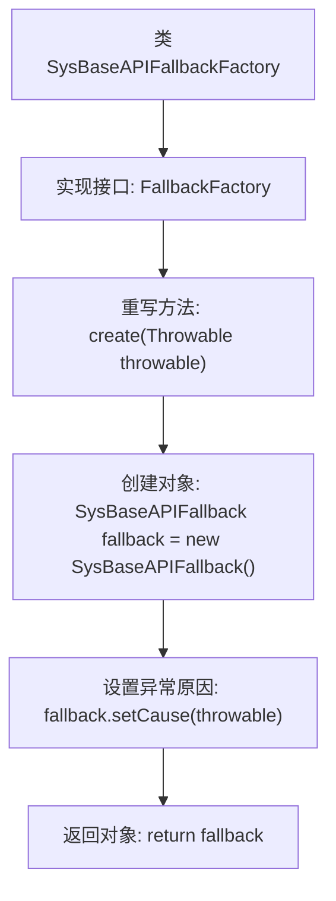

# 基础信息

|      |      |
|------|------|
| 名称 | SysBaseAPIFallbackFactory |
| 编码语言 | .java |
| 代码路径 | JeecgBoot/jeecg-boot/jeecg-module-system/jeecg-system-api/jeecg-system-cloud-api/src/main/java/org/jeecg/common/system/api/factory/SysBaseAPIFallbackFactory.java |
| 包名 | org.jeecg.common.system.api.factory |
| 依赖项 | ['org.springframework.cloud.openfeign.FallbackFactory', 'org.jeecg.common.system.api.ISysBaseAPI', 'org.jeecg.common.system.api.fallback.SysBaseAPIFallback', 'org.springframework.stereotype.Component'] |
| 概述说明 | SysBaseAPIFallbackFactory实现FallbackFactory，生成带异常的ISysBaseAPI回退实例。 |

# 说明

SysBaseAPIFallbackFactory实现了FallbackFactory接口，其主要功能是创建带有异常的ISysBaseAPI回退实例。该工厂类在系统基础API调用失败时，能够生成一个包含异常信息的回退实例，确保系统在异常情况下仍能提供基本的服务或错误处理机制。通过这种方式，SysBaseAPIFallbackFactory增强了系统的容错能力和稳定性。

# 类列表 Class Summary

| 名称   | 类型  | 说明 |
|-------|------|-------------|
| SysBaseAPIFallbackFactory | class | SysBaseAPIFallbackFactory实现FallbackFactory，创建带异常的ISysBaseAPI回退实例。 |

## 类 SysBaseAPIFallbackFactory

|      |      |
|------|------|
| 访问范围 | @Component;public |
| 类型 | class |
| 名称 | SysBaseAPIFallbackFactory |
| 说明 | SysBaseAPIFallbackFactory实现FallbackFactory，创建带异常的ISysBaseAPI回退实例。 |

### UML类图

**描述**：`SysBaseAPIFallbackFactory` 是一个工厂类，实现了 `FallbackFactory` 接口，用于创建 `ISysBaseAPI` 的降级处理对象 `SysBaseAPIFallback`。`SysBaseAPIFallback` 类中包含一个 `Throwable` 类型的私有成员 `cause`，并通过 `setCause` 方法设置该成员。`SysBaseAPIFallback` 和 `SysBaseAPIFallbackFactory` 都实现了 `ISysBaseAPI` 接口，用于处理系统基础API的降级逻辑。

### 内部方法调用关系图

这段代码定义了一个名为 `SysBaseAPIFallbackFactory` 的类，该类实现了 `FallbackFactory<ISysBaseAPI>` 接口。在 `create` 方法中，首先创建了一个 `SysBaseAPIFallback` 对象，然后通过 `setCause` 方法将传入的异常原因设置到该对象中，最后返回这个对象。该类的核心功能是提供一个回退机制，用于处理当 `ISysBaseAPI` 接口调用失败时的异常情况。

### 字段列表 Field List

| 名称  | 类型  | 说明 |
|-------|-------|------|

### 方法列表 Method List

| 名称  | 类型  | 说明 |
|-------|-------|------|
| create | ISysBaseAPI | 重写create方法，生成带异常原因的SysBaseAPIFallback实例。 |

