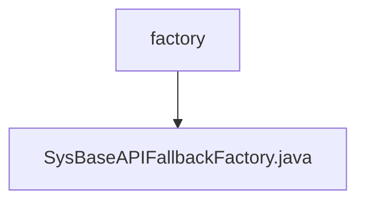

# 基础信息

|      |      |
|------|------|
| 名称 | factory |
| 编码语言 | .java |
| 代码路径 | JeecgBoot/jeecg-boot/jeecg-module-system/jeecg-system-api/jeecg-system-cloud-api/src/main/java/org/jeecg/common/system/api/factory |
| 包名 | JeecgBoot.jeecg-boot.jeecg-module-system.jeecg-system-api.jeecg-system-cloud-api.src.main.java.org.jeecg.common.system.api.factory |
| 概述说明 | SysBaseAPIFallbackFactory实现FallbackFactory，生成带异常的ISysBaseAPI回退实例。 |

# 说明

SysBaseAPIFallbackFactory实现了FallbackFactory接口，其主要功能是创建带有异常的ISysBaseAPI回退实例。该工厂类在系统基础API调用失败时，能够生成一个包含异常信息的回退实例，确保系统在异常情况下仍能提供基本的服务或错误处理机制。通过这种方式，SysBaseAPIFallbackFactory增强了系统的容错能力和稳定性。

### 包内部结构视图

该流程图展示了路径2中的层级关系。路径2的最后一级元素是`factory`文件夹，其中包含一个文件`SysBaseAPIFallbackFactory.java`。流程图清晰地表示了`factory`与`SysBaseAPIFallbackFactory.java`之间的父子关系，简洁明了地展示了文件在项目中的位置。

# 文件列表 File List

| 名称   | 类型  | 说明 |
|-------|------|-------------|
| [SysBaseAPIFallbackFactory.java](SysBaseAPIFallbackFactory.md) | file | SysBaseAPIFallbackFactory实现FallbackFactory，生成带异常的ISysBaseAPI回退实例。 |

