# 基础信息

|      |      |
|------|------|
| 名称 | SysBaseAPIFallback |
| 编码语言 | .java |
| 代码路径 | JeecgBoot/jeecg-boot/jeecg-module-system/jeecg-system-api/jeecg-system-cloud-api/src/main/java/org/jeecg/common/system/api/fallback/SysBaseAPIFallback.java |
| 包名 | org.jeecg.common.system.api.fallback |
| 依赖项 | ['com.alibaba.fastjson.JSONObject', 'lombok.Setter', 'lombok.extern.slf4j.Slf4j', 'org.jeecg.common.api.dto.DataLogDTO', 'org.jeecg.common.api.dto.OnlineAuthDTO', 'org.jeecg.common.api.dto.message', 'org.jeecg.common.constant.enums.EmailTemplateEnum', 'org.jeecg.common.system.api.ISysBaseAPI', 'org.jeecg.common.system.vo', 'java.util.List', 'java.util.Map', 'java.util.Set'] |
| 概述说明 | SysBaseAPIFallback实现ISysBaseAPI，处理消息发送失败并记录日志，其他方法返回null或空值。 |

# 说明

SysBaseAPIFallback类实现了ISysBaseAPI接口，主要用于处理系统消息发送失败的情况，并在失败时记录相关日志。该类中的其他方法在调用时返回null或空值，确保在接口实现中不会产生意外的副作用或错误。该设计旨在提供一个可靠的备用机制，以应对系统消息发送失败时的处理需求。

# 类列表 Class Summary

| 名称   | 类型  | 说明 |
|-------|------|-------------|
| SysBaseAPIFallback | class | SysBaseAPIFallback类实现ISysBaseAPI接口，处理系统消息发送失败并记录日志，其他方法返回null或空值。 |

## 类 SysBaseAPIFallback

|      |      |
|------|------|
| 访问范围 | @Slf4j;public |
| 类型 | class |
| 名称 | SysBaseAPIFallback |
| 说明 | SysBaseAPIFallback类实现ISysBaseAPI接口，处理系统消息发送失败并记录日志，其他方法返回null或空值。 |

### UML类图

```mermaid
classDiagram
    class ISysBaseAPI {
        <<Interface>>
        +sendSysAnnouncement(MessageDTO message) void
        +sendBusAnnouncement(BusMessageDTO message) void
        +sendTemplateAnnouncement(TemplateMessageDTO message) void
        +sendBusTemplateAnnouncement(BusTemplateMessageDTO message) void
        +parseTemplateByCode(TemplateDTO templateDTO) String
        +getUserById(String id) LoginUser
        +getRolesByUsername(String username) List~String~
        +getRolesByUserId(String userId) List~String~
        +getDepartIdsByUsername(String username) List~String~
        +getDepartIdsByUserId(String userId) List~String~
        +getDepartParentIdsByUsername(String username) Set~String~
        +getDepartParentIdsByDepIds(Set~String~ depIds) Set~String~
        +getDepartNamesByUsername(String username) List~String~
        +queryDictItemsByCode(String code) List~DictModel~
        +queryEnableDictItemsByCode(String code) List~DictModel~
        +queryAllDict() List~DictModel~
        +queryAllSysCategory() List~SysCategoryModel~
        +queryTableDictItemsByCode(String tableFilterSql, String text, String code) List~DictModel~
        +queryAllDepartBackDictModel() List~DictModel~
        +updateSysAnnounReadFlag(String busType, String busId) void
        +queryFilterTableDictInfo(String table, String text, String code, String filterSql) List~DictModel~
        +queryTableDictByKeys(String table, String text, String code, String[] keyArray) List~String~
        +queryAllUserBackCombo() List~ComboModel~
        +queryAllUser(String userIds, Integer pageNo, Integer pageSize) JSONObject
        +queryAllRole(String[] roleIds) List~ComboModel~
        +getRoleIdsByUsername(String username) List~String~
        +getDepartIdsByOrgCode(String orgCode) String
        +getAllSysDepart() List~SysDepartModel~
        +getParentDepartId(String departId) DictModel
        +getDeptHeadByDepId(String deptId) List~String~
        +sendWebSocketMsg(String[] userIds, String cmd) void
        +queryAllUserByIds(String[] userIds) List~UserAccountInfo~
        +meetingSignWebsocket(String userId) void
        +queryUserByNames(String[] userNames) List~UserAccountInfo~
        +getUserRoleSet(String username) Set~String~
        +getUserRoleSetById(String userId) Set~String~
        +getUserPermissionSet(String userId) Set~String~
        +hasOnlineAuth(OnlineAuthDTO onlineAuthDTO) boolean
        +selectAllById(String id) SysDepartModel
        +queryDeptUsersByUserId(String userId) List~String~
        +queryUserRoles(String username) Set~String~
        +queryUserRolesById(String userId) Set~String~
        +queryUserAuths(String userId) Set~String~
        +getDynamicDbSourceById(String dbSourceId) DynamicDataSourceModel
        +getDynamicDbSourceByCode(String dbSourceCode) DynamicDataSourceModel
        +getUserByName(String username) LoginUser
        +getUserIdByName(String username) String
        +translateDictFromTable(String table, String text, String code, String key) String
        +translateDict(String code, String key) String
        +queryPermissionDataRule(String component, String requestPath, String username) List~SysPermissionDataRuleModel~
        +getCacheUser(String username) SysUserCacheInfo
        +queryUsersByUsernames(String usernames) List~JSONObject~
        +queryUsersByIds(String ids) List~JSONObject~
        +queryDepartsByOrgcodes(String orgCodes) List~JSONObject~
        +queryDepartsByIds(String ids) List~JSONObject~
        +translateManyDict(String dictCodes, String keys) Map~String, List~DictModel~~
        +translateDictFromTableByKeys(String table, String text, String code, String keys, String dataSource) List~DictModel~
        +sendTemplateMessage(MessageDTO message) void
        +getTemplateContent(String code) String
        +saveDataLog(DataLogDTO dataLogDto) void
        +sendEmailMsg(String email, String title, String content) void
        +sendHtmlTemplateEmail(String email, String title, EmailTemplateEnum emailTemplateEnum, JSONObject params) void
        +getDeptUserByOrgCode(String orgCode) List~Map~
        +loadCategoryDictItem(String ids) List~String~
        +loadCategoryDictItemByNames(String names, boolean delNotExist) List~String~
        +loadDictItem(String dictCode, String keys) List~String~
        +copyLowAppDict(String originalAppId, String appId, String tenantId) Map~String, String~
        +getDictItems(String dictCode) List~DictModel~
        +getManyDictItems(List~String~ dictCodeList) Map~String, List~DictModel~~
        +loadDictItemByKeyword(String dictCode, String keyword, Integer pageNo, Integer pageSize) List~DictModel~
        +updateAvatar(LoginUser loginUser) void
        +sendAppChatSocket(String userId) void
        +getRoleCodeById(String id) String
        +queryRoleDictByCode(String roleCodes) List~DictModel~
        +queryUserBySuperQuery(String superQuery, String matchType) List~JSONObject~
        +queryUserById(String id) JSONObject
        +queryDeptBySuperQuery(String superQuery, String matchType) List~JSONObject~
        +queryRoleBySuperQuery(String superQuery, String matchType) List~JSONObject~
        +selectUserIdByTenantId(String tenantId) List~String~
        +queryUserIdsByDeptIds(List~String~ deptIds) List~String~
        +queryUserAccountsByDeptIds(List~String~ deptIds) List~String~
        +queryUserIdsByRoleds(List~String~ roleCodes) List~String~
        +queryUserIdsByPositionIds(List~String~ positionIds) List~String~
        +getUserAccountsByDepCode(String orgCode) List~String~
        +dictTableWhiteListCheckBySql(String selectSql) boolean
        +dictTableWhiteListCheckByDict(String tableOrDictCode, String... fields) boolean
    }

    class SysBaseAPIFallback {
        -Throwable cause
        +sendSysAnnouncement(MessageDTO message) void
        +sendBusAnnouncement(BusMessageDTO message) void
        +sendTemplateAnnouncement(TemplateMessageDTO message) void
        +sendBusTemplateAnnouncement(BusTemplateMessageDTO message) void
        +parseTemplateByCode(TemplateDTO templateDTO) String
        +getUserById(String id) LoginUser
        +getRolesByUsername(String username) List~String~
        +getRolesByUserId(String userId) List~String~
        +getDepartIdsByUsername(String username) List~String~
        +getDepartIdsByUserId(String userId) List~String~
        +getDepartParentIdsByUsername(String username) Set~String~
        +getDepartParentIdsByDepIds(Set~String~ depIds) Set~String~
        +getDepartNamesByUsername(String username) List~String~
        +queryDictItemsByCode(String code) List~DictModel~
        +queryEnableDictItemsByCode(String code) List~DictModel~
        +queryAllDict() List~DictModel~
        +queryAllSysCategory() List~SysCategoryModel~
        +queryTableDictItemsByCode(String tableFilterSql, String text, String code) List~DictModel~
        +queryAllDepartBackDictModel() List~DictModel~
        +updateSysAnnounReadFlag(String busType, String busId) void
        +queryFilterTableDictInfo(String table, String text, String code, String filterSql) List~DictModel~
        +queryTableDictByKeys(String table, String text, String code, String[] keyArray) List~String~
        +queryAllUserBackCombo() List~ComboModel~
        +queryAllUser(String userIds, Integer pageNo, Integer pageSize) JSONObject
        +queryAllRole(String[] roleIds) List~ComboModel~
        +getRoleIdsByUsername(String username) List~String~
        +getDepartIdsByOrgCode(String orgCode) String
        +getAllSysDepart() List~SysDepartModel~
        +getParentDepartId(String departId) DictModel
        +getDeptHeadByDepId(String deptId) List~String~
        +sendWebSocketMsg(String[] userIds, String cmd) void
        +queryAllUserByIds(String[] userIds) List~UserAccountInfo~
        +meetingSignWebsocket(String userId) void
        +queryUserByNames(String[] userNames) List~UserAccountInfo~
        +getUserRoleSet(String username) Set~String~
        +getUserRoleSetById(String userId) Set~String~
        +getUserPermissionSet(String userId) Set~String~
        +hasOnlineAuth(OnlineAuthDTO onlineAuthDTO) boolean
        +selectAllById(String id) SysDepartModel
        +queryDeptUsersByUserId(String userId) List~String~
        +queryUserRoles(String username) Set~String~
        +queryUserRolesById(String userId) Set~String~
        +queryUserAuths(String userId) Set~String~
        +getDynamicDbSourceById(String dbSourceId) DynamicDataSourceModel
        +getDynamicDbSourceByCode(String dbSourceCode) DynamicDataSourceModel
        +getUserByName(String username) LoginUser
        +getUserIdByName(String username) String
        +translateDictFromTable(String table, String text, String code, String key) String
        +translateDict(String code, String key) String
        +queryPermissionDataRule(String component, String requestPath, String username) List~SysPermissionDataRuleModel~
        +getCacheUser(String username) SysUserCacheInfo
        +queryUsersByUsernames(String usernames) List~JSONObject~
        +queryUsersByIds(String ids) List~JSONObject~
        +queryDepartsByOrgcodes(String orgCodes) List~JSONObject~
        +queryDepartsByIds(String ids) List~JSONObject~
        +translateManyDict(String dictCodes, String keys) Map~String, List~DictModel~~
        +translateDictFromTableByKeys(String table, String text, String code, String keys, String dataSource) List~DictModel~
        +sendTemplateMessage(MessageDTO message) void
        +getTemplateContent(String code) String
        +saveDataLog(DataLogDTO dataLogDto) void
        +sendEmailMsg(String email, String title, String content) void
        +sendHtmlTemplateEmail(String email, String title, EmailTemplateEnum emailTemplateEnum, JSONObject params) void
        +getDeptUserByOrgCode(String orgCode) List~Map~
        +loadCategoryDictItem(String ids) List~String~
        +loadCategoryDictItemByNames(String names, boolean delNotExist) List~String~
        +loadDictItem(String dictCode, String keys) List~String~
        +copyLowAppDict(String originalAppId, String appId, String tenantId) Map~String, String~
        +getDictItems(String dictCode) List~DictModel~
        +getManyDictItems(List~String~ dictCodeList) Map~String, List~DictModel~~
        +loadDictItemByKeyword(String dictCode, String keyword, Integer pageNo, Integer pageSize) List~DictModel~
        +updateAvatar(LoginUser loginUser) void
        +sendAppChatSocket(String userId) void
        +getRoleCodeById(String id) String
        +queryRoleDictByCode(String roleCodes) List~DictModel~
        +queryUserBySuperQuery(String superQuery, String matchType) List~JSONObject~
        +queryUserById(String id) JSONObject
        +queryDeptBySuperQuery(String superQuery, String matchType) List~JSONObject~
        +queryRoleBySuperQuery(String superQuery, String matchType) List~JSONObject~
        +selectUserIdByTenantId(String tenantId) List~String~
        +queryUserIdsByDeptIds(List~String~ deptIds) List~String~
        +queryUserAccountsByDeptIds(List~String~ deptIds) List~String~
        +queryUserIdsByRoleds(List~String~ roleCodes) List~String~
        +queryUserIdsByPositionIds(List~String~ positionIds) List~String~
        +getUserAccountsByDepCode(String orgCode) List~String~
        +dictTableWhiteListCheckBySql(String selectSql) boolean
        +dictTableWhiteListCheckByDict(String tableOrDictCode, String... fields) boolean
    }

    ISysBaseAPI <|.. SysBaseAPIFallback : 实现
```

**描述**：`SysBaseAPIFallback` 类实现了 `ISysBaseAPI` 接口，主要用于处理系统基础API的降级逻辑。当系统调用失败时，该类会记录错误日志并返回默认值（如 `null` 或 `false`）。`ISysBaseAPI` 接口定义了大量的系统基础操作方法，涵盖了消息发送、用户管理、角色管理、部门管理、字典查询等多个功能模块。`SysBaseAPIFallback` 类通过实现这些方法，确保了在系统异常情况下的降级处理。

### 内部方法调用关系图

该流程图展示了 `SysBaseAPIFallback` 类的结构及其所有方法的调用关系。类中包含多个方法，主要用于处理系统公告、消息发送、用户信息查询、字典查询等操作。每个方法通过箭头与类进行连接，清晰地展示了类的内部结构和方法之间的调用关系。

### 字段列表 Field List

| 名称  | 类型  | 说明 |
|-------|-------|------|
| cause | Throwable | Setter方法用于设置私有的Throwable类型变量cause。 |

### 方法列表 Method List

| 名称  | 类型  | 说明 |
|-------|-------|------|
| getUserPermissionSet | Set<String> | 重写方法获取用户权限集，返回空值。 |
| parseTemplateByCode | String | 解析模板失败，记录错误并返回空值。 |
| getDepartIdsByUsername | List<String> | 重写方法getDepartIdsByUsername，返回空列表。 |
| queryAllRole | List<ComboModel> | 查询所有角色信息失败，返回空值。 |
| getUserById | LoginUser | 根据ID获取用户信息的方法，返回值为空。 |
| sendBusTemplateAnnouncement | void | 重写方法发送公交模板公告，记录发送失败信息。 |
| getUserRoleSetById | Set<String> | 重写方法获取用户角色集，返回空值。 |
| getDynamicDbSourceByCode | DynamicDataSourceModel | 重写方法，返回空值。 |
| sendBusAnnouncement | void | 方法sendBusAnnouncement记录发送消息失败及原因。 |
| queryTableDictByKeys | List<String> | 方法queryTableDictByKeys查询失败并返回null。 |
| loadCategoryDictItem | List<String> | 重写方法，加载分类字典项，返回空列表。 |
| updateSysAnnounReadFlag | void | 更新系统公告阅读标志的方法，参数为业务类型和业务ID。 |
| getDeptHeadByDepId | List<String> | 重写getDeptHeadByDepId方法，返回空列表。 |
| sendEmailMsg | void | 重写发送邮件方法，参数为邮箱、标题和内容。 |
| translateDict | String | 重写translateDict方法，返回空值。 |
| copyLowAppDict | Map<String, String> | 重写方法copyLowAppDict，返回空映射。 |
| getRolesByUsername | List<String> | 重写getRolesByUsername方法，返回null。 |
| queryDeptUsersByUserId | List<String> | 重写方法queryDeptUsersByUserId，返回空列表。 |
| translateManyDict | Map<String, List<DictModel>> | 重写translateManyDict方法，返回空映射。 |
| saveDataLog | void | 重写saveDataLog方法，接收DataLogDTO参数。 |
| loadCategoryDictItemByNames | List<String> | 重写方法返回空列表，按名称加载分类字典项。 |
| queryTableDictItemsByCode | List<DictModel> | 重写方法，查询表字典项，返回空列表。 |
| getAllSysDepart | List<SysDepartModel> | 重写方法返回空列表。 |
| queryAllSysCategory | List<SysCategoryModel> | 重写方法queryAllSysCategory，返回空列表。 |
| queryAllUserBackCombo | List<ComboModel> | 方法queryAllUserBackCombo返回空列表。 |
| queryAllDepartBackDictModel | List<DictModel> | 方法`queryAllDepartBackDictModel`返回空列表。 |
| queryUserAuths | Set<String> | 重写查询用户权限方法，返回空集合。 |
| updateAvatar | void | 更新用户头像方法，参数为登录用户对象。 |
| getDeptUserByOrgCode | List<Map> | 重写方法获取部门用户，返回空列表。 |
| getParentDepartId | DictModel | 该方法返回指定部门ID的父部门模型，当前实现返回null。 |
| getRoleIdsByUsername | List<String> | 重写方法getRoleIdsByUsername，返回空列表。 |
| loadDictItem | List<String> | 重写方法加载字典项，返回空列表。 |
| getDepartParentIdsByUsername | Set<String> | 方法返回用户所属部门的父级ID集合，当前返回null。 |
| getUserAccountsByDepCode | List<String> | 重写方法获取用户账户列表，返回空值。 |
| selectAllById | SysDepartModel | 重写方法，按ID查询部门信息，返回空值。 |
| queryDepartsByIds | List<JSONObject> | 重写方法queryDepartsByIds，返回空列表。 |
| getTemplateContent | String | 重写getTemplateContent方法，返回null。 |
| queryDeptBySuperQuery | List<JSONObject> | 重写方法queryDeptBySuperQuery，返回空JSON对象列表。 |
| queryUserIdsByPositionIds | List<String> | 重写方法查询用户ID列表，参数为职位ID列表，返回空值。 |
| translateDictFromTable | String | 重写方法用于从表中翻译字典，返回空值。 |
| getDynamicDbSourceById | DynamicDataSourceModel | 重写方法获取动态数据源，返回空值。 |
| hasOnlineAuth | boolean | 方法`hasOnlineAuth`返回`false`，不接受`OnlineAuthDTO`参数。 |
| getDepartIdsByUserId | List<String> | 重写方法获取用户部门ID列表，返回空值。 |
| queryAllUser | JSONObject | 该方法查询所有用户信息，接收用户ID、页码和页大小参数，返回JSON对象。 |
| queryEnableDictItemsByCode | List<DictModel> | 重写方法queryEnableDictItemsByCode，根据code查询可用字典项，返回空列表。 |
| queryUserIdsByDeptIds | List<String> | 重写方法queryUserIdsByDeptIds，返回空列表。 |
| translateDictFromTableByKeys | List<DictModel> | 重写方法，通过表、文本、代码、键和数据源翻译字典。 |
| queryDictItemsByCode | List<DictModel> | 重写方法queryDictItemsByCode，返回空列表。 |
| meetingSignWebsocket | void | 重写会议签到Websocket方法，接收用户ID参数。 |
| queryUserBySuperQuery | List<JSONObject> | 重写查询用户方法，接受超级查询和匹配类型参数，返回空列表。 |
| queryUserRolesById | Set<String> | 重写方法queryUserRolesById，返回用户角色集合，当前返回null。 |
| getRolesByUserId | List<String> | 重写方法getRolesByUserId，返回用户角色列表，目前返回null。 |
| getDepartIdsByOrgCode | String | 重写方法getDepartIdsByOrgCode，返回null。 |
| queryUserByNames | List<UserAccountInfo> | 重写方法queryUserByNames，返回用户账户信息列表，参数为用户名字符串数组。 |
| getUserRoleSet | Set<String> | 重写方法获取用户角色集，返回值为空。 |
| getUserIdByName | String | 重写方法getUserIdByName，返回用户ID，目前返回null。 |
| queryPermissionDataRule | List<SysPermissionDataRuleModel> | 重写查询权限数据规则方法，返回空列表。 |
| queryUserRoles | Set<String> | 重写方法queryUserRoles，返回用户角色集合，当前返回null。 |
| queryAllUserByIds | List<UserAccountInfo> | 重写方法queryAllUserByIds，返回用户账户信息列表，输入为用户ID数组。 |
| getManyDictItems | Map<String, List<DictModel>> | 重写方法getManyDictItems，返回空Map，接收字典代码列表。 |
| queryRoleDictByCode | List<DictModel> | 重写方法queryRoleDictByCode，返回空列表。 |
| queryDepartsByOrgcodes | List<JSONObject> | 重写方法查询部门信息，返回空列表。 |
| queryUserAccountsByDeptIds | List<String> | 方法查询部门ID对应的用户账户，返回空列表。 |
| getCacheUser | SysUserCacheInfo | 重写方法获取用户缓存信息失败返回空值。 |
| queryAllDict | List<DictModel> | 重写方法queryAllDict，记录错误日志并返回null。 |
| dictTableWhiteListCheckByDict | boolean | 重写方法检查字典表白名单，返回固定值false。 |
| getDictItems | List<DictModel> | 重写getDictItems方法，返回DictModel列表，当前返回null。 |
| dictTableWhiteListCheckBySql | boolean | 重写方法，返回固定值false。 |
| sendWebSocketMsg | void | 重写方法，用于发送WebSocket消息给指定用户。 |
| sendSysAnnouncement | void | 重写方法发送系统公告，记录发送失败日志。 |
| queryUsersByUsernames | List<JSONObject> | 重写方法queryUsersByUsernames，返回空列表。 |
| getUserByName | LoginUser | jeecg-system服务节点不通，获取登录用户信息失败。 |
| selectUserIdByTenantId | List<String> | 重写方法selectUserIdByTenantId，返回空列表。 |
| getDepartNamesByUsername | List<String> | 重写方法，按用户名获取部门名列表，返回空值。 |
| queryRoleBySuperQuery | List<JSONObject> | 重写方法查询角色，返回空列表。 |
| sendAppChatSocket | void | 重写sendAppChatSocket方法，接收userId参数，无具体实现。 |
| sendTemplateMessage | void | 重写发送模板消息方法，具体实现未定义。 |
| getDepartParentIdsByDepIds | Set<String> | 重写方法返回空集合。 |
| sendTemplateAnnouncement | void | 方法sendTemplateAnnouncement发送模板消息失败并记录错误。 |
| queryUserIdsByRoleds | List<String> | 重写方法queryUserIdsByRoleds，返回空列表。 |
| queryUserById | JSONObject | 重写方法queryUserById，返回JSONObject类型，参数为id，目前返回null。 |
| queryUsersByIds | List<JSONObject> | 重写queryUsersByIds方法，返回空列表。 |
| loadDictItemByKeyword | List<DictModel> | 重写方法加载字典项，返回空列表。 |
| sendHtmlTemplateEmail | void | 重写方法发送带模板的HTML邮件。 |
| queryFilterTableDictInfo | List<DictModel> | 重写方法查询过滤表字典信息，返回空列表。 |
| getRoleCodeById | String | 重写方法`getRoleCodeById`，根据ID返回角色代码，目前返回null。 |

