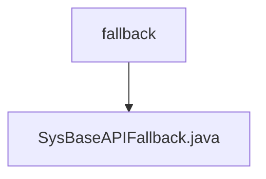

# 基础信息

|      |      |
|------|------|
| 名称 | fallback |
| 编码语言 | .java |
| 代码路径 | JeecgBoot/jeecg-boot/jeecg-module-system/jeecg-system-api/jeecg-system-cloud-api/src/main/java/org/jeecg/common/system/api/fallback |
| 包名 | JeecgBoot.jeecg-boot.jeecg-module-system.jeecg-system-api.jeecg-system-cloud-api.src.main.java.org.jeecg.common.system.api.fallback |
| 概述说明 | SysBaseAPIFallback实现ISysBaseAPI，处理消息发送失败并记录日志，其他方法返回null或空值。 |

# 说明

SysBaseAPIFallback类实现了ISysBaseAPI接口，主要用于处理系统消息发送失败的情况，并在失败时记录相关日志。该类中的其他方法在调用时返回null或空值，确保在接口实现中不会产生意外的副作用或错误。该设计旨在提供一个可靠的备用机制，以应对系统消息发送失败时的处理需求。

### 包内部结构视图

流程图展示了路径的层级关系，`fallback` 是上级目录，`SysBaseAPIFallback.java` 是位于该目录下的文件。路径结构简洁明了，符合给定的路径信息，确保节点数量不超过路径总数。

# 文件列表 File List

| 名称   | 类型  | 说明 |
|-------|------|-------------|
| [SysBaseAPIFallback.java](SysBaseAPIFallback.md) | file | SysBaseAPIFallback实现ISysBaseAPI，处理消息发送失败并记录日志，其他方法返回null或空值。 |

