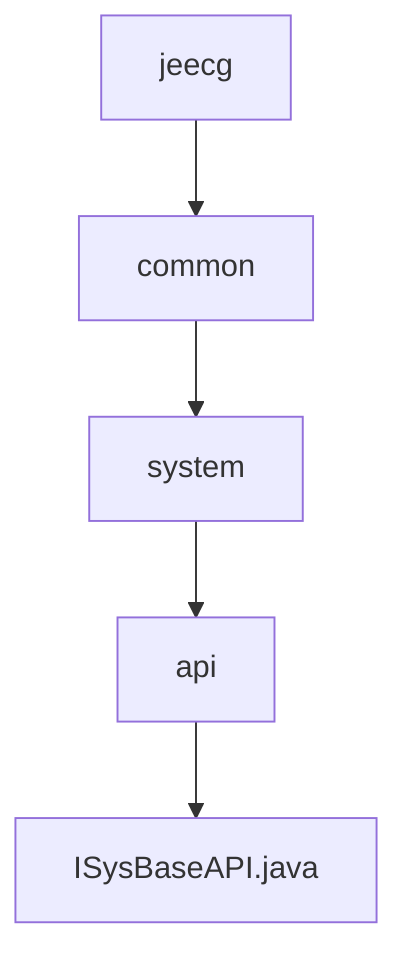

# 基础信息

|      |      |
|------|------|
| 名称 | jeecg |
| 编码语言 | .java |
| 代码路径 | JeecgBoot/jeecg-boot/jeecg-module-system/jeecg-system-api/jeecg-system-local-api/src/main/java/org/jeecg |
| 包名 | JeecgBoot.jeecg-boot.jeecg-module-system.jeecg-system-api.jeecg-system-local-api.src.main.java.org.jeecg |
| 概述说明 | 输入信息为空，无法生成概要描述。 |

# 说明

内容为空，无法进行总结描述。请提供具体内容以便生成详尽的描述。

### 包内部结构视图

流程图展示了Jeecg项目中系统模块的层级结构。从`jeecg`节点开始，依次向下展开为`common`、`system`和`api`，最终指向`ISysBaseAPI.java`文件。该图清晰地反映了路径的嵌套关系，帮助开发者快速理解项目的模块划分和文件位置。

# 文件列表 File List

| 名称   | 类型  | 说明 |
|-------|------|-------------|
| [common](common/_module.md) | package | 输入信息为空，无法生成概要描述。 |

