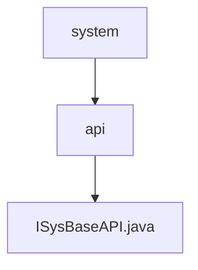

# 基础信息

|      |      |
|------|------|
| 名称 | system |
| 编码语言 | .java |
| 代码路径 | JeecgBoot/jeecg-boot/jeecg-module-system/jeecg-system-api/jeecg-system-local-api/src/main/java/org/jeecg/common/system |
| 包名 | JeecgBoot.jeecg-boot.jeecg-module-system.jeecg-system-api.jeecg-system-local-api.src.main.java.org.jeecg.common.system |
| 概述说明 | 输入信息为空，无法生成概要描述。 |

# 说明

内容为空，无法进行总结描述。请提供具体内容以便生成详尽的描述。

### 包内部结构视图

该流程图展示了路径的层级关系，`system` 是根节点，包含 `api` 子节点，而 `api` 节点下又包含 `ISysBaseAPI.java` 文件。这种结构清晰地反映了代码的组织方式，帮助开发者快速理解模块的依赖关系。

# 文件列表 File List

| 名称   | 类型  | 说明 |
|-------|------|-------------|
| [api](api/_module.md) | package | 输入信息为空，无法生成概要描述。 |

