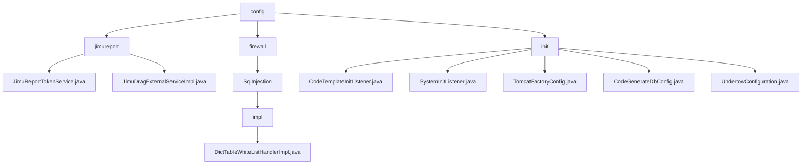

# 基础信息

|      |      |
|------|------|
| 名称 | config |
| 编码语言 | .java |
| 代码路径 | JeecgBoot/jeecg-boot/jeecg-module-system/jeecg-system-biz/src/main/java/org/jeecg/config |
| 包名 | JeecgBoot.jeecg-boot.jeecg-module-system.jeecg-system-biz.src.main.java.org.jeecg.config |
| 概述说明 | 该模块包含两个核心服务类：`JimuReportTokenService`处理用户身份验证和授权，`JimuDragExternalServiceImpl`提供字典项查询和日志记录功能。适用于用户验证、权限管理、字典查询和操作日志记录等场景。 |

# 说明

## 概述

该代码模块主要包含多个核心服务类和初始化配置类，涵盖了用户身份验证与授权、字典项查询与操作日志记录、应用启动初始化、代码生成器模板初始化、数据库连接配置以及WebSocket配置优化等功能。模块通过合理的架构设计，提供了稳定且可扩展的解决方案，适用于需要频繁进行用户身份验证、权限管理、字典项查询、操作日志记录以及应用启动初始化和代码生成的应用场景。

## 主要业务场景

1. **用户身份验证与授权**：
   - `JimuReportTokenService` 负责在系统中获取和验证用户的 token、用户名、角色和权限信息，确保系统的安全性和功能性。该服务适用于需要进行用户身份验证和权限管理的业务场景，如登录验证、权限控制等。

2. **字典项查询与操作日志记录**：
   - `JimuDragExternalServiceImpl` 提供了字典项查询和日志添加功能，支持用户通过指定条件检索字典中的相关条目，并记录系统操作或用户行为。该服务适用于需要频繁查询字典项并记录操作日志的应用场景，如数据管理、系统审计等。

3. **应用启动初始化**：
   - 通过`SystemInitListener`监听应用启动事件，配置路由信息并将其存储到Redis中，确保路由配置在应用启动时已准备就绪，并通过Redis实现数据的持久化和高效访问。

4. **代码生成器模板初始化**：
   - `CodeTemplateInitListener`在应用启动时初始化代码生成器模板，记录操作耗时以优化性能，并处理可能出现的异常，确保系统稳定运行。

5. **数据库连接配置**：
   - `CodeGenerateDbConfig`类负责初始化代码生成器的数据库连接，包括解密密码以确保安全性，并通过日志记录提供操作的可追溯性。

6. **WebSocket配置优化**：
   - `UndertowConfiguration`类用于自定义WebSocket部署信息，通过调整缓冲区大小优化性能和资源管理，确保在高并发或大数据传输场景下WebSocket连接的稳定性和效率。

这些业务场景共同构成了该模块的核心功能，确保应用在启动时能够高效、稳定地完成各项初始化操作，并为后续的代码生成和系统运行提供可靠的支持。

### 包内部结构视图

该流程图展示了JeecgBoot项目中配置模块的层级结构。根节点为`config`，其下分为`jimureport`、`firewall`和`init`三个子模块。`jimureport`包含两个服务类文件，`firewall`进一步细分为`SqlInjection`及其实现类，而`init`模块则包含多个初始化相关的配置类文件。

# 文件列表 File List

| 名称   | 类型  | 说明 |
|-------|------|-------------|
| [init](init/_module.md) | package | 监听应用启动，初始化代码生成器，记录耗时，处理异常，确保系统稳定。配置路由并存储Redis，初始化数据库连接，自定义WebSocket缓冲区大小。 |
| [firewall](firewall/_module.md) | package | 实现SQL和字典查询的白名单校验，自动添加dev模式数据。 |
| [jimureport](jimureport/_module.md) | package | JimuReportTokenService实现JmReportTokenServiceI接口，负责用户身份验证和授权功能。 |

