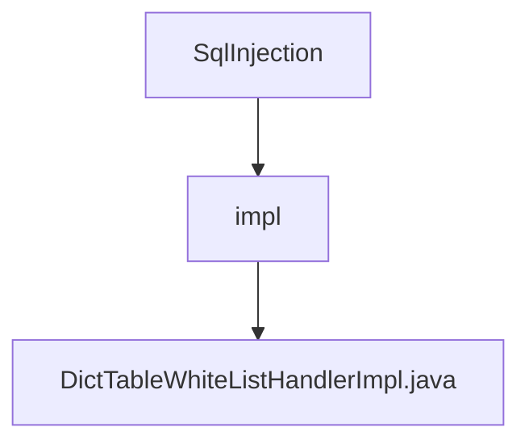

# 基础信息

|      |      |
|------|------|
| 名称 | SqlInjection |
| 编码语言 | .java |
| 代码路径 | JeecgBoot/jeecg-boot/jeecg-module-system/jeecg-system-biz/src/main/java/org/jeecg/config/firewall/SqlInjection |
| 包名 | JeecgBoot.jeecg-boot.jeecg-module-system.jeecg-system-biz.src.main.java.org.jeecg.config.firewall.SqlInjection |
| 概述说明 | 实现SQL和字典查询的白名单校验，自动添加dev模式数据。 |

# 说明

该功能实现了表字典白名单校验，支持通过SQL查询和字典查询两种方式进行验证。系统能够自动在开发模式下添加白名单数据，确保在开发和测试环境中数据的合法性和安全性。这一机制有助于提高数据校验的灵活性和效率，同时简化了开发过程中的配置操作。

### 包内部结构视图

该流程图展示了SQL注入防护模块的层级结构。`SqlInjection` 是根节点，包含一个子节点 `impl`，而 `impl` 下又包含一个具体的实现类 `DictTableWhiteListHandlerImpl.java`。这种结构清晰地反映了代码的组织方式，便于理解模块的组成和功能划分。

# 文件列表 File List

| 名称   | 类型  | 说明 |
|-------|------|-------------|
| [impl](impl/_module.md) | package | 实现SQL和字典查询的白名单校验，自动添加dev模式数据。 |

