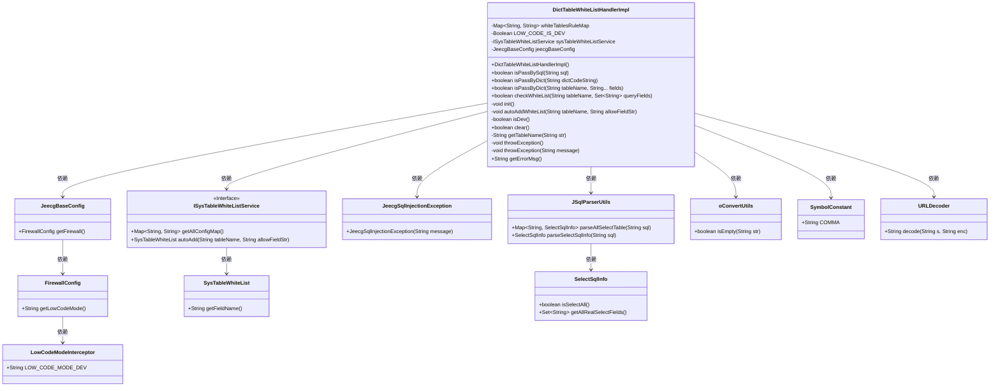
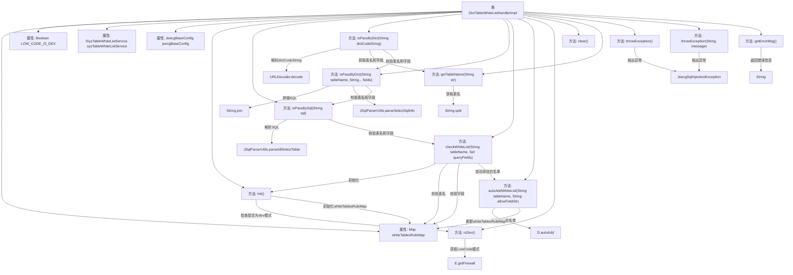

# 基础信息

|      |      |
|------|------|
| 名称 | DictTableWhiteListHandlerImpl |
| 编码语言 | .java |
| 代码路径 | JeecgBoot/jeecg-boot/jeecg-module-system/jeecg-system-biz/src/main/java/org/jeecg/config/firewall/SqlInjection/impl/DictTableWhiteListHandlerImpl.java |
| 包名 | org.jeecg.config.firewall.SqlInjection.impl |
| 依赖项 | ['lombok.extern.slf4j.Slf4j', 'org.jeecg.common.constant.SymbolConstant', 'org.jeecg.common.exception.JeecgSqlInjectionException', 'org.jeecg.common.util.oConvertUtils', 'org.jeecg.common.util.sqlparse.JSqlParserUtils', 'org.jeecg.common.util.sqlparse.vo.SelectSqlInfo', 'org.jeecg.config.JeecgBaseConfig', 'org.jeecg.config.firewall.SqlInjection.IDictTableWhiteListHandler', 'org.jeecg.config.firewall.interceptor.LowCodeModeInterceptor', 'org.jeecg.modules.system.entity.SysTableWhiteList', 'org.jeecg.modules.system.security.DictQueryBlackListHandler', 'org.jeecg.modules.system.service.ISysTableWhiteListService', 'org.springframework.beans.factory.annotation.Autowired', 'org.springframework.stereotype.Component', 'java.net.URLDecoder', 'java.util'] |
| 概述说明 | 实现SQL和字典查询的白名单校验，自动添加dev模式数据。 |

# 说明

该功能实现了表字典白名单校验，支持通过SQL查询和字典查询两种方式进行验证。系统能够自动在开发模式下添加白名单数据，确保在开发和测试环境中数据的合法性和安全性。这一机制有助于提高数据校验的灵活性和效率，同时简化了开发过程中的配置操作。

# 类列表 Class Summary

| 名称   | 类型  | 说明 |
|-------|------|-------------|
| DictTableWhiteListHandlerImpl | class | 实现表字典白名单校验，支持SQL和字典查询，自动添加dev模式下的白名单数据。 |

## 类 DictTableWhiteListHandlerImpl

|      |      |
|------|------|
| 访问范围 | @Slf4j;@Component("dictTableWhiteListHandlerImpl");public |
| 类型 | class |
| 名称 | DictTableWhiteListHandlerImpl |
| 说明 | 实现表字典白名单校验，支持SQL和字典查询，自动添加dev模式下的白名单数据。 |

### UML类图

**类图描述：**
`DictTableWhiteListHandlerImpl` 类实现了 `IDictTableWhiteListHandler` 接口，用于处理表字典白名单的校验逻辑。它依赖于 `ISysTableWhiteListService` 服务来获取白名单配置，并通过 `JeecgBaseConfig` 获取低代码模式配置。类中包含了初始化白名单、校验SQL和字典字段是否在白名单内的方法，同时支持在开发模式下自动添加白名单数据。其他辅助类如 `JSqlParserUtils` 用于SQL解析，`oConvertUtils` 用于字符串处理，`JeecgSqlInjectionException` 用于抛出异常。

### 内部方法调用关系图

这段代码是一个用于处理白名单校验的类 `DictTableWhiteListHandlerImpl`，主要功能包括初始化白名单规则、校验SQL语句和字典编码是否在白名单内、自动添加白名单等。代码通过解析SQL语句和字典编码，判断表名和字段是否在白名单中，并根据当前是否为开发模式决定是否自动添加白名单。流程图展示了类中各个方法的调用关系，以及它们如何协同工作来完成白名单校验。

### 字段列表 Field List

| 名称  | 类型  | 说明 |
|-------|-------|------|
| sysTableWhiteListService | ISysTableWhiteListService | 自动注入系统表白名单服务实例。 |
| jeecgBaseConfig | JeecgBaseConfig | 自动注入JeecgBaseConfig配置类实例。 |
| whiteTablesRuleMap = new HashMap<>() | Map<String, String> | 定义了一个静态不可变的映射变量whiteTablesRuleMap。 |
| LOW_CODE_IS_DEV = null | Boolean | 私有静态布尔变量LOW_CODE_IS_DEV初始化为null。 |

### 方法列表 Method List

| 名称  | 类型  | 说明 |
|-------|-------|------|
| getTableName | String | 提取SQL表名并去除多余字符。 |
| isPassByDict | boolean | 检查表名和字段是否通过字典验证，防止SQL注入。 |
| throwException | void | 方法抛出SQL注入异常，若消息为空则使用默认错误信息。 |
| isDev | boolean | 判断是否为开发模式，无配置默认false。 |
| init | void | 开发模式下清空缓存并重新加载数据库白名单配置。 |
| throwException | void | 抛出SQL注入异常，并附带错误信息。 |
| getErrorMsg | String | 重写getErrorMsg方法，返回白名单校验未通过信息。 |
| clear | boolean | 重写clear方法，清空白表规则映射并返回true。 |
| checkWhiteList | boolean | 检查表名和字段名是否在白名单内，若未通过校验则抛出异常，开发模式下自动添加缺失字段。 |
| isPassBySql | boolean | 方法解析SQL语句，校验表名和字段是否在白名单中，通过返回true，否则返回false。 |
| isPassByDict | boolean | 方法`isPassByDict`解码并校验字典码，确保表名和字段合法。 |
| autoAddWhiteList | void | dev模式下，表未通过校验时自动添加白名单，失败则抛出异常。 |

