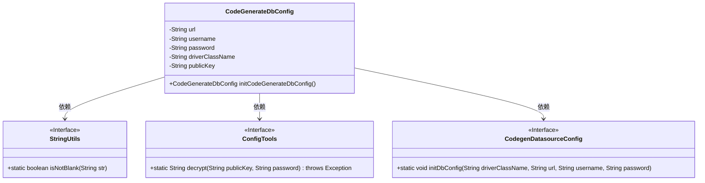

# 基础信息

|      |      |
|------|------|
| 名称 | CodeGenerateDbConfig |
| 编码语言 | .java |
| 代码路径 | JeecgBoot/jeecg-boot/jeecg-module-system/jeecg-system-biz/src/main/java/org/jeecg/config/init/CodeGenerateDbConfig.java |
| 包名 | org.jeecg.config.init |
| 依赖项 | ['com.alibaba.druid.filter.config.ConfigTools', 'lombok.extern.slf4j.Slf4j', 'org.apache.commons.lang3.StringUtils', 'org.jeecgframework.codegenerate.database.CodegenDatasourceConfig', 'org.springframework.beans.factory.annotation.Value', 'org.springframework.context.annotation.Bean', 'org.springframework.context.annotation.Configuration'] |
| 概述说明 | 配置类用于初始化数据库连接，解密密码并记录日志。 |

# 说明

配置类的主要功能是初始化代码生成器的数据库连接，包括解密密码以确保安全性，并在操作过程中记录日志，以便于追踪和调试。该类通过处理数据库连接的配置细节，确保代码生成器能够顺利访问数据库，同时通过日志记录提供操作的可追溯性。

# 类列表 Class Summary

| 名称   | 类型  | 说明 |
|-------|------|-------------|
| CodeGenerateDbConfig | class | 配置类用于初始化代码生成器数据库连接，解密密码并记录日志。 |

## 类 CodeGenerateDbConfig

|      |      |
|------|------|
| 访问范围 | @Slf4j;@Configuration;public |
| 类型 | class |
| 名称 | CodeGenerateDbConfig |
| 说明 | 配置类用于初始化代码生成器数据库连接，解密密码并记录日志。 |

### UML类图

**描述：**  
`CodeGenerateDbConfig` 是一个配置类，用于初始化代码生成器的数据库配置。它从 `application.yml` 文件中读取数据库连接信息，并通过 `ConfigTools` 类对密码进行解密。如果解密成功，则调用 `CodegenDatasourceConfig` 类的 `initDbConfig` 方法初始化数据库配置。该类依赖于 `StringUtils`、`ConfigTools` 和 `CodegenDatasourceConfig` 接口来完成其功能。

### 内部方法调用关系图

这段代码定义了一个配置类 `CodeGenerateDbConfig`，用于初始化代码生成器的数据库配置。它从配置文件中读取数据库连接信息，并尝试解密密码。如果解密成功，则初始化数据库配置；如果解密失败，则记录错误日志。最终，无论是否成功，该方法都返回 `null`。流程图展示了该类的属性、方法调用以及条件判断的逻辑流程。

### 字段列表 Field List

| 名称  | 类型  | 说明 |
|-------|-------|------|
| url | String | 主数据源URL配置，默认值为空。 |
| password | String | 主数据源密码配置，默认值为空。 |
| publicKey | String | Spring配置主数据源Druid公钥。 |
| driverClassName | String | 主数据源驱动类名配置，默认值为空。 |
| username | String | Spring动态数据源主库用户名配置项。 |

### 方法列表 Method List

| 名称  | 类型  | 说明 |
|-------|-------|------|
| initCodeGenerateDbConfig | CodeGenerateDbConfig | 初始化代码生成器数据库配置，解密密码并连接数据库。 |

