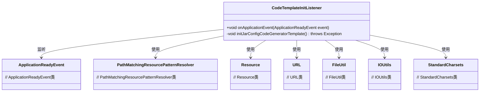
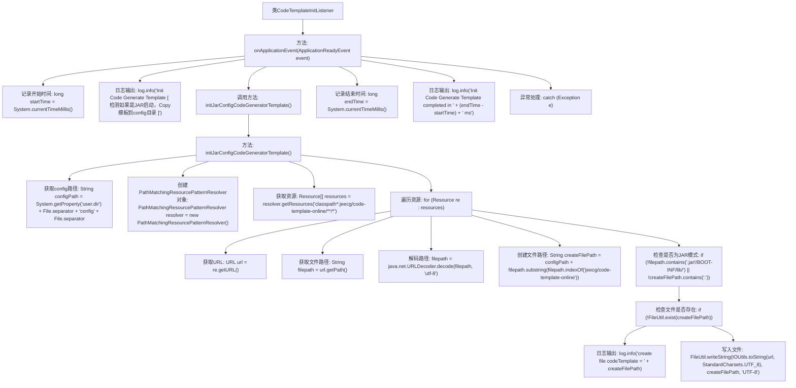

# 基础信息

|      |      |
|------|------|
| 名称 | CodeTemplateInitListener |
| 编码语言 | .java |
| 代码路径 | JeecgBoot/jeecg-boot/jeecg-module-system/jeecg-system-biz/src/main/java/org/jeecg/config/init/CodeTemplateInitListener.java |
| 包名 | org.jeecg.config.init |
| 依赖项 | ['cn.hutool.core.io.FileUtil', 'lombok.extern.slf4j.Slf4j', 'org.apache.commons.io.IOUtils', 'org.springframework.boot.context.event.ApplicationReadyEvent', 'org.springframework.context.ApplicationListener', 'org.springframework.core.io.Resource', 'org.springframework.core.io.support.PathMatchingResourcePatternResolver', 'org.springframework.stereotype.Component', 'java.io.File', 'java.net.URL', 'java.nio.charset.StandardCharsets'] |
| 概述说明 | 监听应用启动，初始化模板，记录耗时并处理异常。 |

# 说明

监听应用启动事件，确保在应用启动时自动执行相关操作。初始化代码生成器模板，为后续代码生成做好准备。记录操作耗时，以便分析和优化性能。处理可能出现的异常，确保系统稳定运行，避免因错误导致应用崩溃或功能失效。整个流程旨在提升应用启动效率和代码生成质量，同时保障系统的可靠性和稳定性。

# 类列表 Class Summary

| 名称   | 类型  | 说明 |
|-------|------|-------------|
| CodeTemplateInitListener | class | 监听应用启动事件，初始化代码生成器模板，记录耗时并处理异常。 |

## 类 CodeTemplateInitListener

|      |      |
|------|------|
| 访问范围 | @Slf4j;@Component;public |
| 类型 | class |
| 名称 | CodeTemplateInitListener |
| 说明 | 监听应用启动事件，初始化代码生成器模板，记录耗时并处理异常。 |

### UML类图

**描述：**  
`CodeTemplateInitListener` 是一个Spring组件，监听 `ApplicationReadyEvent` 事件，在应用启动时初始化代码生成器模板。它使用 `PathMatchingResourcePatternResolver` 获取资源，并通过 `FileUtil` 和 `IOUtils` 将模板文件复制到指定目录。该过程包括获取配置路径、解码URL、创建文件等步骤，确保在JAR启动模式下正确生成模板文件。

### 内部方法调用关系图

这段代码流程图描述了一个Spring Boot应用启动时初始化代码生成器模板的过程。首先，应用在启动时会触发`onApplicationEvent`方法，记录开始时间并输出日志。然后调用`initJarConfigCodeGeneratorTemplate`方法，该方法会获取JAR包同级的config路径，遍历指定路径下的资源文件，检查是否为JAR模式，如果文件不存在则创建并写入内容。最后记录结束时间并输出耗时日志。整个过程确保了在JAR启动模式下，代码生成器模板文件被正确复制到config目录。

### 字段列表 Field List

| 名称  | 类型  | 说明 |
|-------|-------|------|

### 方法列表 Method List

| 名称  | 类型  | 说明 |
|-------|-------|------|
| onApplicationEvent | void | 初始化代码生成模板，记录并输出耗时。 |
| initJarConfigCodeGeneratorTemplate | void | 方法初始化JAR配置代码生成模板，从指定路径获取资源并生成模板文件。 |

