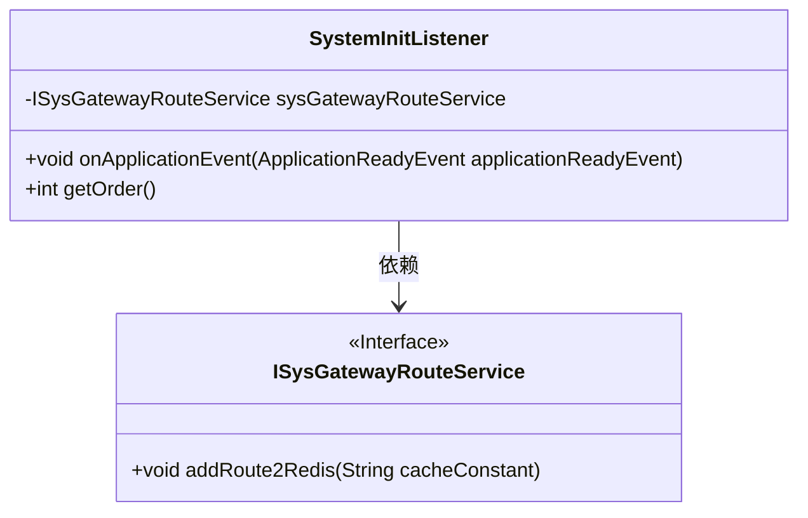
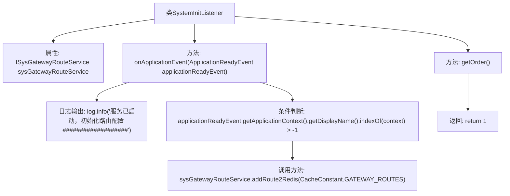

# 基础信息

|      |      |
|------|------|
| 名称 | SystemInitListener |
| 编码语言 | .java |
| 代码路径 | JeecgBoot/jeecg-boot/jeecg-module-system/jeecg-system-biz/src/main/java/org/jeecg/config/init/SystemInitListener.java |
| 包名 | org.jeecg.config.init |
| 依赖项 | ['lombok.extern.slf4j.Slf4j', 'org.jeecg.common.constant.CacheConstant', 'org.jeecg.config.JeecgCloudCondition', 'org.jeecg.modules.system.service.ISysGatewayRouteService', 'org.springframework.beans.factory.annotation.Autowired', 'org.springframework.boot.context.event.ApplicationReadyEvent', 'org.springframework.context.ApplicationListener', 'org.springframework.context.annotation.Conditional', 'org.springframework.core.Ordered', 'org.springframework.stereotype.Component'] |
| 概述说明 | SystemInitListener监听启动事件，初始化路由并存入Redis。 |

# 说明

SystemInitListener用于监听应用启动事件，在应用启动时执行初始化操作。其主要功能是配置路由信息，并将这些配置数据存储到Redis中，以便后续使用。通过这种方式，确保应用启动时路由配置已准备就绪，并通过Redis实现数据的持久化和高效访问。

# 类列表 Class Summary

| 名称   | 类型  | 说明 |
|-------|------|-------------|
| SystemInitListener | class | SystemInitListener监听应用启动事件，初始化路由配置并存入Redis。 |

## 类 SystemInitListener

|      |      |
|------|------|
| 访问范围 | @Slf4j;@Component;@Conditional(JeecgCloudCondition.class);public |
| 类型 | class |
| 名称 | SystemInitListener |
| 说明 | SystemInitListener监听应用启动事件，初始化路由配置并存入Redis。 |

### UML类图

**描述**：`SystemInitListener`类是一个Spring组件，实现了`ApplicationListener`接口，用于监听应用启动事件。当应用启动时，它会调用`onApplicationEvent`方法，检查应用上下文，并通过`ISysGatewayRouteService`接口将路由配置添加到Redis中。`ISysGatewayRouteService`是一个接口，定义了`addRoute2Redis`方法，用于具体的路由配置操作。

### 内部方法调用关系图

**描述：**
`SystemInitListener` 类是一个Spring组件，用于监听应用启动事件。当应用启动时，`onApplicationEvent` 方法会被触发，首先记录日志信息，然后检查应用上下文的显示名称是否包含特定字符串。如果条件满足，则调用 `sysGatewayRouteService.addRoute2Redis` 方法将路由配置添加到Redis中。`getOrder` 方法返回一个固定的顺序值1，用于确定监听器的执行顺序。

### 字段列表 Field List

| 名称  | 类型  | 说明 |
|-------|-------|------|
| sysGatewayRouteService | ISysGatewayRouteService | 自动注入系统网关路由服务实例。 |

### 方法列表 Method List

| 名称  | 类型  | 说明 |
|-------|-------|------|
| getOrder | int | 重写getOrder方法，返回值为1。 |
| onApplicationEvent | void | 服务启动时初始化路由配置，若上下文匹配则添加路由至Redis。 |

