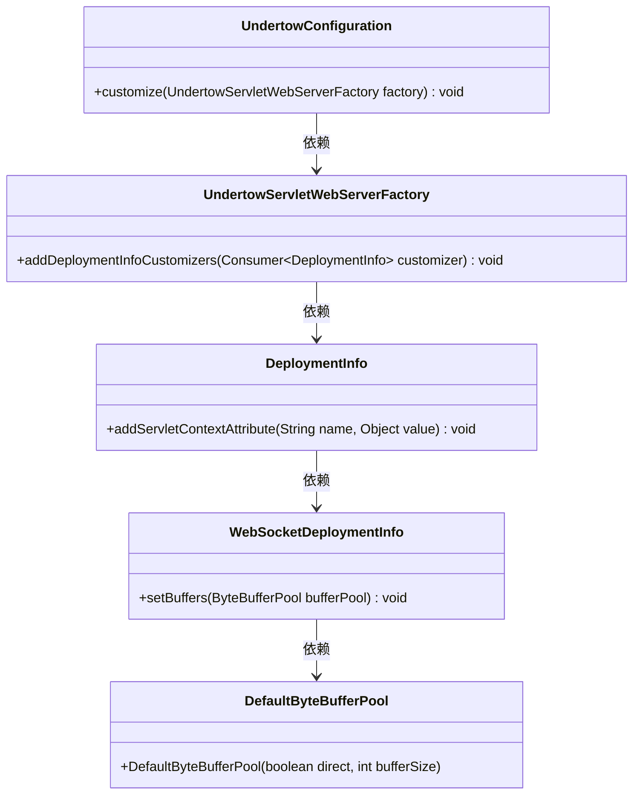
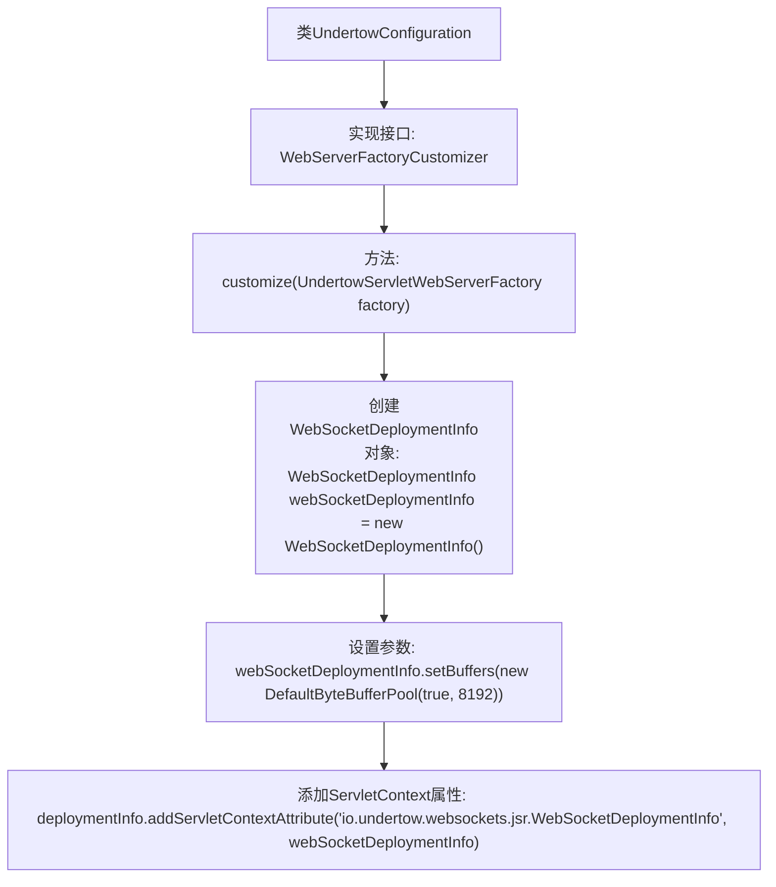

# 基础信息

|      |      |
|------|------|
| 名称 | UndertowConfiguration |
| 编码语言 | .java |
| 代码路径 | JeecgBoot/jeecg-boot/jeecg-module-system/jeecg-system-biz/src/main/java/org/jeecg/config/init/UndertowConfiguration.java |
| 包名 | org.jeecg.config.init |
| 依赖项 | ['io.undertow.server.DefaultByteBufferPool', 'io.undertow.websockets.jsr.WebSocketDeploymentInfo', 'org.springframework.boot.web.embedded.undertow.UndertowServletWebServerFactory', 'org.springframework.boot.web.server.WebServerFactoryCustomizer', 'org.springframework.context.annotation.Configuration'] |
| 概述说明 | 自定义WebSocket部署，配置Undertow缓冲区大小。 |

# 说明

Undertow配置类用于自定义WebSocket部署信息，其中包含设置缓冲区大小的功能。通过该配置类，用户可以调整WebSocket的缓冲区大小，以优化性能和资源管理。这一设置有助于在高并发或大数据传输场景下，确保WebSocket连接的稳定性和效率。配置类的实现使得开发者能够根据具体需求灵活调整参数，从而提升整体系统的响应速度和处理能力。

# 类列表 Class Summary

| 名称   | 类型  | 说明 |
|-------|------|-------------|
| UndertowConfiguration | class | Undertow配置类自定义WebSocket部署信息，设置缓冲区大小。 |

## 类 UndertowConfiguration

|      |      |
|------|------|
| 访问范围 | @Configuration;public |
| 类型 | class |
| 名称 | UndertowConfiguration |
| 说明 | Undertow配置类自定义WebSocket部署信息，设置缓冲区大小。 |

### UML类图

这段代码定义了一个`UndertowConfiguration`类，该类实现了`WebServerFactoryCustomizer<UndertowServletWebServerFactory>`接口，用于自定义Undertow服务器的配置。在`customize`方法中，通过`UndertowServletWebServerFactory`对象添加了一个`DeploymentInfo`自定义器，该自定义器配置了`WebSocketDeploymentInfo`，并设置了`DefaultByteBufferPool`作为缓冲区池。整体结构展示了类之间的依赖关系，以及如何通过配置类来定制Undertow服务器的行为。

### 内部方法调用关系图

这段代码定义了一个名为`UndertowConfiguration`的配置类，该类实现了`WebServerFactoryCustomizer<UndertowServletWebServerFactory>`接口。在`customize`方法中，代码通过`UndertowServletWebServerFactory`对象对`DeploymentInfo`进行自定义配置，具体包括创建`WebSocketDeploymentInfo`对象、设置缓冲区参数，并将该对象作为ServletContext属性添加到`DeploymentInfo`中。该配置类主要用于在Undertow服务器中自定义WebSocket的部署信息。

### 字段列表 Field List

| 名称  | 类型  | 说明 |
|-------|-------|------|

### 方法列表 Method List

| 名称  | 类型  | 说明 |
|-------|-------|------|
| customize | void | 重写方法配置Undertow服务器，设置WebSocket缓冲区大小。 |

