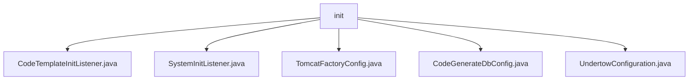

# 基础信息

|      |      |
|------|------|
| 名称 | init |
| 编码语言 | .java |
| 代码路径 | JeecgBoot/jeecg-boot/jeecg-module-system/jeecg-system-biz/src/main/java/org/jeecg/config/init |
| 包名 | JeecgBoot.jeecg-boot.jeecg-module-system.jeecg-system-biz.src.main.java.org.jeecg.config.init |
| 概述说明 | 监听应用启动，初始化代码生成器，记录耗时，处理异常，确保系统稳定。配置路由并存储Redis，初始化数据库连接，自定义WebSocket缓冲区大小。 |

# 说明

## 概述
该代码模块主要涉及应用启动时的初始化配置和代码生成器的准备工作。模块中的各个类通过监听应用启动事件、配置路由信息、初始化数据库连接、自定义WebSocket部署信息等功能，确保应用在启动时能够自动执行相关操作，并为后续的代码生成和系统运行提供支持。模块的设计旨在提升应用启动效率、代码生成质量以及系统的可靠性和稳定性。

## 主要业务场景
1. **应用启动初始化**：通过`SystemInitListener`监听应用启动事件，配置路由信息并将其存储到Redis中，确保路由配置在应用启动时已准备就绪，并通过Redis实现数据的持久化和高效访问。
2. **代码生成器模板初始化**：`CodeTemplateInitListener`在应用启动时初始化代码生成器模板，记录操作耗时以优化性能，并处理可能出现的异常，确保系统稳定运行。
3. **数据库连接配置**：`CodeGenerateDbConfig`类负责初始化代码生成器的数据库连接，包括解密密码以确保安全性，并通过日志记录提供操作的可追溯性。
4. **WebSocket配置优化**：`UndertowConfiguration`类用于自定义WebSocket部署信息，通过调整缓冲区大小优化性能和资源管理，确保在高并发或大数据传输场景下WebSocket连接的稳定性和效率。

这些业务场景共同构成了该模块的核心功能，确保应用在启动时能够高效、稳定地完成各项初始化操作，并为后续的代码生成和系统运行提供可靠的支持。

### 包内部结构视图

该流程图展示了`init`文件夹下的所有文件层级关系。`init`作为根节点，包含了五个子节点，分别是`CodeTemplateInitListener.java`、`SystemInitListener.java`、`TomcatFactoryConfig.java`、`CodeGenerateDbConfig.java`和`UndertowConfiguration.java`。这些文件均位于`init`目录下，没有进一步的子目录结构。

# 文件列表 File List

| 名称   | 类型  | 说明 |
|-------|------|-------------|
| [UndertowConfiguration.java](UndertowConfiguration.md) | file | 自定义WebSocket部署，配置Undertow缓冲区大小。 |
| [CodeGenerateDbConfig.java](CodeGenerateDbConfig.md) | file | 配置类用于初始化数据库连接，解密密码并记录日志。 |
| [TomcatFactoryConfig.java](TomcatFactoryConfig.md) | file | 信息为空，无法生成概要描述。 |
| [SystemInitListener.java](SystemInitListener.md) | file | SystemInitListener监听启动事件，初始化路由并存入Redis。 |
| [CodeTemplateInitListener.java](CodeTemplateInitListener.md) | file | 监听应用启动，初始化模板，记录耗时并处理异常。 |

