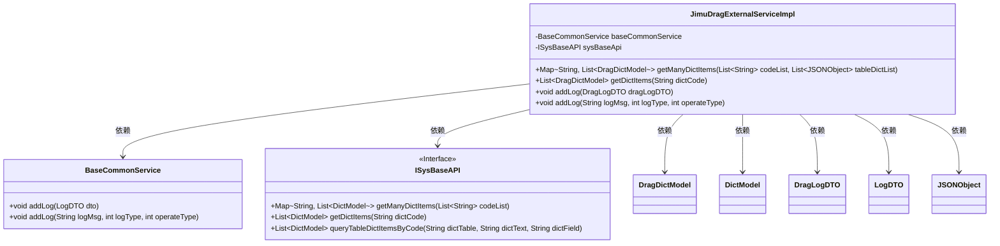

# 基础信息

|      |      |
|------|------|
| 名称 | JimuDragExternalServiceImpl |
| 编码语言 | .java |
| 代码路径 | JeecgBoot/jeecg-boot/jeecg-module-system/jeecg-system-biz/src/main/java/org/jeecg/config/jimureport/JimuDragExternalServiceImpl.java |
| 包名 | org.jeecg.config.jimureport |
| 依赖项 | ['com.alibaba.fastjson.JSONObject', 'lombok.extern.slf4j.Slf4j', 'org.jeecg.common.api.dto.LogDTO', 'org.jeecg.common.system.api.ISysBaseAPI', 'org.jeecg.common.system.vo.DictModel', 'org.jeecg.common.util.oConvertUtils', 'org.jeecg.modules.base.service.BaseCommonService', 'org.jeecg.modules.drag.service.IOnlDragExternalService', 'org.jeecg.modules.drag.vo.DragDictModel', 'org.jeecg.modules.drag.vo.DragLogDTO', 'org.springframework.beans.BeanUtils', 'org.springframework.beans.factory.annotation.Autowired', 'org.springframework.context.annotation.Lazy', 'org.springframework.stereotype.Service', 'org.springframework.util.CollectionUtils', 'java.util.ArrayList', 'java.util.HashMap', 'java.util.List', 'java.util.Map'] |
| 概述说明 | Java服务类实现字典查询与日志记录功能。 |

# 说明

该Java服务类实现了字典项查询和日志添加功能。字典项查询功能允许用户通过指定条件检索字典中的相关条目，确保数据获取的准确性和高效性。日志添加功能则用于记录系统操作或用户行为，便于后续的审计和问题排查。服务类通过合理的架构设计，将这两项功能集成在一起，提供了稳定且可扩展的解决方案，适用于需要频繁查询字典项并记录操作日志的应用场景。

# 类列表 Class Summary

| 名称   | 类型  | 说明 |
|-------|------|-------------|
| JimuDragExternalServiceImpl | class | 实现字典项查询和日志添加功能的Java服务类。 |

## 类 JimuDragExternalServiceImpl

|      |      |
|------|------|
| 访问范围 | @Slf4j;@Service("onlDragExternalServiceImpl");public |
| 类型 | class |
| 名称 | JimuDragExternalServiceImpl |
| 说明 | 实现字典项查询和日志添加功能的Java服务类。 |

### UML类图

这段代码描述了一个服务类 `JimuDragExternalServiceImpl`，它实现了 `IOnlDragExternalService` 接口。该类通过 `BaseCommonService` 和 `ISysBaseAPI` 两个依赖类来处理字典项和日志记录。`getManyDictItems` 方法根据多个字典code查询多个字典项，`getDictItems` 方法根据单个字典code查询字典项，`addLog` 方法用于添加和保存日志。类图中展示了类之间的依赖关系，以及类内部的成员和方法。

### 内部方法调用关系图

这段代码实现了一个名为`JimuDragExternalServiceImpl`的服务类，主要功能包括根据字典代码查询字典项、添加日志和保存日志。代码通过调用`sysBaseApi`和`baseCommonService`的方法来完成这些功能，并使用了`BeanUtils.copyProperties`进行对象属性的复制。流程图展示了各个方法的调用顺序和逻辑判断，清晰地描述了代码的执行流程。

### 字段列表 Field List

| 名称  | 类型  | 说明 |
|-------|-------|------|
| baseCommonService | BaseCommonService | 使用@Autowired和@Lazy注入BaseCommonService实例。 |
| sysBaseApi | ISysBaseAPI | 使用@Autowired和@Lazy注入延迟初始化的ISysBaseAPI实例。 |

### 方法列表 Method List

| 名称  | 类型  | 说明 |
|-------|-------|------|
| getDictItems | List<DragDictModel> | 方法重写，根据字典码获取并转换字典项列表。 |
| getManyDictItems | Map<String, List<DragDictModel>> | 方法获取多个字典项，处理codeList和tableDictList，返回包含DragDictModel的Map。 |
| addLog | void | 方法`addLog`接收`DragLogDTO`对象，若不为空则复制属性至`LogDTO`并调用`baseCommonService.addLog`。 |
| addLog | void | 重写addLog方法，调用baseCommonService的addLog方法记录日志。 |

