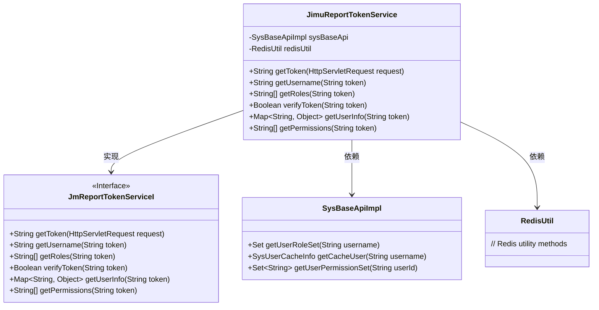
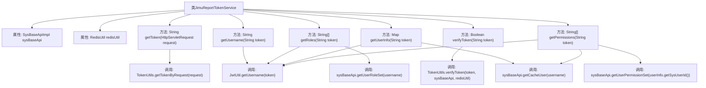

# 基础信息

|      |      |
|------|------|
| 名称 | JimuReportTokenService |
| 编码语言 | .java |
| 代码路径 | JeecgBoot/jeecg-boot/jeecg-module-system/jeecg-system-biz/src/main/java/org/jeecg/config/jimureport/JimuReportTokenService.java |
| 包名 | org.jeecg.config.jimureport |
| 依赖项 | ['lombok.extern.slf4j.Slf4j', 'org.jeecg.common.system.util.JwtUtil', 'org.jeecg.common.system.vo.SysUserCacheInfo', 'org.jeecg.common.util.RedisUtil', 'org.jeecg.common.util.TokenUtils', 'org.jeecg.modules.jmreport.api.JmReportTokenServiceI', 'org.jeecg.modules.system.service.impl.SysBaseApiImpl', 'org.springframework.beans.factory.annotation.Autowired', 'org.springframework.context.annotation.Lazy', 'org.springframework.stereotype.Component', 'org.springframework.util.CollectionUtils', 'javax.servlet.http.HttpServletRequest', 'java.util.HashMap', 'java.util.Map', 'java.util.Set'] |
| 概述说明 | JimuReportTokenService实现JmReportTokenServiceI接口，提供用户认证和信息获取功能。 |

# 说明

JimuReportTokenService实现了JmReportTokenServiceI接口，主要负责获取token、用户名、角色、权限以及用户信息。该服务通过接口定义，确保能够提供与用户身份验证和授权相关的核心功能，支持系统在需要时获取并验证用户的基本信息和权限状态，从而保障系统的安全性和功能性。

# 类列表 Class Summary

| 名称   | 类型  | 说明 |
|-------|------|-------------|
| JimuReportTokenService | class | JimuReportTokenService实现JmReportTokenServiceI接口，提供获取token、用户名、角色、权限及用户信息的功能。 |

## 类 JimuReportTokenService

|      |      |
|------|------|
| 访问范围 | @Slf4j;@Component;public |
| 类型 | class |
| 名称 | JimuReportTokenService |
| 说明 | JimuReportTokenService实现JmReportTokenServiceI接口，提供获取token、用户名、角色、权限及用户信息的功能。 |

### UML类图

**描述：**
`JimuReportTokenService`类实现了`JmReportTokenServiceI`接口，负责处理与令牌相关的操作，如获取令牌、验证令牌、获取用户信息和权限等。该类依赖于`SysBaseApiImpl`和`RedisUtil`来获取用户角色、权限和缓存信息。通过`JwtUtil`和`TokenUtils`工具类，该类能够解析和验证JWT令牌，并将用户信息封装在`Map`中返回。

### 内部方法调用关系图

**描述：**  
`JimuReportTokenService`类实现了`JmReportTokenServiceI`接口，主要用于处理与用户令牌相关的操作。类中包含两个自动注入的属性`sysBaseApi`和`redisUtil`，分别用于系统基础API操作和Redis缓存操作。类中的方法包括获取令牌、获取用户名、获取用户角色、验证令牌、获取用户信息以及获取用户权限。每个方法都依赖于`TokenUtils`、`JwtUtil`和`sysBaseApi`等工具类或服务类来完成具体的业务逻辑。

### 字段列表 Field List

| 名称  | 类型  | 说明 |
|-------|-------|------|
| redisUtil | RedisUtil | 使用@Autowired和@Lazy注解注入延迟加载的RedisUtil实例。 |
| sysBaseApi | SysBaseApiImpl | 自动注入SysBaseApiImpl实例。 |

### 方法列表 Method List

| 名称  | 类型  | 说明 |
|-------|-------|------|
| getUserInfo | Map<String, Object> | 通过token获取用户信息，存入map并返回。 |
| getUsername | String | 重写方法，通过JwtUtil获取token中的用户名。 |
| getToken | String | 重写getToken方法，通过请求获取令牌，异常时返回空。 |
| getRoles | String[] | 根据token获取用户角色数组，若角色为空返回null。 |
| verifyToken | Boolean | 该方法验证令牌有效性，调用TokenUtils工具类进行验证。 |
| getPermissions | String[] | 根据token获取用户权限信息。 |

