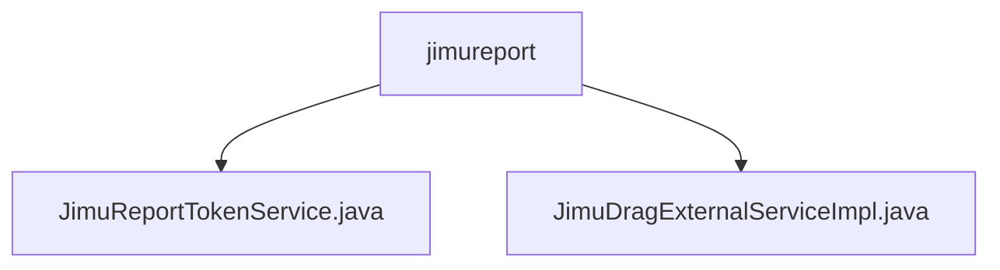

# 基础信息

|      |      |
|------|------|
| 名称 | jimureport |
| 编码语言 | .java |
| 代码路径 | JeecgBoot/jeecg-boot/jeecg-module-system/jeecg-system-biz/src/main/java/org/jeecg/config/jimureport |
| 包名 | JeecgBoot.jeecg-boot.jeecg-module-system.jeecg-system-biz.src.main.java.org.jeecg.config.jimureport |
| 概述说明 | JimuReportTokenService实现JmReportTokenServiceI接口，负责用户身份验证和授权功能。 |

# 说明

## 概述
该代码模块主要包含两个核心服务类：`JimuReportTokenService` 和 `JimuDragExternalServiceImpl`。`JimuReportTokenService` 实现了 `JmReportTokenServiceI` 接口，负责处理与用户身份验证和授权相关的功能，包括获取 token、用户名、角色、权限以及用户信息。`JimuDragExternalServiceImpl` 则提供了字典项查询和日志添加功能，支持用户通过指定条件检索字典项，并记录系统操作或用户行为，便于审计和问题排查。这两个服务类通过合理的架构设计，提供了稳定且可扩展的解决方案，适用于需要频繁进行用户身份验证、权限管理、字典项查询和操作日志记录的应用场景。

## 主要业务场景
1. **用户身份验证与授权**：`JimuReportTokenService` 负责在系统中获取和验证用户的 token、用户名、角色和权限信息，确保系统的安全性和功能性。该服务适用于需要进行用户身份验证和权限管理的业务场景，如登录验证、权限控制等。

2. **字典项查询与操作日志记录**：`JimuDragExternalServiceImpl` 提供了字典项查询和日志添加功能，支持用户通过指定条件检索字典中的相关条目，并记录系统操作或用户行为。该服务适用于需要频繁查询字典项并记录操作日志的应用场景，如数据管理、系统审计等。

### 包内部结构视图

该流程图展示了`jimureport`目录下的两个文件`JimuReportTokenService.java`和`JimuDragExternalServiceImpl.java`的层级关系。`jimureport`作为父节点，直接包含这两个文件，表示它们是该目录下的具体实现类。

# 文件列表 File List

| 名称   | 类型  | 说明 |
|-------|------|-------------|
| [JimuDragExternalServiceImpl.java](JimuDragExternalServiceImpl.md) | file | Java服务类实现字典查询与日志记录功能。 |
| [JimuReportTokenService.java](JimuReportTokenService.md) | file | JimuReportTokenService实现JmReportTokenServiceI接口，提供用户认证和信息获取功能。 |

