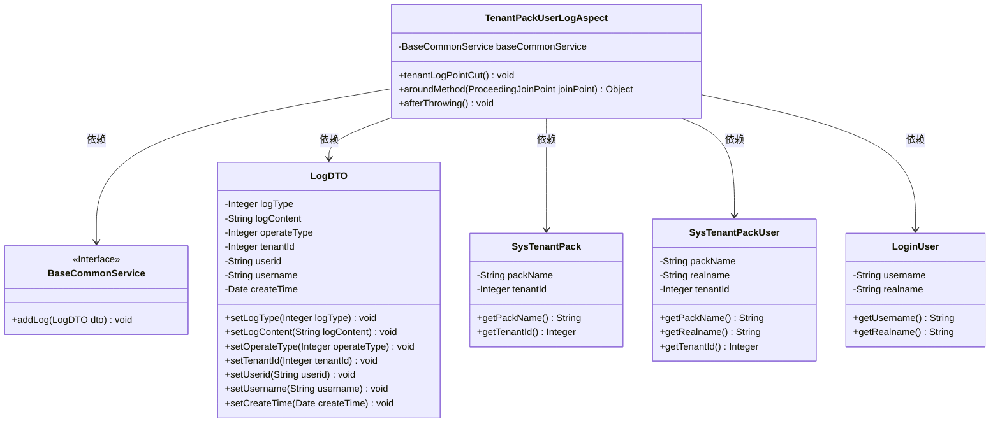
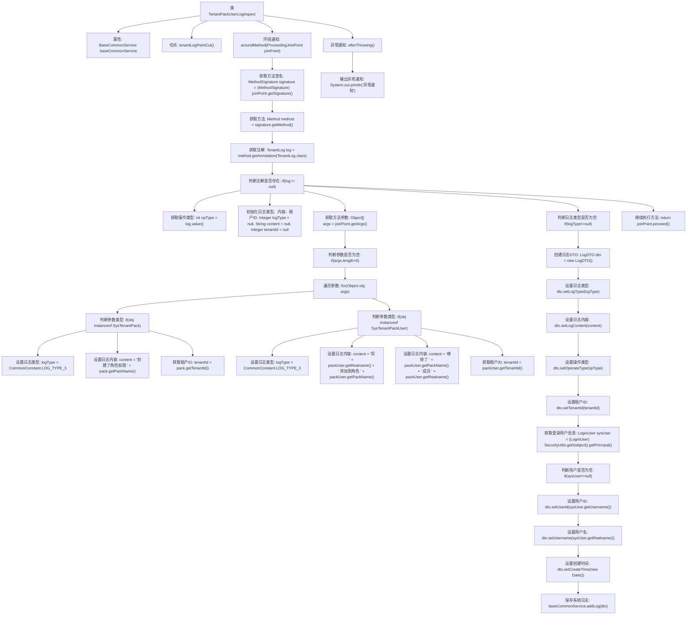

# 基础信息

|      |      |
|------|------|
| 名称 | TenantPackUserLogAspect |
| 编码语言 | .java |
| 代码路径 | JeecgBoot/jeecg-boot/jeecg-module-system/jeecg-system-biz/src/main/java/org/jeecg/modules/aop/TenantPackUserLogAspect.java |
| 包名 | org.jeecg.modules.aop |
| 依赖项 | ['org.apache.shiro.SecurityUtils', 'org.aspectj.lang.ProceedingJoinPoint', 'org.aspectj.lang.annotation.AfterThrowing', 'org.aspectj.lang.annotation.Around', 'org.aspectj.lang.annotation.Aspect', 'org.aspectj.lang.annotation.Pointcut', 'org.aspectj.lang.reflect.MethodSignature', 'org.jeecg.common.api.dto.LogDTO', 'org.jeecg.common.constant.CommonConstant', 'org.jeecg.common.system.vo.LoginUser', 'org.jeecg.modules.base.service.BaseCommonService', 'org.jeecg.modules.system.entity.SysTenantPack', 'org.jeecg.modules.system.entity.SysTenantPackUser', 'org.springframework.stereotype.Component', 'javax.annotation.Resource', 'java.lang.reflect.Method', 'java.util.Date'] |
| 概述说明 | TenantPackUserLogAspect类记录租户操作日志，处理角色权限增删改。 |

# 说明

TenantPackUserLogAspect类主要用于记录租户的操作日志，涉及创建、添加和移除角色权限等关键操作。该类通过捕捉和处理这些操作，确保对租户行为的全面跟踪和记录，从而提供操作审计和日志管理的功能。

# 类列表 Class Summary

| 名称   | 类型  | 说明 |
|-------|------|-------------|
| TenantPackUserLogAspect | class | TenantPackUserLogAspect类用于记录租户操作日志，处理创建、添加和移除角色权限等操作。 |

## 类 TenantPackUserLogAspect

|      |      |
|------|------|
| 访问范围 | @Aspect;@Component;public |
| 类型 | class |
| 名称 | TenantPackUserLogAspect |
| 说明 | TenantPackUserLogAspect类用于记录租户操作日志，处理创建、添加和移除角色权限等操作。 |

### UML类图

**描述：**  
`TenantPackUserLogAspect` 是一个切面类，用于处理与租户操作相关的日志记录。它依赖于 `BaseCommonService` 接口来保存日志，并使用了 `LogDTO` 类来封装日志信息。在 `aroundMethod` 方法中，根据传入的参数类型（`SysTenantPack` 或 `SysTenantPackUser`），生成相应的日志内容，并通过 `BaseCommonService` 保存日志。`afterThrowing` 方法用于处理异常情况。

### 内部方法调用关系图

这段代码是一个基于AOP（面向切面编程）的日志记录类，用于在特定方法执行前后记录租户操作日志。代码通过`@Around`注解在方法执行前后进行拦截，根据方法参数的类型和操作类型生成相应的日志内容，并通过`BaseCommonService`将日志保存到系统中。`@AfterThrowing`注解用于在方法抛出异常时执行异常通知。整体流程包括获取方法签名、解析注解、遍历参数、生成日志内容、保存日志等步骤。

### 字段列表 Field List

| 名称  | 类型  | 说明 |
|-------|-------|------|
| baseCommonService | BaseCommonService | 私有资源注入BaseCommonService实例。 |

### 方法列表 Method List

| 名称  | 类型  | 说明 |
|-------|-------|------|
| tenantLogPointCut | void | 定义切点，用于拦截带有TenantLog注解的方法。 |
| afterThrowing | void | 在切点抛出异常后执行异常通知。 |
| aroundMethod | Object | 环绕通知处理租户日志，根据操作类型记录日志并保存。 |

