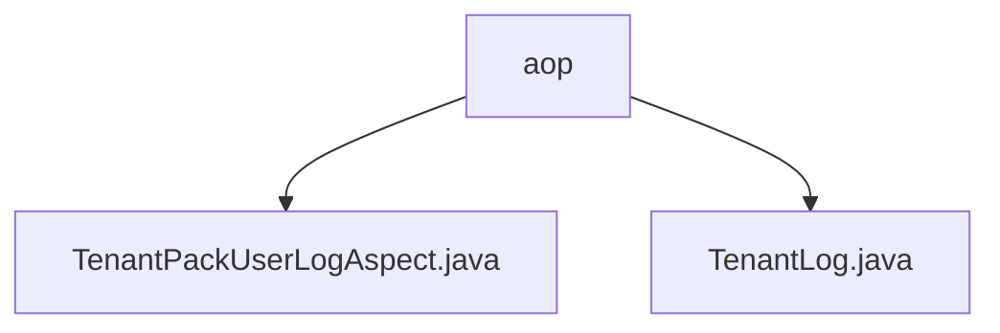

# 基础信息

|      |      |
|------|------|
| 名称 | aop |
| 编码语言 | .java |
| 代码路径 | JeecgBoot/jeecg-boot/jeecg-module-system/jeecg-system-biz/src/main/java/org/jeecg/modules/aop |
| 包名 | JeecgBoot.jeecg-boot.jeecg-module-system.jeecg-system-biz.src.main.java.org.jeecg.modules.aop |
| 概述说明 | TenantPackUserLogAspect类记录租户操作日志，确保行为跟踪和审计。 |

# 说明

## 概述
该代码模块主要涉及租户操作日志的记录和管理功能，通过捕捉和处理租户的关键操作（如创建、添加和移除角色权限等），确保对租户行为的全面跟踪和记录。模块中的`TenantPackUserLogAspect`类是实现这一功能的核心组件，它利用AOP（面向切面编程）技术，在相关操作发生时自动记录日志，从而为系统提供操作审计和日志管理的支持。

## 主要业务场景
1. **租户操作日志记录**：在租户进行创建、添加或移除角色权限等操作时，`TenantPackUserLogAspect`类会自动捕捉这些操作，并生成相应的日志记录，确保操作的可追溯性。
2. **操作审计**：通过记录租户的操作日志，系统能够对租户行为进行审计，帮助管理员了解租户的操作历史，便于问题排查和责任追溯。
3. **日志管理**：模块提供日志管理功能，支持对记录的日志进行存储、查询和分析，为系统运维和安全管理提供数据支持。

### 包内部结构视图

该流程图展示了在`aop`目录下的文件层级关系。`aop`作为根节点，包含两个子节点：`TenantPackUserLogAspect.java`和`TenantLog.java`。这两个文件位于同一层级，均直接隶属于`aop`目录，体现了它们在项目中的结构和依赖关系。

# 文件列表 File List

| 名称   | 类型  | 说明 |
|-------|------|-------------|
| [TenantLog.java](TenantLog.md) | file | 信息为空，无法生成概要描述。 |
| [TenantPackUserLogAspect.java](TenantPackUserLogAspect.md) | file | TenantPackUserLogAspect类记录租户操作日志，处理角色权限增删改。 |

