# 基础信息

|      |      |
|------|------|
| 名称 | SystemApiController |
| 编码语言 | .java |
| 代码路径 | JeecgBoot/jeecg-boot/jeecg-module-system/jeecg-system-biz/src/main/java/org/jeecg/modules/api/controller/SystemApiController.java |
| 包名 | org.jeecg.modules.api.controller |
| 依赖项 | ['com.alibaba.fastjson.JSONObject', 'lombok.extern.slf4j.Slf4j', 'org.jeecg.common.api.dto.DataLogDTO', 'org.jeecg.common.api.dto.OnlineAuthDTO', 'org.jeecg.common.api.dto.message', 'org.jeecg.common.api.vo.Result', 'org.jeecg.common.desensitization.util.SensitiveInfoUtil', 'org.jeecg.common.system.vo', 'org.jeecg.modules.system.service.ISysUserService', 'org.jeecg.modules.system.service.impl.SysBaseApiImpl', 'org.springframework.beans.factory.annotation.Autowired', 'org.springframework.web.bind.annotation', 'java.util.List', 'java.util.Map', 'java.util.Set'] |
| 概述说明 | SystemApiController支持消息发送、用户查询、字典和部门管理，处理多种模板和参数。 |

# 说明

SystemApiController是一个多功能接口控制器，提供系统消息发送、用户信息查询、字典管理和部门管理等功能。它支持处理多种消息模板和业务参数，确保系统的高效运行和灵活配置。

# 类列表 Class Summary

| 名称   | 类型  | 说明 |
|-------|------|-------------|
| SystemApiController | class | SystemApiController提供系统消息发送、用户信息查询、字典管理、部门管理等功能，支持多种消息模板和业务参数处理。 |

## 类 SystemApiController

|      |      |
|------|------|
| 访问范围 | @Slf4j;@RestController;@RequestMapping("/sys/api");public |
| 类型 | class |
| 名称 | SystemApiController |
| 说明 | SystemApiController提供系统消息发送、用户信息查询、字典管理、部门管理等功能，支持多种消息模板和业务参数处理。 |

### UML类图

```mermaid
classDiagram
    class SystemApiController {
        -SysBaseApiImpl sysBaseApi
        -ISysUserService sysUserService
        +void sendSysAnnouncement(MessageDTO message)
        +void sendBusAnnouncement(BusMessageDTO message)
        +void sendTemplateAnnouncement(TemplateMessageDTO message)
        +void sendBusTemplateAnnouncement(BusTemplateMessageDTO message)
        +String parseTemplateByCode(TemplateDTO templateDTO)
        +void updateSysAnnounReadFlag(String busType, String busId)
        +LoginUser getUserByName(String username)
        +String getUserIdByName(String username)
        +LoginUser getUserById(String id)
        +List~String~ getRolesByUsername(String username)
        +List~String~ getRolesByUserId(String userId)
        +List~String~ getDepartIdsByUsername(String username)
        +List~String~ getDepartIdsByUserId(String userId)
        +Set~String~ getDepartParentIdsByUsername(String username)
        +Set~String~ getDepartParentIdsByDepIds(Set~String~ depIds)
        +List~String~ getDepartNamesByUsername(String username)
        +List~DictModel~ queryDictItemsByCode(String code)
        +List~DictModel~ queryEnableDictItemsByCode(String code)
        +List~DictModel~ queryAllDict()
        +List~SysCategoryModel~ queryAllSysCategory()
        +List~DictModel~ queryAllDepartBackDictModel()
        +List~ComboModel~ queryAllRole(String[] roleIds)
        +List~String~ getRoleIdsByUsername(String username)
        +String getDepartIdsByOrgCode(String orgCode)
        +List~SysDepartModel~ getAllSysDepart()
        +DynamicDataSourceModel getDynamicDbSourceById(String dbSourceId)
        +List~String~ getDeptHeadByDepId(String deptId)
        +DictModel getParentDepartId(String departId)
        +DynamicDataSourceModel getDynamicDbSourceByCode(String dbSourceCode)
        +void sendWebSocketMsg(String[] userIds, String cmd)
        +List~UserAccountInfo~ queryAllUserByIds(String[] userIds)
        +List~ComboModel~ queryAllUserBackCombo()
        +JSONObject queryAllUser(String userIds, Integer pageNo, Integer pageSize)
        +void meetingSignWebsocket(String userId)
        +List~UserAccountInfo~ queryUserByNames(String[] userNames)
        +Set~String~ getUserRoleSet(String username)
        +Set~String~ getUserRoleSetById(String userId)
        +Set~String~ getUserPermissionSet(String userId)
        +boolean hasOnlineAuth(OnlineAuthDTO onlineAuthDTO)
        +Set~String~ queryUserRoles(String username)
        +Set~String~ queryUserRolesById(String userId)
        +Set~String~ queryUserAuths(String userId)
        +SysDepartModel selectAllById(String id)
        +List~String~ queryDeptUsersByUserId(String userId)
        +List~SysPermissionDataRuleModel~ queryPermissionDataRule(String component, String requestPath, String username)
        +SysUserCacheInfo getCacheUser(String username)
        +String translateDict(String code, String key)
        +List~JSONObject~ queryUsersByUsernames(String usernames)
        +List~JSONObject~ queryUsersByIds(String ids)
        +List~JSONObject~ queryDepartsByOrgcodes(String orgCodes)
        +List~JSONObject~ queryDepartsByIds(String ids)
        +void sendEmailMsg(String email, String title, String content)
        +List~Map~ getDeptUserByOrgCode(String orgCode)
        +List~String~ loadCategoryDictItem(String ids)
        +List~String~ loadCategoryDictItemByNames(String names, boolean delNotExist)
        +List~String~ loadDictItem(String dictCode, String keys)
        +Map~String, String~ copyLowAppDict(String originalAppId, String appId, String tenantId)
        +List~DictModel~ getDictItems(String dictCode)
        +Map~String, List~DictModel~~ getManyDictItems(List~String~ dictCodeList)
        +List~DictModel~ loadDictItemByKeyword(String dictCode, String keyword, Integer pageNo, Integer pageSize)
        +Map~String, List~DictModel~~ translateManyDict(String dictCodes, String keys)
        +List~DictModel~ queryTableDictItemsByCode(String tableFilterSql, String text, String code)
        +List~DictModel~ queryFilterTableDictInfo(String table, String text, String code, String filterSql)
        +List~String~ queryTableDictByKeys(String table, String text, String code, String[] keyArray)
        +String translateDictFromTable(String table, String text, String code, String key)
        +List~DictModel~ translateDictFromTableByKeys(String table, String text, String code, String keys, String ds)
        +void sendTemplateMessage(MessageDTO message)
        +String getTemplateContent(String code)
        +void saveDataLog(DataLogDTO dataLogDto)
        +void updateAvatar(LoginUser loginUser)
        +void sendAppChatSocket(String userId)
        +List~DictModel~ queryRoleDictByCode(String roleCodes)
        +String getRoleCodeById(String id)
        +Result~?~ handleSQLException(Exception e)
        +List~JSONObject~ queryUserBySuperQuery(String superQuery, String matchType)
        +JSONObject queryUserById(String id)
        +List~JSONObject~ queryDeptBySuperQuery(String superQuery, String matchType)
        +List~JSONObject~ queryRoleBySuperQuery(String superQuery, String matchType)
        +List~String~ selectUserIdByTenantId(String tenantId)
        +List~String~ queryUserIdsByDeptIds(List~String~ deptIds)
        +List~String~ queryUserAccountsByDeptIds(List~String~ deptIds)
        +List~String~ queryUserIdsByRoleds(List~String~ roleCodes)
        +List~String~ queryUserIdsByPositionIds(List~String~ positionIds)
        +List~String~ getUserAccountsByDepCode(String orgCode)
        +boolean dictTableWhiteListCheckBySql(String selectSql)
        +boolean dictTableWhiteListCheckByDict(String tableOrDictCode, String... fields)
    }

    class SysBaseApiImpl {
        <<Interface>>
        +void sendSysAnnouncement(MessageDTO message)
        +void sendBusAnnouncement(BusMessageDTO message)
        +void sendTemplateAnnouncement(TemplateMessageDTO message)
        +void sendBusTemplateAnnouncement(BusTemplateMessageDTO message)
        +String parseTemplateByCode(TemplateDTO templateDTO)
        +void updateSysAnnounReadFlag(String busType, String busId)
        +LoginUser getUserByName(String username)
        +String getUserIdByName(String username)
        +LoginUser getUserById(String id)
        +List~String~ getRolesByUsername(String username)
        +List~String~ getRolesByUserId(String userId)
        +List~String~ getDepartIdsByUsername(String username)
        +List~String~ getDepartIdsByUserId(String userId)
        +Set~String~ getDepartParentIdsByUsername(String username)
        +Set~String~ getDepartParentIdsByDepIds(Set~String~ depIds)
        +List~String~ getDepartNamesByUsername(String username)
        +List~DictModel~ queryDictItemsByCode(String code)
        +List~DictModel~ queryEnableDictItemsByCode(String code)
        +List~DictModel~ queryAllDict()
        +List~SysCategoryModel~ queryAllSysCategory()
        +List~DictModel~ queryAllDepartBackDictModel()
        +List~ComboModel~ queryAllRole(String[] roleIds)
        +List~String~ getRoleIdsByUsername(String username)
        +String getDepartIdsByOrgCode(String orgCode)
        +List~SysDepartModel~ getAllSysDepart()
        +DynamicDataSourceModel getDynamicDbSourceById(String dbSourceId)
        +List~String~ getDeptHeadByDepId(String deptId)
        +DictModel getParentDepartId(String departId)
        +DynamicDataSourceModel getDynamicDbSourceByCode(String dbSourceCode)
        +void sendWebSocketMsg(String[] userIds, String cmd)
        +List~UserAccountInfo~ queryAllUserByIds(String[] userIds)
        +List~ComboModel~ queryAllUserBackCombo()
        +JSONObject queryAllUser(String userIds, Integer pageNo, Integer pageSize)
        +void meetingSignWebsocket(String userId)
        +List~UserAccountInfo~ queryUserByNames(String[] userNames)
        +Set~String~ getUserRoleSet(String username)
        +Set~String~ getUserRoleSetById(String userId)
        +Set~String~ getUserPermissionSet(String userId)
        +boolean hasOnlineAuth(OnlineAuthDTO onlineAuthDTO)
        +Set~String~ queryUserRoles(String username)
        +Set~String~ queryUserRolesById(String userId)
        +Set~String~ queryUserAuths(String userId)
        +SysDepartModel selectAllById(String id)
        +List~String~ queryDeptUsersByUserId(String userId)
        +List~SysPermissionDataRuleModel~ queryPermissionDataRule(String component, String requestPath, String username)
        +SysUserCacheInfo getCacheUser(String username)
        +String translateDict(String code, String key)
        +List~JSONObject~ queryUsersByUsernames(String usernames)
        +List~JSONObject~ queryUsersByIds(String ids)
        +List~JSONObject~ queryDepartsByOrgcodes(String orgCodes)
        +List~JSONObject~ queryDepartsByIds(String ids)
        +void sendEmailMsg(String email, String title, String content)
        +List~Map~ getDeptUserByOrgCode(String orgCode)
        +List~String~ loadCategoryDictItem(String ids)
        +List~String~ loadCategoryDictItemByNames(String names, boolean delNotExist)
        +List~String~ loadDictItem(String dictCode, String keys)
        +Map~String, String~ copyLowAppDict(String originalAppId, String appId, String tenantId)
        +List~DictModel~ getDictItems(String dictCode)
        +Map~String, List~DictModel~~ getManyDictItems(List~String~ dictCodeList)
        +List~DictModel~ loadDictItemByKeyword(String dictCode, String keyword, Integer pageNo, Integer pageSize)
        +Map~String, List~DictModel~~ translateManyDict(String dictCodes, String keys)
        +List~DictModel~ queryTableDictItemsByCode(String tableFilterSql, String text, String code)
        +List~DictModel~ queryFilterTableDictInfo(String table, String text, String code, String filterSql)
        +List~String~ queryTableDictByKeys(String table, String text, String code, String[] keyArray)
        +String translateDictFromTable(String table, String text, String code, String key)
        +List~DictModel~ translateDictFromTableByKeys(String table, String text, String code, String keys, String ds)
        +void sendTemplateMessage(MessageDTO message)
        +String getTemplateContent(String code)
        +void saveDataLog(DataLogDTO dataLogDto)
        +void updateAvatar(LoginUser loginUser)
        +void sendAppChatSocket(String userId)
        +List~DictModel~ queryRoleDictByCode(String roleCodes)
        +String getRoleCodeById(String id)
        +Result~?~ handleSQLException(Exception e)
        +List~JSONObject~ queryUserBySuperQuery(String superQuery, String matchType)
        +JSONObject queryUserById(String id)
        +List~JSONObject~ queryDeptBySuperQuery(String superQuery, String matchType)
        +List~JSONObject~ queryRoleBySuperQuery(String superQuery, String matchType)
        +List~String~ selectUserIdByTenantId(String tenantId)
        +List~String~ queryUserIdsByDeptIds(List~String~ deptIds)
        +List~String~ queryUserAccountsByDeptIds(List~String~ deptIds)
        +List~String~ queryUserIdsByRoleds(List~String~ roleCodes)
        +List~String~ queryUserIdsByPositionIds(List~String~ positionIds)
        +List~String~ getUserAccountsByDepCode(String orgCode)
        +boolean dictTableWhiteListCheckBySql(String selectSql)
        +boolean dictTableWhiteListCheckByDict(String tableOrDictCode, String... fields)
    }

    class ISysUserService {
        <<Interface>>
        +Set~String~ getUserRolesSet(String username)
        +Set~String~ getUserRoleSetById(String userId)
        +Set~String~ getUserPermissionsSet(String userId)
    }

    SystemApiController --> SysBaseApiImpl : 依赖
    SystemApiController --> ISysUserService : 依赖
```

**描述**：`SystemApiController` 是一个Spring Boot的REST控制器，负责处理与系统相关的API请求。它依赖于`SysBaseApiImpl`和`ISysUserService`两个接口，分别用于处理系统基础API和用户服务相关操作。控制器提供了多种方法，包括发送系统消息、查询用户信息、获取字典数据等，涵盖了系统的核心功能。

### 内部方法调用关系图

该流程图展示了`SystemApiController`类中的各个方法及其调用关系。`SystemApiController`是一个REST控制器，负责处理系统相关的API请求。它通过`sysBaseApi`和`sysUserService`两个服务类来执行具体的业务逻辑。图中的每个节点代表一个方法，箭头表示方法之间的调用关系。该控制器涵盖了消息发送、用户信息查询、角色管理、部门管理、字典查询等多种功能，展示了系统的完整业务逻辑流程。

### 字段列表 Field List

| 名称  | 类型  | 说明 |
|-------|-------|------|
| sysBaseApi | SysBaseApiImpl | 自动注入SysBaseApiImpl实例。 |
| sysUserService | ISysUserService | 自动注入系统用户服务实例。 |

### 方法列表 Method List

| 名称  | 类型  | 说明 |
|-------|-------|------|
| getDictItems | List<DictModel> | 通过字典代码获取字典项列表。 |
| getParentDepartId | DictModel | 通过部门ID获取父部门信息的API接口。 |
| getRoleCode | String | 通过ID获取角色代码的API接口。 |
| loadDictItem | List<String> | 通过字典代码和键值加载字典项列表。 |
| getUserPermissionSet | Set<String> | 通过用户ID获取权限集合的接口。 |
| queryUserRoles | Set<String> | 通过用户名查询用户角色集。 |
| getDeptHeadByDepId | List<String> | 通过部门ID获取部门负责人列表的API接口。 |
| selectAllById | SysDepartModel | 通过ID查询系统部门信息的接口方法。 |
| getUserById | LoginUser | 通过ID获取用户信息并加密返回。 |
| getRolesByUsername | List<String> | 通过用户名获取角色列表的API接口。 |
| getAllSysDepart | List<SysDepartModel> | 获取所有系统部门信息的GET接口。 |
| parseTemplateByCode | String | 通过POST请求解析模板代码并返回结果。 |
| getDeptUserByOrgCode | List<Map> | 通过orgCode获取部门用户列表。 |
| getDepartIdsByUserId | List<String> | 通过用户ID获取部门ID列表的API接口。 |
| getRolesByUserId | List<String> | 通过用户ID获取角色列表的API接口。 |
| translateManyDict | Map<String, List<DictModel>> | 通过GET请求翻译多个字典码和键值对。 |
| getRoleIdsByUsername | List<String> | 通过用户名获取角色ID列表的API接口。 |
| queryUserByNames | List<UserAccountInfo> | 通过用户名称数组查询用户账户信息列表。 |
| loadDictItemByKeyword | List<DictModel> | 通过关键词和字典代码加载字典项，支持分页。 |
| loadCategoryDictItem | List<String> | 通过GET请求加载分类字典项，返回指定ID的列表。 |
| queryUserById | JSONObject | 通过ID查询用户信息的GET接口。 |
| queryAllUserByIds | List<UserAccountInfo> | 通过用户ID数组查询所有用户账户信息。 |
| queryDictItemsByCode | List<DictModel> | 通过GET请求查询指定代码的字典项列表。 |
| getDepartIdsByOrgCode | String | 通过orgCode获取部门ID的GET请求接口。 |
| queryUserIdsByPositionIds | List<String> | 通过职位ID查询用户ID列表的API接口。 |
| queryAllRole | List<ComboModel> | 查询所有角色信息，支持按角色ID过滤。 |
| queryEnableDictItemsByCode | List<DictModel> | 通过code查询启用的字典项列表。 |
| sendTemplateMessage | void | PostMapping接口接收MessageDTO对象并调用发送模板消息方法。 |
| queryAllDict | List<DictModel> | 查询所有字典数据接口，返回字典模型列表。 |
| dictTableWhiteListCheckBySql | boolean | 通过SQL查询检查字典表白名单。 |
| queryFilterTableDictInfo | List<DictModel> | 通过GET请求查询过滤表字典信息，返回列表。 |
| updateSysAnnounReadFlag | void | 更新系统公告阅读标志接口，接收业务类型和业务ID参数。 |
| queryPermissionDataRule | List<SysPermissionDataRuleModel> | 查询权限数据规则，返回组件、路径和用户名的权限列表。 |
| queryTableDictByKeys | List<String> | 废弃的API：通过键查询表字典数据。 |
| sendBusAnnouncement | void | 定义POST接口发送公交公告消息。 |
| queryAllDepartBackDictModel | List<DictModel> | GET请求查询所有部门字典模型并返回列表。 |
| getCacheUser | SysUserCacheInfo | 获取指定用户名的缓存用户信息。 |
| getDepartIdsByUsername | List<String> | 通过用户名获取部门ID列表的API接口。 |
| sendTemplateAnnouncement | void | 发送模板公告的API接口，接收消息并调用系统基础API发送。 |
| sendBusTemplateAnnouncement | void | 后端接口通过POST请求发送公交模板公告消息。 |
| getUserByName | LoginUser | 通过用户名获取用户信息并进行加密处理。 |
| getUserRoleSet | Set<String> | 通过用户名获取用户角色集合的API接口。 |
| sendWebSocketMsg | void | 通过WebSocket向指定用户发送消息的API接口。 |
| meetingSignWebsocket | void | 通过WebSocket实现会议签到功能，接收用户ID参数。 |
| queryUserIdsByDeptIds | List<String> | 通过部门ID列表查询用户ID列表的API接口。 |
| handleSQLException | Result<?> | 处理SQL异常，检查错误信息并返回解析异常结果。 |
| translateDict | String | GetMapping接口，通过code和key参数调用translateDict方法返回翻译结果。 |
| queryUsersByIds | List<JSONObject> | 根据用户ID列表查询用户信息并返回JSON对象列表。 |
| queryRoleDictByCode | List<DictModel> | 通过角色代码查询角色字典信息并返回列表。 |
| getTemplateContent | String | 通过GET请求获取模板内容，传入code参数并返回结果。 |
| selectUserIdByTenantId | List<String> | 通过租户ID查询用户ID列表的API接口。 |
| queryDepartsByOrgcodes | List<JSONObject> | 通过orgCodes查询部门信息并返回JSON列表。 |
| queryUserAccountsByDeptIds | List<String> | 通过部门ID查询用户账号的GET接口。 |
| queryDeptBySuperQuery | List<JSONObject> | 通过superQuery和matchType查询部门信息并返回JSON列表。 |
| sendEmailMsg | void | 通过GET请求发送邮件，接收邮箱、标题和内容参数。 |
| copyLowAppDict | Map<String, String> | GET请求复制低代码应用字典，参数为原应用ID、目标应用ID和租户ID。 |
| updateAvatar | void | 更新用户头像的API接口，调用系统基础API实现。 |
| queryAllSysCategory | List<SysCategoryModel> | 查询所有系统分类的API接口，返回系统分类模型列表。 |
| getDynamicDbSourceById | DynamicDataSourceModel | 通过ID获取动态数据源信息的API接口。 |
| getUserRoleSetById | Set<String> | 通过用户ID获取角色集合的API接口。 |
| sendSysAnnouncement | void | 发送系统公告的API接口，接收消息并调用系统基础API发送。 |
| getDepartNamesByUsername | List<String> | 通过用户名获取部门名称列表的接口。 |
| getDepartParentIdsByDepIds | Set<String> | 通过部门ID获取其父部门ID集合的API方法。 |
| getUserAccountsByDepCode | List<String> | 通过部门代码获取用户账号列表的API接口。 |
| getManyDictItems | Map<String, List<DictModel>> | 通过字典代码列表获取多个字典项，返回字典模型映射。 |
| queryDepartsByIds | List<JSONObject> | 通过ID列表查询部门信息并返回JSON对象列表。 |
| queryRoleBySuperQuery | List<JSONObject> | 通过超级查询和匹配类型查询角色信息。 |
| sendAppChatSocket | void | GET请求接口通过userId调用sendAppChatSocket方法。 |
| queryUserBySuperQuery | List<JSONObject> | 通过superQuery和matchType参数查询用户列表。 |
| getDepartParentIdsByUsername | Set<String> | 通过用户名获取部门父级ID集合的GET接口。 |
| queryUsersByUsernames | List<JSONObject> | 通过用户名查询用户信息的API接口。 |
| queryDeptUsersByUserId | List<String> | 通过用户ID查询部门用户列表的API接口。 |
| hasOnlineAuth | boolean | PostMapping方法检查在线授权状态。 |
| queryUserAuths | Set<String> | 通过用户ID查询用户权限集。 |
| translateDictFromTable | String | 通过GET请求翻译字典表数据，参数包括表名、文本、代码和键。 |
| saveDataLog | void | PostMapping方法saveDataLog接收DataLogDTO对象并调用sysBaseApi保存日志。 |
| loadCategoryDictItemByNames | List<String> | 通过名称加载分类字典项，可选择删除不存在的项。 |
| dictTableWhiteListCheckByDict | boolean | GET接口检查字典表白名单，参数为表或字典码及可选字段。 |
| queryAllUserBackCombo | List<ComboModel> | 查询所有用户后端组合接口。 |
| queryTableDictItemsByCode | List<DictModel> | 通过GET请求查询字典项，参数包括SQL过滤条件、文本和代码。 |
| queryAllUser | JSONObject | 通过GET请求查询所有用户信息，支持分页和用户ID过滤。 |
| translateDictFromTableByKeys | List<DictModel> | 通过表键值翻译字典数据接口。 |
| queryUserIdsByRoleds | List<String> | 通过角色代码查询用户ID列表的API接口。 |
| getUserIdByName | String | 通过用户名获取用户ID的API接口。 |
| getDynamicDbSourceByCode | DynamicDataSourceModel | 通过dbSourceCode获取动态数据源信息。 |
| queryUserRolesById | Set<String> | 通过用户ID查询其角色集合的GET接口。 |

