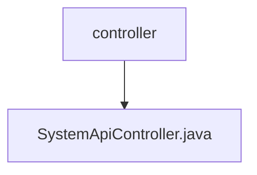

# 基础信息

|      |      |
|------|------|
| 名称 | controller |
| 编码语言 | .java |
| 代码路径 | JeecgBoot/jeecg-boot/jeecg-module-system/jeecg-system-biz/src/main/java/org/jeecg/modules/api/controller |
| 包名 | JeecgBoot.jeecg-boot.jeecg-module-system.jeecg-system-biz.src.main.java.org.jeecg.modules.api.controller |
| 概述说明 | SystemApiController支持消息发送、用户查询、字典和部门管理，处理多种模板和参数。 |

# 说明

SystemApiController是一个多功能接口控制器，提供系统消息发送、用户信息查询、字典管理和部门管理等功能。它支持处理多种消息模板和业务参数，确保系统的高效运行和灵活配置。

### 包内部结构视图

该流程图展示了`controller`文件夹与`SystemApiController.java`文件之间的层级关系。`controller`是父节点，`SystemApiController.java`是其子节点，表示该文件位于`controller`文件夹内。

# 文件列表 File List

| 名称   | 类型  | 说明 |
|-------|------|-------------|
| [SystemApiController.java](SystemApiController.md) | file | SystemApiController支持消息发送、用户查询、字典和部门管理，处理多种模板和参数。 |

