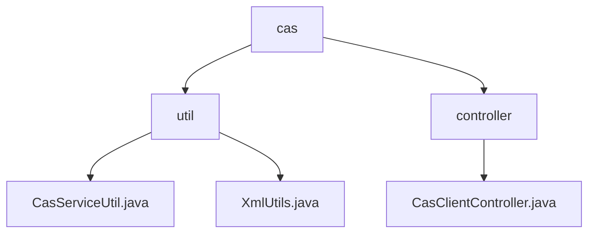

# 基础信息

|      |      |
|------|------|
| 名称 | cas |
| 编码语言 | .java |
| 代码路径 | JeecgBoot/jeecg-boot/jeecg-module-system/jeecg-system-biz/src/main/java/org/jeecg/modules/cas |
| 包名 | JeecgBoot.jeecg-boot.jeecg-module-system.jeecg-system-biz.src.main.java.org.jeecg.modules.cas |
| 概述说明 | 该模块包含`CasServiceUtil`和`XmlUtils`类，分别实现CAS票据验证和XML数据处理功能，支持安全认证和灵活数据操作。 |

# 说明

## 概述
该代码模块主要包含两个核心功能类：`CasServiceUtil`和`XmlUtils`，以及一个CAS登录验证控制器。`CasServiceUtil`类实现了CAS（中央认证服务）服务票据的验证功能，支持通过HTTP请求进行票据验证，并提供了禁用SSL（安全套接层）的选项，以确保认证过程的安全性和灵活性。`XmlUtils`类是一个用于处理XML的工具类，提供了多种XML解析功能，包括创建DOM文档、获取XMLReader、提取XML元素文本和自定义属性值等功能，使得XML数据处理更加灵活和高效。CAS登录验证控制器则用于处理用户登录验证，验证用户身份并生成相应的令牌和用户信息，确保身份验证的准确性和安全性。

## 主要业务场景
1. **CAS票据验证**：`CasServiceUtil`类用于处理HTTP请求以验证CAS票据的有效性，适用于需要集成CAS认证的系统。它允许在特定情况下关闭SSL加密，以适应不同的安全需求或环境配置。
2. **XML数据处理**：`XmlUtils`类用于处理XML数据，适用于需要解析、操作和提取XML文档内容的场景。它支持创建DOM文档、读取XML数据流、提取元素文本和自定义属性值，广泛应用于需要处理XML格式数据的业务场景中。
3. **用户登录验证**：CAS登录验证控制器用于处理用户登录验证，验证用户的登录凭证并生成令牌和用户信息。该控制器在用户登录过程中扮演关键角色，确保身份验证的准确性和安全性，并返回与用户相关的信息，如用户名、角色等，以便系统能够根据用户信息进行个性化处理。

这些组件共同构成了一个功能强大的模块，支持CAS认证、XML数据处理和用户登录验证，适用于需要安全认证和灵活数据处理的系统。

### 包内部结构视图

该流程图展示了`cas`目录下的层级结构，`cas`包含`util`和`controller`两个子目录。`util`目录下包含`CasServiceUtil.java`和`XmlUtils.java`两个文件，而`controller`目录下包含`CasClientController.java`文件。该图清晰地反映了目录与文件之间的从属关系。

# 文件列表 File List

| 名称   | 类型  | 说明 |
|-------|------|-------------|
| [controller](controller/_module.md) | package | CAS控制器处理登录验证，返回令牌及用户信息。 |
| [util](util/_module.md) | package | 代码实现CAS票据验证，支持HTTP请求和禁用SSL。XmlUtils类提供XML解析功能，支持DOM创建和元素提取。 |

