# 基础信息

|      |      |
|------|------|
| 名称 | CasClientController |
| 编码语言 | .java |
| 代码路径 | JeecgBoot/jeecg-boot/jeecg-module-system/jeecg-system-biz/src/main/java/org/jeecg/modules/cas/controller/CasClientController.java |
| 包名 | org.jeecg.modules.cas.controller |
| 依赖项 | ['java.util.List', 'javax.servlet.http.HttpServletRequest', 'javax.servlet.http.HttpServletResponse', 'org.apache.commons.lang.StringUtils', 'org.jeecg.common.api.vo.Result', 'org.jeecg.common.constant.CommonConstant', 'org.jeecg.common.system.util.JwtUtil', 'org.jeecg.common.util.RedisUtil', 'org.jeecg.modules.cas.util.CasServiceUtil', 'org.jeecg.modules.cas.util.XmlUtils', 'org.jeecg.modules.system.entity.SysDepart', 'org.jeecg.modules.system.entity.SysUser', 'org.jeecg.modules.system.service.ISysDepartService', 'org.jeecg.modules.system.service.ISysUserService', 'org.springframework.beans.factory.annotation.Autowired', 'org.springframework.beans.factory.annotation.Value', 'org.springframework.http.HttpEntity', 'org.springframework.web.bind.annotation.GetMapping', 'org.springframework.web.bind.annotation.RequestMapping', 'org.springframework.web.bind.annotation.RequestParam', 'org.springframework.web.bind.annotation.RestController', 'com.alibaba.fastjson.JSONObject', 'lombok.extern.slf4j.Slf4j'] |
| 概述说明 | CAS控制器处理登录验证，返回令牌及用户信息。 |

# 说明

CAS登录验证控制器是一个用于处理用户登录验证的模块，其主要功能是验证用户身份并生成相应的令牌和用户信息。该控制器在用户登录过程中扮演关键角色，确保身份验证的准确性和安全性。通过验证用户的登录凭证，控制器会生成一个令牌，该令牌可用于后续的会话管理和权限控制。同时，控制器还会返回与用户相关的信息，如用户名、角色等，以便系统能够根据用户信息进行个性化处理。该模块的设计旨在提供高效、安全的登录验证机制，确保用户身份的真实性和系统的安全性。

# 类列表 Class Summary

| 名称   | 类型  | 说明 |
|-------|------|-------------|
| CasClientController | class | CAS登录验证控制器，处理用户登录验证并返回令牌和用户信息。 |

## 类 CasClientController

|      |      |
|------|------|
| 访问范围 | @Slf4j;@RestController;@RequestMapping("/sys/cas/client");public |
| 类型 | class |
| 名称 | CasClientController |
| 说明 | CAS登录验证控制器，处理用户登录验证并返回令牌和用户信息。 |

### UML类图

```mermaid
classDiagram
    class CasClientController {
        -ISysUserService sysUserService
        -ISysDepartService sysDepartService
        -RedisUtil redisUtil
        -String prefixUrl
        +Object validateLogin(String ticket, String service, HttpServletRequest request, HttpServletResponse response)
    }
    class ISysUserService {
        <<Interface>>
        +SysUser getUserByName(String name)
        +Result~JSONObject~ checkUserIsEffective(SysUser sysUser)
        +void updateUserDepart(String principal, String orgCode, Object obj)
    }
    class ISysDepartService {
        <<Interface>>
        +List~SysDepart~ queryUserDeparts(String userId)
    }
    class RedisUtil {
        +void set(String key, String value)
        +void expire(String key, int seconds)
    }
    class SysUser {
        -String username
        -String password
        -String id
    }
    class SysDepart {
        -String orgCode
    }
    class Result~T~ {
        -T result
        -boolean success
        +void setResult(T result)
        +void success(String message)
        +void error500(String message)
    }
    class JSONObject {
        +void put(String key, Object value)
    }
    class HttpEntity~T~ {
        -T body
    }
    class JwtUtil {
        +String sign(String username, String password)
    }
    class XmlUtils {
        +String getTextForElement(String xml, String element)
    }
    class StringUtils {
        +boolean isEmpty(String str)
        +boolean isNotEmpty(String str)
    }
    class CasServiceUtil {
        +String getStValidate(String validateUrl, String ticket, String service)
    }
    CasClientController --> ISysUserService : 依赖
    CasClientController --> ISysDepartService : 依赖
    CasClientController --> RedisUtil : 依赖
    CasClientController --> JwtUtil : 依赖
    CasClientController --> XmlUtils : 依赖
    CasClientController --> StringUtils : 依赖
    CasClientController --> CasServiceUtil : 依赖
    ISysUserService --> SysUser : 依赖
    ISysDepartService --> SysDepart : 依赖
    Result~JSONObject~ --> JSONObject : 依赖
    HttpEntity~Result~ --> Result~JSONObject~ : 依赖
```

**描述：**
`CasClientController` 是一个Spring Boot控制器，负责处理CAS客户端的登录验证请求。它依赖于多个服务类，如 `ISysUserService` 和 `ISysDepartService`，用于获取用户信息和部门信息。控制器还使用 `RedisUtil` 来管理用户令牌，并通过 `JwtUtil` 生成JWT令牌。在验证过程中，控制器会调用 `CasServiceUtil` 来与CAS服务器进行交互，并使用 `XmlUtils` 和 `StringUtils` 来处理XML响应和字符串操作。最终，控制器返回一个包含用户信息和令牌的 `HttpEntity` 对象。

### 内部方法调用关系图

```mermaid
graph TD
    A["CasClientController类"]
    B["属性: ISysUserService sysUserService"]
    C["属性: ISysDepartService sysDepartService"]
    D["属性: RedisUtil redisUtil"]
    E["属性: String prefixUrl"]
    F["方法: validateLogin(String ticket, String service, HttpServletRequest request, HttpServletResponse response)"]
    G["创建Result<JSONObject>对象"]
    H["记录日志: 'Rest api login.'"]
    I["构建validateUrl"]
    J["调用CasServiceUtil.getStValidate(validateUrl, ticket, service)"]
    K["记录日志: 'res.'+res"]
    L["调用XmlUtils.getTextForElement(res, 'authenticationFailure')"]
    M["判断error是否为空"]
    N["抛出异常: error"]
    O["调用XmlUtils.getTextForElement(res, 'user')"]
    P["判断principal是否为空"]
    Q["抛出异常: 'No principal was found in the response from the CAS server.'"]
    R["记录日志: '-------token----username---'+principal"]
    S["调用sysUserService.getUserByName(principal)"]
    T["调用sysUserService.checkUserIsEffective(sysUser)"]
    U["判断result.isSuccess()"]
    V["返回result"]
    W["调用JwtUtil.sign(sysUser.getUsername(), sysUser.getPassword())"]
    X["调用redisUtil.set(CommonConstant.PREFIX_USER_TOKEN + token, token)"]
    Y["调用redisUtil.expire(CommonConstant.PREFIX_USER_TOKEN + token, JwtUtil.EXPIRE_TIME*2 / 1000)"]
    Z["创建JSONObject对象"]
    AA["调用sysDepartService.queryUserDeparts(sysUser.getId())"]
    AB["判断departs是否为空或大小是否为0"]
    AC["设置obj.put('multi_depart', 0)"]
    AD["判断departs大小是否为1"]
    AE["调用sysUserService.updateUserDepart(principal, departs.get(0).getOrgCode(),null)"]
    AF["设置obj.put('multi_depart', 1)"]
    AG["设置obj.put('multi_depart', 2)"]
    AH["设置obj.put('token', token)"]
    AI["设置obj.put('userInfo', sysUser)"]
    AJ["设置result.setResult(obj)"]
    AK["设置result.success('登录成功')"]
    AL["捕获异常"]
    AM["设置result.error500(e.getMessage())"]
    AN["返回new HttpEntity<>(result)"]

    A --> B
    A --> C
    A --> D
    A --> E
    A --> F
    F --> G
    F --> H
    F --> I
    F --> J
    F --> K
    F --> L
    F --> M
    M -->|是| N
    M -->|否| O
    F --> O
    F --> P
    P -->|是| Q
    P -->|否| R
    F --> S
    F --> T
    F --> U
    U -->|否| V
    U -->|是| W
    F --> W
    F --> X
    F --> Y
    F --> Z
    F --> AA
    F --> AB
    AB -->|是| AC
    AB -->|否| AD
    AD -->|是| AE
    AD -->|否| AG
    F --> AE
    F --> AF
    F --> AG
    F --> AH
    F --> AI
    F --> AJ
    F --> AK
    F --> AL
    AL --> AM
    F --> AN
```

这段代码是一个用于处理CAS（Central Authentication Service）客户端登录验证的控制器。它通过接收ticket和service参数，调用CAS服务进行验证，并根据验证结果执行一系列操作，包括用户有效性检查、生成JWT令牌、设置Redis缓存、获取用户部门信息等。最终，返回包含用户信息和登录结果的HTTP响应。

### 字段列表 Field List

| 名称  | 类型  | 说明 |
|-------|-------|------|
| sysDepartService | ISysDepartService | 自动注入系统部门服务实例。 |
| sysUserService | ISysUserService | 自动注入系统用户服务实例。 |
| redisUtil | RedisUtil | 自动注入Redis工具类实例。 |
| prefixUrl | String | 配置项prefixUrl用于定义CAS前缀URL。 |

### 方法列表 Method List

| 名称  | 类型  | 说明 |
|-------|-------|------|
| validateLogin | Object | 验证登录，获取用户信息并生成令牌，返回登录结果。 |

