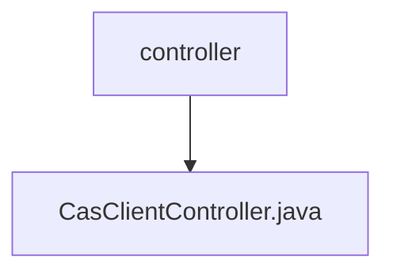

# 基础信息

|      |      |
|------|------|
| 名称 | controller |
| 编码语言 | .java |
| 代码路径 | JeecgBoot/jeecg-boot/jeecg-module-system/jeecg-system-biz/src/main/java/org/jeecg/modules/cas/controller |
| 包名 | JeecgBoot.jeecg-boot.jeecg-module-system.jeecg-system-biz.src.main.java.org.jeecg.modules.cas.controller |
| 概述说明 | CAS控制器处理登录验证，返回令牌及用户信息。 |

# 说明

CAS登录验证控制器是一个用于处理用户登录验证的模块，其主要功能是验证用户身份并生成相应的令牌和用户信息。该控制器在用户登录过程中扮演关键角色，确保身份验证的准确性和安全性。通过验证用户的登录凭证，控制器会生成一个令牌，该令牌可用于后续的会话管理和权限控制。同时，控制器还会返回与用户相关的信息，如用户名、角色等，以便系统能够根据用户信息进行个性化处理。该模块的设计旨在提供高效、安全的登录验证机制，确保用户身份的真实性和系统的安全性。

### 包内部结构视图

该流程图展示了路径中的层级关系，`controller`文件夹包含一个文件`CasClientController.java`。路径信息简洁明了，符合Mermaid格式的生成规则，节点名称仅使用路径的最后一级元素，确保了流程图的清晰性和准确性。

# 文件列表 File List

| 名称   | 类型  | 说明 |
|-------|------|-------------|
| [CasClientController.java](CasClientController.md) | file | CAS控制器处理登录验证，返回令牌及用户信息。 |

