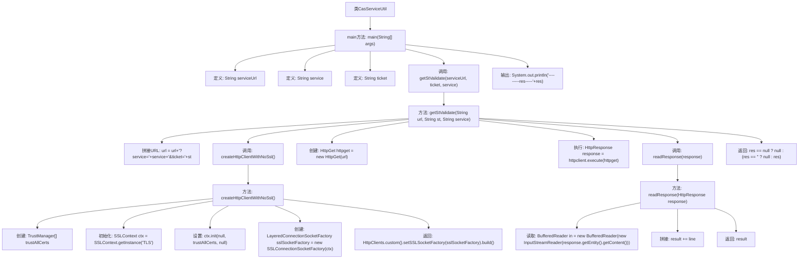

# 基础信息

|      |      |
|------|------|
| 名称 | CasServiceUtil |
| 编码语言 | .java |
| 代码路径 | JeecgBoot/jeecg-boot/jeecg-module-system/jeecg-system-biz/src/main/java/org/jeecg/modules/cas/util/CasServiceUtil.java |
| 包名 | org.jeecg.modules.cas.util |
| 依赖项 | ['java.io.BufferedReader', 'java.io.IOException', 'java.io.InputStreamReader', 'java.security.cert.X509Certificate', 'javax.net.ssl.SSLContext', 'javax.net.ssl.TrustManager', 'javax.net.ssl.X509TrustManager', 'org.apache.http.HttpResponse', 'org.apache.http.client.methods.HttpGet', 'org.apache.http.conn.socket.LayeredConnectionSocketFactory', 'org.apache.http.conn.ssl.SSLConnectionSocketFactory', 'org.apache.http.impl.client.CloseableHttpClient', 'org.apache.http.impl.client.HttpClients'] |
| 概述说明 | 该代码实现CAS服务票据验证，支持HTTP请求和SSL禁用功能。 |

# 说明

该代码实现了CAS（中央认证服务）服务票据的验证功能，支持通过HTTP请求进行票据验证，并提供了禁用SSL（安全套接层）的选项。具体功能包括处理HTTP请求以验证CAS票据的有效性，同时允许在特定情况下关闭SSL加密，以适配不同的安全需求或环境配置。该实现确保了认证过程的安全性和灵活性。

# 类列表 Class Summary

| 名称   | 类型  | 说明 |
|-------|------|-------------|
| CasServiceUtil | class | 该代码实现CAS服务票据验证，包含HTTP请求和SSL禁用功能。 |

## 类 CasServiceUtil

|      |      |
|------|------|
| 访问范围 | public |
| 类型 | class |
| 名称 | CasServiceUtil |
| 说明 | 该代码实现CAS服务票据验证，包含HTTP请求和SSL禁用功能。 |

### UML类图

```mermaid
classDiagram
    class CasServiceUtil {
        +main(String[] args) void
        +getStValidate(String url, String st, String service) String
        -readResponse(HttpResponse response) String
        -createHttpClientWithNoSsl() CloseableHttpClient
    }

    class X509TrustManager {
        <<Interface>>
        +getAcceptedIssuers() X509Certificate[]
        +checkClientTrusted(X509Certificate[] certs, String authType) void
        +checkServerTrusted(X509Certificate[] certs, String authType) void
    }

    class SSLContext {
        +getInstance(String protocol) SSLContext
        +init(KeyManager[] km, TrustManager[] tm, SecureRandom random) void
    }

    class LayeredConnectionSocketFactory {
        <<Interface>>
    }

    class SSLConnectionSocketFactory {
        +SSLConnectionSocketFactory(SSLContext ctx)
    }

    class HttpClients {
        +custom() HttpClientBuilder
    }

    class HttpClientBuilder {
        +setSSLSocketFactory(LayeredConnectionSocketFactory sslSocketFactory) HttpClientBuilder
        +build() CloseableHttpClient
    }

    class CloseableHttpClient {
        +execute(HttpUriRequest request) HttpResponse
    }

    class HttpGet {
        +HttpGet(String uri)
    }

    class HttpResponse {
        +getEntity() HttpEntity
    }

    class HttpEntity {
        +getContent() InputStream
    }

    class BufferedReader {
        +BufferedReader(Reader in)
        +readLine() String
    }

    class InputStreamReader {
        +InputStreamReader(InputStream in)
    }

    CasServiceUtil --> X509TrustManager : 依赖
    CasServiceUtil --> SSLContext : 依赖
    CasServiceUtil --> LayeredConnectionSocketFactory : 依赖
    CasServiceUtil --> SSLConnectionSocketFactory : 依赖
    CasServiceUtil --> HttpClients : 依赖
    CasServiceUtil --> HttpClientBuilder : 依赖
    CasServiceUtil --> CloseableHttpClient : 依赖
    CasServiceUtil --> HttpGet : 依赖
    CasServiceUtil --> HttpResponse : 依赖
    CasServiceUtil --> HttpEntity : 依赖
    CasServiceUtil --> BufferedReader : 依赖
    CasServiceUtil --> InputStreamReader : 依赖
```

### 描述
`CasServiceUtil` 类主要用于通过 HTTP 请求验证 CAS 服务票据（ST）。它包含三个主要方法：`getStValidate` 用于验证 ST 并返回响应内容，`readResponse` 用于读取 HTTP 响应的内容，`createHttpClientWithNoSsl` 用于创建一个禁用 SSL 验证的 HTTP 客户端。该类依赖于多个外部类，如 `X509TrustManager`、`SSLContext`、`HttpClients` 等，以实现 HTTPS 请求的处理和 SSL 验证的禁用。

### 内部方法调用关系图

该流程图描述了`CasServiceUtil`类的主要执行流程。首先，`main`方法定义了服务URL、服务和票据，并调用`getStValidate`方法进行ST验证。`getStValidate`方法拼接URL，创建HTTP客户端，执行HTTP请求，并读取响应内容。`createHttpClientWithNoSsl`方法创建了一个禁用SSL验证的HTTP客户端，而`readResponse`方法则负责读取HTTP响应内容并将其拼接为字符串。最终，`main`方法输出验证结果。

### 字段列表 Field List

| 名称  | 类型  | 说明 |
|-------|-------|------|

### 方法列表 Method List

| 名称  | 类型  | 说明 |
|-------|-------|------|
| main | void | Java代码调用CAS服务验证票据并输出结果。 |
| readResponse | String | 读取HTTP响应内容并返回字符串。 |
| createHttpClientWithNoSsl | CloseableHttpClient | 创建不验证SSL证书的HTTP客户端。 |
| getStValidate | String | 该方法通过HTTP GET请求验证服务票据，返回响应内容或空值。 |

