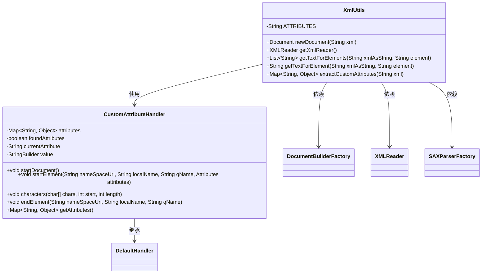
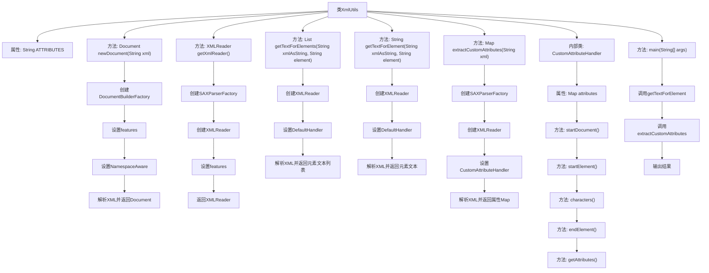

# 基础信息

|      |      |
|------|------|
| 名称 | XmlUtils |
| 编码语言 | .java |
| 代码路径 | JeecgBoot/jeecg-boot/jeecg-module-system/jeecg-system-biz/src/main/java/org/jeecg/modules/cas/util/XmlUtils.java |
| 包名 | org.jeecg.modules.cas.util |
| 依赖项 | ['java.io.StringReader', 'java.util.ArrayList', 'java.util.Collections', 'java.util.HashMap', 'java.util.LinkedList', 'java.util.List', 'java.util.Map', 'javax.xml.XMLConstants', 'javax.xml.parsers.DocumentBuilderFactory', 'javax.xml.parsers.ParserConfigurationException', 'javax.xml.parsers.SAXParser', 'javax.xml.parsers.SAXParserFactory', 'org.jeecg.common.constant.CommonConstant', 'org.w3c.dom.Document', 'org.xml.sax.Attributes', 'org.xml.sax.InputSource', 'org.xml.sax.SAXException', 'org.xml.sax.XMLReader', 'org.xml.sax.helpers.DefaultHandler', 'lombok.extern.slf4j.Slf4j'] |
| 概述说明 | XmlUtils类提供XML解析功能，支持DOM创建、读取器获取及元素属性提取。 |

# 说明

XmlUtils类是一个用于处理XML的工具类，提供了多种XML解析功能。它支持创建DOM文档，能够生成XML文档对象模型，便于进一步操作和解析。该类还支持获取XMLReader，用于读取XML数据流。此外，XmlUtils类具备提取XML元素文本的能力，能够从XML文档中获取指定元素的文本内容。同时，它还支持提取自定义属性，允许用户从XML元素中获取自定义的属性值。这些功能使得XmlUtils类在处理XML数据时非常灵活和高效。

# 类列表 Class Summary

| 名称   | 类型  | 说明 |
|-------|------|-------------|
| XmlUtils | class | XmlUtils类提供XML解析功能，支持创建DOM文档、获取XMLReader、提取元素文本及自定义属性。 |

## 类 XmlUtils

|      |      |
|------|------|
| 访问范围 | @Slf4j;public final |
| 类型 | class |
| 名称 | XmlUtils |
| 说明 | XmlUtils类提供XML解析功能，支持创建DOM文档、获取XMLReader、提取元素文本及自定义属性。 |

### UML类图

### 类图描述
`XmlUtils` 是一个工具类，提供了多种与 XML 处理相关的方法，包括创建 DOM 文档、获取 XML 读取器、提取 XML 元素文本以及提取自定义属性。`CustomAttributeHandler` 是 `XmlUtils` 的内部类，继承自 `DefaultHandler`，用于处理 XML 文档中的自定义属性。`XmlUtils` 类依赖于 `DocumentBuilderFactory`、`XMLReader` 和 `SAXParserFactory` 来实现其功能。

### 内部方法调用关系图

这段代码定义了一个`XmlUtils`类，主要用于处理XML文档。它提供了多种方法来解析XML，包括创建DOM文档、获取XMLReader、提取特定元素的文本内容以及提取自定义属性。代码还包含一个内部类`CustomAttributeHandler`，用于处理XML中的自定义属性。`main`方法展示了如何使用这些方法来解析XML并输出结果。流程图清晰地展示了各个方法之间的调用关系和执行流程。

### 字段列表 Field List

| 名称  | 类型  | 说明 |
|-------|-------|------|
| ATTRIBUTES = "attributes" | String | 定义私有静态常量ATTRIBUTES，值为"attributes"。 |

### 方法列表 Method List

| 名称  | 类型  | 说明 |
|-------|-------|------|
| getXmlReader | XMLReader | 创建XMLReader并设置命名空间和外部DTD加载特性。 |
| getTextForElements | List<String> | 解析XML字符串，提取指定元素内容并返回列表。 |
| getTextForElement | String | 从XML字符串中提取指定元素的文本内容。 |
| newDocument | Document | 创建XML文档对象，配置安全处理和禁用外部DTD，支持命名空间，解析异常抛出运行时错误。 |
| main | void | Java代码解析CAS认证响应，提取用户信息和错误信息。 |
| extractCustomAttributes | Map<String, Object> | 从XML中提取自定义属性的静态方法，使用SAX解析器处理，异常时返回空映射。 |

