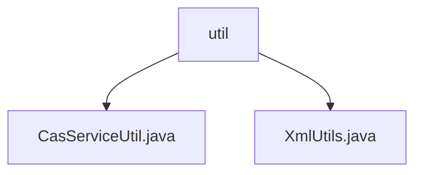

# 基础信息

|      |      |
|------|------|
| 名称 | util |
| 编码语言 | .java |
| 代码路径 | JeecgBoot/jeecg-boot/jeecg-module-system/jeecg-system-biz/src/main/java/org/jeecg/modules/cas/util |
| 包名 | JeecgBoot.jeecg-boot.jeecg-module-system.jeecg-system-biz.src.main.java.org.jeecg.modules.cas.util |
| 概述说明 | 代码实现CAS票据验证，支持HTTP请求和禁用SSL。XmlUtils类提供XML解析功能，支持DOM创建和元素提取。 |

# 说明

## 概述
该代码模块主要包含两个核心功能类：`CasServiceUtil`和`XmlUtils`。`CasServiceUtil`类实现了CAS（中央认证服务）服务票据的验证功能，支持通过HTTP请求进行票据验证，并提供了禁用SSL（安全套接层）的选项，以确保认证过程的安全性和灵活性。`XmlUtils`类是一个用于处理XML的工具类，提供了多种XML解析功能，包括创建DOM文档、获取XMLReader、提取XML元素文本和自定义属性值等功能，使得XML数据处理更加灵活和高效。

## 主要业务场景
1. **CAS票据验证**：`CasServiceUtil`类用于处理HTTP请求以验证CAS票据的有效性，适用于需要集成CAS认证的系统。它允许在特定情况下关闭SSL加密，以适应不同的安全需求或环境配置。
2. **XML数据处理**：`XmlUtils`类用于处理XML数据，适用于需要解析、操作和提取XML文档内容的场景。它支持创建DOM文档、读取XML数据流、提取元素文本和自定义属性值，广泛应用于需要处理XML格式数据的业务场景中。

这两个类共同构成了一个功能强大的模块，支持CAS认证和XML数据处理，适用于需要安全认证和灵活数据处理的系统。

### 包内部结构视图

该流程图展示了路径2中的层级关系，`util`文件夹下包含两个文件：`CasServiceUtil.java`和`XmlUtils.java`。路径2的结构较为简单，仅包含一个文件夹及其下的两个文件，清晰地反映了文件之间的层级关系。

# 文件列表 File List

| 名称   | 类型  | 说明 |
|-------|------|-------------|
| [CasServiceUtil.java](CasServiceUtil.md) | file | 该代码实现CAS服务票据验证，支持HTTP请求和SSL禁用功能。 |
| [XmlUtils.java](XmlUtils.md) | file | XmlUtils类提供XML解析功能，支持DOM创建、读取器获取及元素属性提取。 |

