# 基础信息

|      |      |
|------|------|
| 名称 | message |
| 编码语言 | .java |
| 代码路径 | JeecgBoot/jeecg-boot/jeecg-module-system/jeecg-system-biz/src/main/java/org/jeecg/modules/message |
| 包名 | JeecgBoot.jeecg-boot.jeecg-module-system.jeecg-system-biz.src.main.java.org.jeecg.modules.message |
| 概述说明 | 该模块处理系统消息发送，包括模板管理、参数传递、状态追踪，支持多种消息类型和实时通信。 |

# 说明

## 概述

该代码模块是JeecgBoot项目中`jeecg-module-system`模块的一部分，专注于系统消息的管理和发送。模块涵盖了从消息模板的定义、消息参数的传递、消息的发送与记录，到实时通信的全流程管理。通过多个核心类和接口，模块提供了高效、灵活的消息处理机制，支持多种消息类型（如短信、邮件、微信、钉钉等）和多种通信方式（如WebSocket、Redis发布订阅等）。模块的设计旨在确保消息的准确传递、模板的可复用性以及消息发送过程的可追踪性。

## 主要业务场景

1. **消息模板管理**：通过`SysMessageTemplate`类和相关控制器，系统能够定义和管理不同类型的消息模板。模板通过唯一的模板CODE标识，支持标题、内容、测试数据、类型和应用状态等字段的配置，确保消息内容的一致性和可复用性。

2. **消息参数传递**：`MsgParams`类用于管理消息处理过程中的关键参数，包括消息类型、接收方、模板码和测试数据。这些参数确保消息能够根据模板生成，并准确地发送给指定的接收方，同时支持在测试环境中进行验证和调试。

3. **系统消息记录与追踪**：`SysMessage`类和相关Mapper接口负责记录系统消息的详细信息，包括推送内容、参数、接收人、失败原因、发送次数、状态、时间、标题、方式和备注等。通过这些字段，系统能够全面追踪消息的发送状态、失败原因以及发送次数等信息，便于后续的监控和问题排查。

4. **消息发送与处理**：模块通过`SendMsgJob`、`PushMsgUtil`以及多个`Handle`类（如`DdSendMsgHandle`、`SmsSendMsgHandle`等）实现了多通道消息发送系统。支持通过短信、邮件、微信、钉钉、企业微信等多种通信平台进行消息发送，并提供了消息发送状态记录、定时发送、变量替换等高级功能。

5. **实时通信**：通过WebSocket协议和Redis发布订阅机制，模块实现了用户与服务器之间的实时双向通信。支持群发和单发功能，适用于在线聊天、实时通知等需要即时消息传递的业务场景。

6. **消息管理操作**：通过`SysMessageController`和`SysMessageTemplateController`，用户可以高效地管理和操作消息数据。支持分页查询、添加、编辑、删除、批量删除、ID查询以及Excel导入导出功能，便于用户在不同业务场景下进行消息数据的维护和迁移。

7. **消息发送状态与类型管理**：通过`SendMsgTypeEnum`和`SendMsgStatusEnum`枚举类，模块定义了消息发送的不同类型和状态，确保消息处理的一致性和可维护性。

该模块通过灵活的架构设计和丰富的功能支持，能够满足企业或系统在不同场景下的消息管理和发送需求，确保消息的可靠传递和高效管理。

### 包内部结构视图

```mermaid
graph TD
    message --> job
    message --> util
    message --> entity
    message --> controller
    message --> enums
    message --> service
    message --> websocket
    message --> mapper
    message --> handle
    job --> SendMsgJob.java
    util --> PushMsgUtil.java
    entity --> SysMessageTemplate.java
    entity --> MsgParams.java
    entity --> SysMessage.java
    controller --> SysMessageController.java
    controller --> SysMessageTemplateController.java
    controller --> TestSocketController.java
    enums --> RangeDateEnum.java
    service --> ISysMessageService.java
    service --> ISysMessageTemplateService.java
    service --> impl
    impl --> SysMessageTemplateServiceImpl.java
    impl --> SysMessageServiceImpl.java
    websocket --> WebSocket.java
    websocket --> SocketHandler.java
    mapper --> xml
    mapper --> SysMessageTemplateMapper.java
    mapper --> SysMessageMapper.java
    handle --> enums
    handle --> ISendMsgHandle.java
    handle --> impl
    enums --> SendMsgTypeEnum.java
    enums --> SendMsgStatusEnum.java
    impl --> DdSendMsgHandle.java
    impl --> SmsSendMsgHandle.java
    impl --> QywxSendMsgHandle.java
    impl --> EmailSendMsgHandle.java
    impl --> SystemSendMsgHandle.java
    impl --> WxSendMsgHandle.java
```

该流程图展示了一个消息模块的目录结构及其子目录和文件的层级关系。根目录为`message`，其下包含多个子目录如`job`、`util`、`entity`等，每个子目录中又包含具体的Java文件。这些文件和目录共同构成了一个完整的消息处理系统，涵盖了消息的发送、处理、存储和管理等功能。

# 文件列表 File List

| 名称   | 类型  | 说明 |
|-------|------|-------------|
| [handle](handle/_module.md) | package | JeecgBoot框架的消息发送模块，支持短信、邮件、微信等多渠道发送，管理消息类型和状态，确保可靠传递。 |
| [mapper](mapper/_module.md) | package | 输入内容为空，无法生成总结描述。 |
| [websocket](websocket/_module.md) | package | WebSocket类管理连接、消息推送及Redis发布，实现实时通信。SocketHandler类通过Redis订阅定向推送消息。 |
| [service](service/_module.md) | package | 该模块处理系统消息和模板管理，支持高效消息处理和模板查询。 |
| [enums](enums/_module.md) | package | 输入信息为空，无法生成概要描述。 |
| [controller](controller/_module.md) | package | SysMessageController管理消息，支持分页查询、增删改、批量操作、Excel导入导出。SysMessageTemplateController处理消息模板，支持发送消息。TestSocketController处理WebSocket消息，支持群发和单发。 |
| [entity](entity/_module.md) | package | SysMessageTemplate类管理消息模板，含CODE、标题、内容等字段。MsgParams类管理消息参数，含消息类型、接收方等字段。SysMessage类记录系统消息，含推送内容、接收人等字段。 |
| [util](util/_module.md) | package | PushMsgUtil类通过模板发送短信、邮件和微信，处理内容并保存记录。 |
| [job](job/_module.md) | package | SendMsgJob类负责处理未发送或失败的消息，调用sysBaseAPI发送模板消息并更新状态。 |

