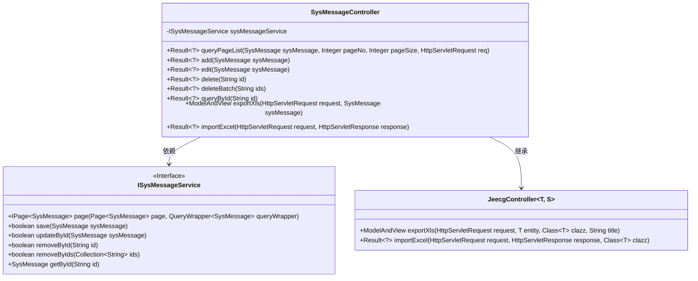

# 基础信息

|      |      |
|------|------|
| 名称 | SysMessageController |
| 编码语言 | .java |
| 代码路径 | JeecgBoot/jeecg-boot/jeecg-module-system/jeecg-system-biz/src/main/java/org/jeecg/modules/message/controller/SysMessageController.java |
| 包名 | org.jeecg.modules.message.controller |
| 依赖项 | ['java.util.Arrays', 'javax.servlet.http.HttpServletRequest', 'javax.servlet.http.HttpServletResponse', 'org.jeecg.common.api.vo.Result', 'org.jeecg.common.system.base.controller.JeecgController', 'org.jeecg.common.system.query.QueryGenerator', 'org.jeecg.modules.message.entity.SysMessage', 'org.jeecg.modules.message.service.ISysMessageService', 'org.springframework.beans.factory.annotation.Autowired', 'org.springframework.web.bind.annotation.DeleteMapping', 'org.springframework.web.bind.annotation.GetMapping', 'org.springframework.web.bind.annotation.PostMapping', 'org.springframework.web.bind.annotation.PutMapping', 'org.springframework.web.bind.annotation.RequestBody', 'org.springframework.web.bind.annotation.RequestMapping', 'org.springframework.web.bind.annotation.RequestParam', 'org.springframework.web.bind.annotation.RestController', 'org.springframework.web.servlet.ModelAndView', 'com.baomidou.mybatisplus.core.conditions.query.QueryWrapper', 'com.baomidou.mybatisplus.core.metadata.IPage', 'com.baomidou.mybatisplus.extension.plugins.pagination.Page', 'lombok.extern.slf4j.Slf4j'] |
| 概述说明 | SysMessageController支持消息的分页查询、增删改查及Excel导入导出。 |

# 说明

SysMessageController是一个功能全面的消息管理模块，提供了消息的分页查询、添加、编辑、删除、批量删除、ID查询以及Excel导入导出功能。通过这些功能，用户可以高效地管理和操作消息数据，支持多种操作方式以满足不同的业务需求。

# 类列表 Class Summary

| 名称   | 类型  | 说明 |
|-------|------|-------------|
| SysMessageController | class | SysMessageController提供消息的分页查询、添加、编辑、删除、批量删除、ID查询及Excel导入导出功能。 |

## 类 SysMessageController

|      |      |
|------|------|
| 访问范围 | @Slf4j;@RestController;@RequestMapping("/sys/message/sysMessage");public |
| 类型 | class |
| 名称 | SysMessageController |
| 说明 | SysMessageController提供消息的分页查询、添加、编辑、删除、批量删除、ID查询及Excel导入导出功能。 |

### UML类图

**描述：**
`SysMessageController` 是一个Spring Boot控制器，继承自 `JeecgController`，并依赖于 `ISysMessageService` 接口。该控制器提供了对系统消息的分页查询、添加、编辑、删除、批量删除、查询、导出Excel和导入Excel等功能。`ISysMessageService` 接口定义了与系统消息相关的CRUD操作。`JeecgController` 是一个泛型控制器，提供了导出和导入Excel的通用方法。

### 内部方法调用关系图

```mermaid
graph TD
    A["类SysMessageController"]
    B["属性: ISysMessageService sysMessageService"]
    C["方法: Result<?> queryPageList(SysMessage sysMessage, Integer pageNo, Integer pageSize, HttpServletRequest req)"]
    D["方法: Result<?> add(@RequestBody SysMessage sysMessage)"]
    E["方法: Result<?> edit(@RequestBody SysMessage sysMessage)"]
    F["方法: Result<?> delete(@RequestParam String id)"]
    G["方法: Result<?> deleteBatch(@RequestParam String ids)"]
    H["方法: Result<?> queryById(@RequestParam String id)"]
    I["方法: ModelAndView exportXls(HttpServletRequest request, SysMessage sysMessage)"]
    J["方法: Result<?> importExcel(HttpServletRequest request, HttpServletResponse response)"]

    A --> B
    A --> C
    A --> D
    A --> E
    A --> F
    A --> G
    A --> H
    A --> I
    A --> J

    C --> K["QueryWrapper<SysMessage> queryWrapper = QueryGenerator.initQueryWrapper(sysMessage, req.getParameterMap())"]
    C --> L["Page<SysMessage> page = new Page<SysMessage>(pageNo, pageSize)"]
    C --> M["IPage<SysMessage> pageList = sysMessageService.page(page, queryWrapper)"]
    C --> N["return Result.ok(pageList)"]

    D --> O["sysMessageService.save(sysMessage)"]
    D --> P["return Result.ok('添加成功！')"]

    E --> Q["sysMessageService.updateById(sysMessage)"]
    E --> R["return Result.ok('修改成功!')"]

    F --> S["sysMessageService.removeById(id)"]
    F --> T["return Result.ok('删除成功!')"]

    G --> U["this.sysMessageService.removeByIds(Arrays.asList(ids.split(',')))"]
    G --> V["return Result.ok('批量删除成功！')"]

    H --> W["SysMessage sysMessage = sysMessageService.getById(id)"]
    H --> X["return Result.ok(sysMessage)"]

    I --> Y["return super.exportXls(request, sysMessage, SysMessage.class, '推送消息模板')"]

    J --> Z["return super.importExcel(request, response, SysMessage.class)"]
```

**描述：**  
`SysMessageController` 是一个用于管理系统消息的控制器类，继承自 `JeecgController`。它提供了分页查询、添加、编辑、删除、批量删除、通过ID查询、导出Excel和导入Excel等功能。每个方法都通过 `sysMessageService` 调用相应的服务层方法，并返回操作结果。流程图展示了各个方法的调用关系及其内部逻辑步骤，清晰地反映了控制器的功能结构和数据处理流程。

### 字段列表 Field List

| 名称  | 类型  | 说明 |
|-------|-------|------|
| sysMessageService | ISysMessageService | 自动注入系统消息服务接口实例。 |

### 方法列表 Method List

| 名称  | 类型  | 说明 |
|-------|-------|------|
| queryById | Result<?> | 通过ID查询系统消息并返回结果。 |
| queryPageList | Result<?> | 通过分页查询系统消息列表，返回查询结果。 |
| exportXls | ModelAndView | GET请求导出XLS文件，处理推送消息模板。 |
| edit | Result<?> | 通过Put请求编辑系统消息并返回成功结果。 |
| importExcel | Result<?> | PostMapping注解的importExcel方法处理Excel导入请求，返回Result对象。 |
| deleteBatch | Result<?> | 通过ID批量删除数据，调用服务方法完成操作并返回成功信息。 |
| delete | Result<?> | 删除接口，接收ID参数，调用服务删除并返回成功信息。 |
| add | Result<?> | 通过POST请求添加系统消息并返回成功结果。 |

