# 基础信息

|      |      |
|------|------|
| 名称 | SysMessageTemplateController |
| 编码语言 | .java |
| 代码路径 | JeecgBoot/jeecg-boot/jeecg-module-system/jeecg-system-biz/src/main/java/org/jeecg/modules/message/controller/SysMessageTemplateController.java |
| 包名 | org.jeecg.modules.message.controller |
| 依赖项 | ['java.util.Arrays', 'java.util.Map', 'javax.servlet.http.HttpServletRequest', 'javax.servlet.http.HttpServletResponse', 'org.jeecg.common.api.dto.message.MessageDTO', 'org.jeecg.common.api.vo.Result', 'org.jeecg.common.system.api.ISysBaseAPI', 'org.jeecg.common.system.base.controller.JeecgController', 'org.jeecg.common.system.query.QueryGenerator', 'org.jeecg.common.util.oConvertUtils', 'org.jeecg.modules.message.entity.MsgParams', 'org.jeecg.modules.message.entity.SysMessageTemplate', 'org.jeecg.modules.message.service.ISysMessageTemplateService', 'org.jeecg.modules.message.util.PushMsgUtil', 'org.springframework.beans.factory.annotation.Autowired', 'org.springframework.web.bind.annotation.DeleteMapping', 'org.springframework.web.bind.annotation.GetMapping', 'org.springframework.web.bind.annotation.PostMapping', 'org.springframework.web.bind.annotation.PutMapping', 'org.springframework.web.bind.annotation.RequestBody', 'org.springframework.web.bind.annotation.RequestMapping', 'org.springframework.web.bind.annotation.RequestParam', 'org.springframework.web.bind.annotation.RestController', 'org.springframework.web.servlet.ModelAndView', 'com.alibaba.fastjson.JSON', 'com.baomidou.mybatisplus.core.conditions.query.QueryWrapper', 'com.baomidou.mybatisplus.core.metadata.IPage', 'com.baomidou.mybatisplus.extension.plugins.pagination.Page', 'lombok.extern.slf4j.Slf4j'] |
| 概述说明 | 控制器管理消息模板，支持增删改查、分页、批量操作及消息发送。 |

# 说明

该控制器负责管理消息模板，提供多种功能以满足不同需求。它支持分页查询，便于用户浏览大量数据。用户可以通过该控制器添加新的消息模板，或对现有模板进行编辑和删除操作。此外，控制器还支持批量删除，提高操作效率。查询功能帮助用户快速定位特定模板。为方便数据管理，控制器提供导出和导入Excel文件的功能，便于数据的备份和迁移。最后，控制器还具备发送消息的功能，允许用户直接通过模板发送消息。

# 类列表 Class Summary

| 名称   | 类型  | 说明 |
|-------|------|-------------|
| SysMessageTemplateController | class | 该控制器管理消息模板，支持分页查询、添加、编辑、删除、批量删除、查询、导出导入Excel及发送消息功能。 |

## 类 SysMessageTemplateController

|      |      |
|------|------|
| 访问范围 | @Slf4j;@RestController;@RequestMapping("/sys/message/sysMessageTemplate");public |
| 类型 | class |
| 名称 | SysMessageTemplateController |
| 说明 | 该控制器管理消息模板，支持分页查询、添加、编辑、删除、批量删除、查询、导出导入Excel及发送消息功能。 |

### UML类图

```mermaid
classDiagram
    class SysMessageTemplateController {
        -ISysMessageTemplateService sysMessageTemplateService
        -PushMsgUtil pushMsgUtil
        -ISysBaseAPI sysBaseApi
        +Result~?~ queryPageList(SysMessageTemplate sysMessageTemplate, Integer pageNo, Integer pageSize, HttpServletRequest req)
        +Result~?~ add(SysMessageTemplate sysMessageTemplate)
        +Result~?~ edit(SysMessageTemplate sysMessageTemplate)
        +Result~?~ delete(String id)
        +Result~?~ deleteBatch(String ids)
        +Result~?~ queryById(String id)
        +ModelAndView exportXls(HttpServletRequest request, SysMessageTemplate sysMessageTemplate)
        +Result~?~ importExcel(HttpServletRequest request, HttpServletResponse response)
        +Result~SysMessageTemplate~ sendMessage(MsgParams msgParams)
    }

    class ISysMessageTemplateService {
        <<Interface>>
        +IPage~SysMessageTemplate~ page(Page~SysMessageTemplate~ page, QueryWrapper~SysMessageTemplate~ queryWrapper)
        +boolean save(SysMessageTemplate sysMessageTemplate)
        +boolean updateById(SysMessageTemplate sysMessageTemplate)
        +boolean removeById(String id)
        +boolean removeByIds(List~String~ ids)
        +SysMessageTemplate getById(String id)
    }

    class PushMsgUtil {
        // 工具类，未定义具体方法
    }

    class ISysBaseAPI {
        <<Interface>>
        +void sendTemplateMessage(MessageDTO md)
    }

    class MessageDTO {
        -boolean toAll
        -String title
        -String templateCode
        -String toUser
        -String type
        -Map~String, Object~ data
        +void setToAll(boolean toAll)
        +void setTitle(String title)
        +void setTemplateCode(String templateCode)
        +void setToUser(String toUser)
        +void setType(String type)
        +void setData(Map~String, Object~ data)
    }

    class MsgParams {
        -String templateCode
        -String receiver
        -String msgType
        -String testData
        +String getTemplateCode()
        +String getReceiver()
        +String getMsgType()
        +String getTestData()
    }

    class Result~T~ {
        +Result~T~ success(String message)
        +Result~T~ error500(String message)
    }

    class QueryWrapper~T~ {
        +QueryWrapper~T~ initQueryWrapper(T entity, Map~String, String~ parameterMap)
    }

    class Page~T~ {
        +Page~T~(Integer pageNo, Integer pageSize)
    }

    class IPage~T~ {
        <<Interface>>
        // 分页接口，未定义具体方法
    }

    SysMessageTemplateController --> ISysMessageTemplateService : 依赖
    SysMessageTemplateController --> PushMsgUtil : 依赖
    SysMessageTemplateController --> ISysBaseAPI : 依赖
    SysMessageTemplateController --> MessageDTO : 依赖
    SysMessageTemplateController --> MsgParams : 依赖
    SysMessageTemplateController --> Result~?~ : 依赖
    SysMessageTemplateController --> QueryWrapper~SysMessageTemplate~ : 依赖
    SysMessageTemplateController --> Page~SysMessageTemplate~ : 依赖
    SysMessageTemplateController --> IPage~SysMessageTemplate~ : 依赖
```

### 描述
`SysMessageTemplateController` 是一个基于Spring Boot的控制器类，负责处理与系统消息模板相关的HTTP请求。它依赖于 `ISysMessageTemplateService` 接口进行数据库操作，并使用 `PushMsgUtil` 和 `ISysBaseAPI` 进行消息推送。控制器提供了分页查询、添加、编辑、删除、批量删除、查询单个记录、导出Excel、导入Excel以及发送消息等功能。通过 `Result` 类返回操作结果，并使用 `QueryWrapper` 和 `Page` 类进行分页查询。

### 内部方法调用关系图

```mermaid
graph TD
    A["类SysMessageTemplateController"]
    B["属性: ISysMessageTemplateService sysMessageTemplateService"]
    C["属性: PushMsgUtil pushMsgUtil"]
    D["属性: ISysBaseAPI sysBaseApi"]
    E["方法: Result<?> queryPageList(SysMessageTemplate sysMessageTemplate, Integer pageNo, Integer pageSize, HttpServletRequest req)"]
    F["方法: Result<?> add(@RequestBody SysMessageTemplate sysMessageTemplate)"]
    G["方法: Result<?> edit(@RequestBody SysMessageTemplate sysMessageTemplate)"]
    H["方法: Result<?> delete(@RequestParam String id)"]
    I["方法: Result<?> deleteBatch(@RequestParam String ids)"]
    J["方法: Result<?> queryById(@RequestParam String id)"]
    K["方法: ModelAndView exportXls(HttpServletRequest request, SysMessageTemplate sysMessageTemplate)"]
    L["方法: Result<?> importExcel(HttpServletRequest request, HttpServletResponse response)"]
    M["方法: Result<SysMessageTemplate> sendMessage(@RequestBody MsgParams msgParams)"]

    A --> B
    A --> C
    A --> D
    A --> E
    A --> F
    A --> G
    A --> H
    A --> I
    A --> J
    A --> K
    A --> L
    A --> M
```

这段代码定义了一个名为 `SysMessageTemplateController` 的控制器类，它继承自 `JeecgController` 并实现了多个与消息模板相关的操作。控制器类中包含了分页查询、添加、编辑、删除、批量删除、查询单个记录、导出Excel、导入Excel以及发送消息等功能。每个方法都通过不同的HTTP请求方式（如GET、POST、PUT、DELETE）来处理相应的业务逻辑，并返回结果或视图。

### 字段列表 Field List

| 名称  | 类型  | 说明 |
|-------|-------|------|
| sysMessageTemplateService | ISysMessageTemplateService | 自动注入系统消息模板服务实例。 |
| pushMsgUtil | PushMsgUtil | 自动注入推送消息工具类。 |
| sysBaseApi | ISysBaseAPI | 自动注入系统基础API接口实例。 |

### 方法列表 Method List

| 名称  | 类型  | 说明 |
|-------|-------|------|
| exportXls | ModelAndView | `exportXls`方法通过HTTP GET请求导出推送消息模板的Excel文件。 |
| queryById | Result<?> | 通过ID查询系统消息模板并返回结果。 |
| queryPageList | Result<?> | 查询消息模板列表，支持分页和条件查询。 |
| importExcel | Result<?> | 导入Excel数据的API接口，调用父类方法处理请求和响应。 |
| deleteBatch | Result<?> | 批量删除功能，接收ID参数并调用服务删除，返回成功信息。 |
| delete | Result<?> | 删除接口，接收ID参数，调用服务删除并返回成功信息。 |
| add | Result<?> | 使用PostMapping注解的add方法，接收SysMessageTemplate对象并保存，返回成功信息。 |
| edit | Result<?> | PUT请求处理编辑操作，更新系统消息模板并返回成功结果。 |
| sendMessage | Result<SysMessageTemplate> | 发送消息接口，处理消息参数并调用模板消息发送，返回成功或错误结果。 |

