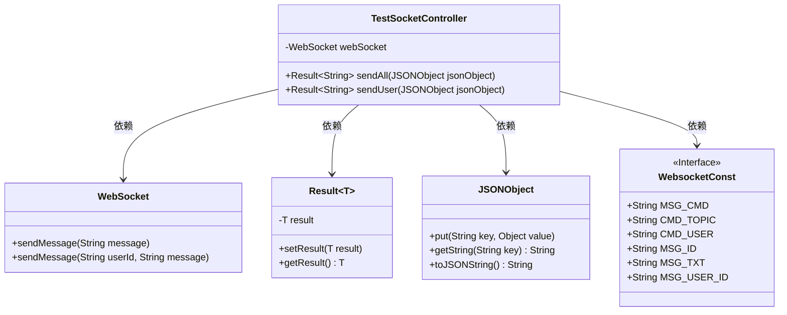

# 基础信息

|      |      |
|------|------|
| 名称 | TestSocketController |
| 编码语言 | .java |
| 代码路径 | JeecgBoot/jeecg-boot/jeecg-module-system/jeecg-system-biz/src/main/java/org/jeecg/modules/message/controller/TestSocketController.java |
| 包名 | org.jeecg.modules.message.controller |
| 依赖项 | ['org.jeecg.common.api.vo.Result', 'org.jeecg.common.constant.WebsocketConst', 'org.jeecg.modules.message.websocket.WebSocket', 'org.springframework.beans.factory.annotation.Autowired', 'org.springframework.web.bind.annotation.PostMapping', 'org.springframework.web.bind.annotation.RequestBody', 'org.springframework.web.bind.annotation.RequestMapping', 'org.springframework.web.bind.annotation.RestController', 'com.alibaba.fastjson.JSONObject'] |
| 概述说明 | 控制器处理WebSocket消息，支持群发和单发。 |

# 说明

控制器负责处理WebSocket消息，具备群发和单发功能。群发功能允许同时向多个客户端发送消息，而单发功能则针对特定客户端进行消息传递。该控制器通过WebSocket协议实现实时通信，确保消息的高效传输和接收。其设计旨在满足不同场景下的消息传递需求，提供灵活且可靠的消息处理机制。

# 类列表 Class Summary

| 名称   | 类型  | 说明 |
|-------|------|-------------|
| TestSocketController | class | 控制器处理WebSocket消息，支持群发和单发功能。 |

## 类 TestSocketController

|      |      |
|------|------|
| 访问范围 | @RestController;@RequestMapping("/sys/socketTest");public |
| 类型 | class |
| 名称 | TestSocketController |
| 说明 | 控制器处理WebSocket消息，支持群发和单发功能。 |

### UML类图

**描述：**  
`TestSocketController` 是一个 Spring 控制器，负责处理 WebSocket 消息的发送请求。它依赖于 `WebSocket` 类来发送消息，并使用了 `Result` 类来封装返回结果。控制器中的两个方法 `sendAll` 和 `sendUser` 分别用于群发消息和单发消息，它们通过 `JSONObject` 类解析请求体，并使用 `WebsocketConst` 接口中的常量来构建消息。`WebSocket` 类提供了发送消息的方法，支持向所有用户或特定用户发送消息。

### 内部方法调用关系图

```mermaid
graph TD
    A["类TestSocketController"]
    B["属性: WebSocket webSocket"]
    C["方法: Result<String> sendAll(JSONObject jsonObject)"]
    D["方法: Result<String> sendUser(JSONObject jsonObject)"]
    E["创建Result对象: Result<String> result = new Result<String>()"]
    F["获取消息内容: String message = jsonObject.getString('message')"]
    G["创建JSON对象: JSONObject obj = new JSONObject()"]
    H["设置消息命令: obj.put(WebsocketConst.MSG_CMD, WebsocketConst.CMD_TOPIC)"]
    I["设置消息ID: obj.put(WebsocketConst.MSG_ID, 'M0001')"]
    J["设置消息文本: obj.put(WebsocketConst.MSG_TXT, message)"]
    K["发送消息: webSocket.sendMessage(obj.toJSONString())"]
    L["设置返回结果: result.setResult('群发！')"]
    M["返回结果: return result"]
    N["获取用户ID: String userId = jsonObject.getString('userId')"]
    O["设置用户ID: obj.put(WebsocketConst.MSG_USER_ID, userId)"]
    P["发送消息: webSocket.sendMessage(userId, obj.toJSONString())"]
    Q["设置返回结果: result.setResult('单发')"]

    A --> B
    A --> C
    A --> D
    C --> E
    C --> F
    C --> G
    C --> H
    C --> I
    C --> J
    C --> K
    C --> L
    C --> M
    D --> E
    D --> N
    D --> F
    D --> G
    D --> O
    D --> I
    D --> J
    D --> P
    D --> Q
    D --> M
```

这段代码定义了一个`TestSocketController`类，包含两个方法：`sendAll`和`sendUser`。`sendAll`方法用于向所有用户发送消息，`sendUser`方法用于向指定用户发送消息。每个方法首先创建一个`Result`对象，然后从传入的`JSONObject`中提取消息内容和用户ID，构建消息对象并通过`WebSocket`发送。最后，设置并返回操作结果。

### 字段列表 Field List

| 名称  | 类型  | 说明 |
|-------|-------|------|
| webSocket | WebSocket | 自动注入WebSocket实例。 |

### 方法列表 Method List

| 名称  | 类型  | 说明 |
|-------|-------|------|
| sendUser | Result<String> | 通过WebSocket向指定用户发送消息并返回结果。 |
| sendAll | Result<String> | 后端方法实现群发消息功能，处理JSON请求并返回结果。 |

