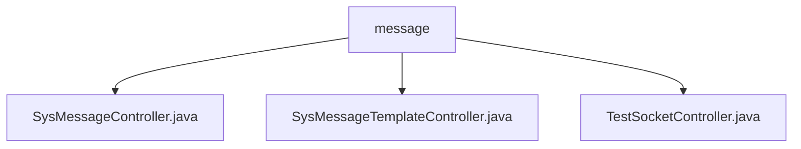

# 基础信息

|      |      |
|------|------|
| 名称 | controller |
| 编码语言 | .java |
| 代码路径 | JeecgBoot/jeecg-boot/jeecg-module-system/jeecg-system-biz/src/main/java/org/jeecg/modules/message/controller |
| 包名 | JeecgBoot.jeecg-boot.jeecg-module-system.jeecg-system-biz.src.main.java.org.jeecg.modules.message.controller |
| 概述说明 | SysMessageController管理消息，支持分页查询、增删改、批量操作、Excel导入导出。SysMessageTemplateController处理消息模板，支持发送消息。TestSocketController处理WebSocket消息，支持群发和单发。 |

# 说明

## 概述

该代码模块是一个功能全面的消息管理系统，旨在提供高效的消息管理和操作功能。模块包含多个控制器，分别负责消息管理、消息模板管理以及WebSocket消息处理。通过这些控制器，用户可以实现消息的分页查询、添加、编辑、删除、批量删除、ID查询、Excel导入导出等操作。此外，模块还支持通过WebSocket协议进行实时消息传递，具备群发和单发功能，满足不同场景下的消息传递需求。

## 主要业务场景

1. **消息管理**：通过`SysMessageController`，用户可以高效地管理和操作消息数据。支持分页查询、添加、编辑、删除、批量删除、ID查询以及Excel导入导出功能，便于用户在不同业务场景下进行消息数据的维护和迁移。

2. **消息模板管理**：`SysMessageTemplateController`提供了消息模板的管理功能，支持分页查询、添加、编辑、删除、批量删除、ID查询以及Excel导入导出。此外，用户还可以通过该控制器直接发送消息，提高消息发送的效率和便捷性。

3. **WebSocket消息处理**：`TestSocketController`负责处理WebSocket消息，支持群发和单发功能。通过WebSocket协议实现实时通信，确保消息的高效传输和接收，适用于需要实时消息传递的业务场景，如在线聊天、实时通知等。

通过这些功能，该模块能够满足不同业务场景下的消息管理和传递需求，提供灵活且可靠的消息处理机制。

### 包内部结构视图

该流程图展示了`message`目录下的三个控制器文件：`SysMessageController.java`、`SysMessageTemplateController.java`和`TestSocketController.java`。这些文件均位于`message`目录下，没有更深层次的子目录结构。流程图清晰地表示了文件与目录之间的层级关系，便于理解项目结构。

# 文件列表 File List

| 名称   | 类型  | 说明 |
|-------|------|-------------|
| [SysMessageController.java](SysMessageController.md) | file | SysMessageController支持消息的分页查询、增删改查及Excel导入导出。 |
| [TestSocketController.java](TestSocketController.md) | file | 控制器处理WebSocket消息，支持群发和单发。 |
| [SysMessageTemplateController.java](SysMessageTemplateController.md) | file | 控制器管理消息模板，支持增删改查、分页、批量操作及消息发送。 |

