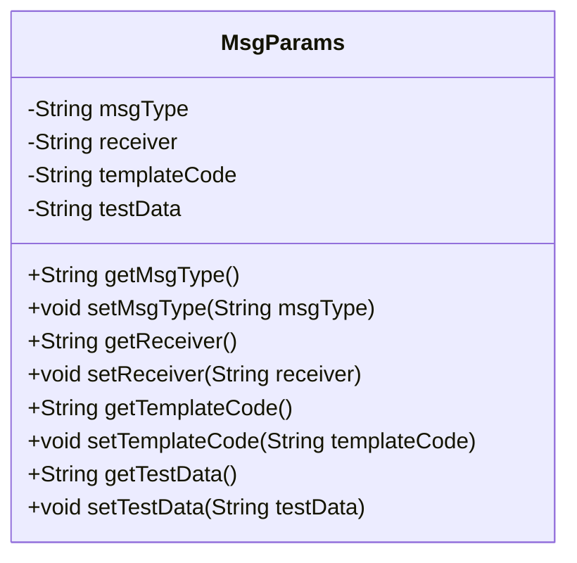
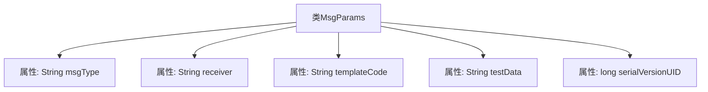

# 基础信息

|      |      |
|------|------|
| 名称 | MsgParams |
| 编码语言 | .java |
| 代码路径 | JeecgBoot/jeecg-boot/jeecg-module-system/jeecg-system-biz/src/main/java/org/jeecg/modules/message/entity/MsgParams.java |
| 包名 | org.jeecg.modules.message.entity |
| 依赖项 | ['java.io.Serializable', 'lombok.Data'] |
| 概述说明 | MsgParams类包含消息类型、接收方、模板码和测试数据字段。 |

# 说明

MsgParams类是一个用于管理消息参数的类，包含了四个关键字段：消息类型、接收方、模板码和测试数据。消息类型字段用于标识消息的种类，接收方字段指定消息的目标对象，模板码字段用于引用消息模板，测试数据字段则用于存储测试过程中所需的数据。这些字段共同构成了消息处理的核心参数，确保消息的准确传递和处理。

# 类列表 Class Summary

| 名称   | 类型  | 说明 |
|-------|------|-------------|
| MsgParams | class | MsgParams类包含消息类型、接收方、模板码和测试数据字段。 |

## 类 MsgParams

|      |      |
|------|------|
| 访问范围 | @Data;public |
| 类型 | class |
| 名称 | MsgParams |
| 说明 | MsgParams类包含消息类型、接收方、模板码和测试数据字段。 |

### UML类图

这段代码定义了一个名为 `MsgParams` 的类，该类实现了 `Serializable` 接口，表明其实例可以被序列化。类中包含四个私有成员变量：`msgType`（消息类型）、`receiver`（消息接收方）、`templateCode`（消息模板码）和 `testData`（测试数据）。这些变量通过对应的 `getter` 和 `setter` 方法进行访问和修改。由于使用了 `@Data` 注解，这些方法会被自动生成，简化了代码的编写。

### 内部方法调用关系图

这段代码定义了一个名为 `MsgParams` 的类，该类实现了 `Serializable` 接口，表明其实例可以被序列化。类中包含四个字符串类型的属性：`msgType`、`receiver`、`templateCode` 和 `testData`，分别用于存储消息类型、消息接收方、消息模板码和测试数据。此外，类中还定义了一个静态的 `serialVersionUID` 属性，用于在序列化和反序列化过程中确保类的版本一致性。

### 字段列表 Field List

| 名称  | 类型  | 说明 |
|-------|-------|------|
| receiver | String | 定义了一个私有字符串变量receiver。 |
| templateCode | String | 定义了一个私有字符串变量templateCode。 |
| msgType | String | 定义私有字符串变量msgType。 |
| testData | String | 声明一个私有的字符串变量testData。 |
| serialVersionUID = 1L | long | 定义序列化版本UID为1L。 |

### 方法列表 Method List

| 名称  | 类型  | 说明 |
|-------|-------|------|

