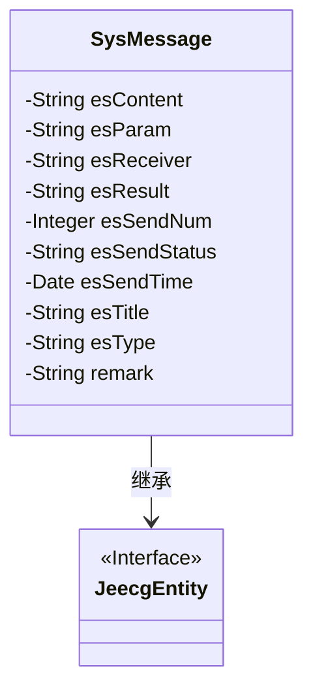
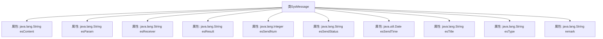

# 基础信息

|      |      |
|------|------|
| 名称 | SysMessage |
| 编码语言 | .java |
| 代码路径 | JeecgBoot/jeecg-boot/jeecg-module-system/jeecg-system-biz/src/main/java/org/jeecg/modules/message/entity/SysMessage.java |
| 包名 | org.jeecg.modules.message.entity |
| 依赖项 | ['org.jeecg.common.aspect.annotation.Dict', 'org.jeecg.common.system.base.entity.JeecgEntity', 'org.jeecgframework.poi.excel.annotation.Excel', 'org.springframework.format.annotation.DateTimeFormat', 'com.baomidou.mybatisplus.annotation.TableName', 'com.fasterxml.jackson.annotation.JsonFormat', 'lombok.Data', 'lombok.EqualsAndHashCode', 'lombok.experimental.Accessors'] |
| 概述说明 | SysMessage类包含推送内容、参数、接收人、状态、时间等字段。 |

# 说明

SysMessage类定义了多个关键字段，用于管理和记录系统消息的详细信息。这些字段包括推送内容、参数、接收人、失败原因、发送次数、状态、时间、标题、方式和备注。通过这些字段，SysMessage类能够全面记录消息的各个方面，包括消息的具体内容、接收对象、发送状态、失败原因、发送次数、时间戳、消息标题、发送方式以及额外的备注信息，从而实现对系统消息的精细化管理与追踪。

# 类列表 Class Summary

| 名称   | 类型  | 说明 |
|-------|------|-------------|
| SysMessage | class | SysMessage类包含推送内容、参数、接收人、失败原因、发送次数、状态、时间、标题、方式和备注等字段。 |

## 类 SysMessage

|      |      |
|------|------|
| 访问范围 | @Data;@EqualsAndHashCode(callSuper = false);@Accessors(chain = true);@TableName("sys_sms");public |
| 类型 | class |
| 名称 | SysMessage |
| 说明 | SysMessage类包含推送内容、参数、接收人、失败原因、发送次数、状态、时间、标题、方式和备注等字段。 |

### UML类图

类图描述：`SysMessage`类继承自`JeecgEntity`接口，主要用于管理系统中的消息推送。它包含多个私有属性，如推送内容`esContent`、接收人`esReceiver`、推送状态`esSendStatus`等，这些属性通过注解与数据库表`sys_sms`进行映射。类中的属性通过注解实现了Excel导出、日期格式化等功能，确保数据的准确性和可读性。

### 内部方法调用关系图

该流程图描述了`SysMessage`类的结构及其属性。`SysMessage`类继承自`JeecgEntity`，并包含多个属性，如`esContent`、`esParam`、`esReceiver`等，这些属性分别用于存储推送内容、推送参数、接收人等信息。每个属性都通过`@Excel`注解进行标注，以便在Excel中进行展示。此外，某些属性还使用了`@Dict`、`@JsonFormat`和`@DateTimeFormat`等注解，用于定义字典值、日期格式等。整体结构清晰，属性之间的关系明确。

### 字段列表 Field List

| 名称  | 类型  | 说明 |
|-------|-------|------|
| esContent | java.lang.String | Excel推送内容字段定义为私有字符串类型。 |
| esTitle | java.lang.String | Excel消息标题字段，类型为Java字符串。 |
| esType | java.lang.String | 推送方式字段使用字典配置，类型为字符串。 |
| esSendStatus | java.lang.String | 推送状态：0未推送，1推送成功，2推送失败。 |
| esSendTime | java.util.Date | 推送时间字段，使用日期格式，遵循GMT+8时区。 |
| esResult | java.lang.String | Excel推送失败原因字段为esResult，宽度15字符。 |
| remark | java.lang.String | Excel备注字段，宽度15，类型为Java字符串。 |
| esSendNum | java.lang.Integer | Excel列名“发送次数”，宽度15，对应Java整数类型变量esSendNum。 |
| esReceiver | java.lang.String | Excel接收人字段为esReceiver，宽度15字符。 |
| esParam | java.lang.String | Excel推送参数格式为JSON，变量名为esParam。 |

### 方法列表 Method List

| 名称  | 类型  | 说明 |
|-------|-------|------|

