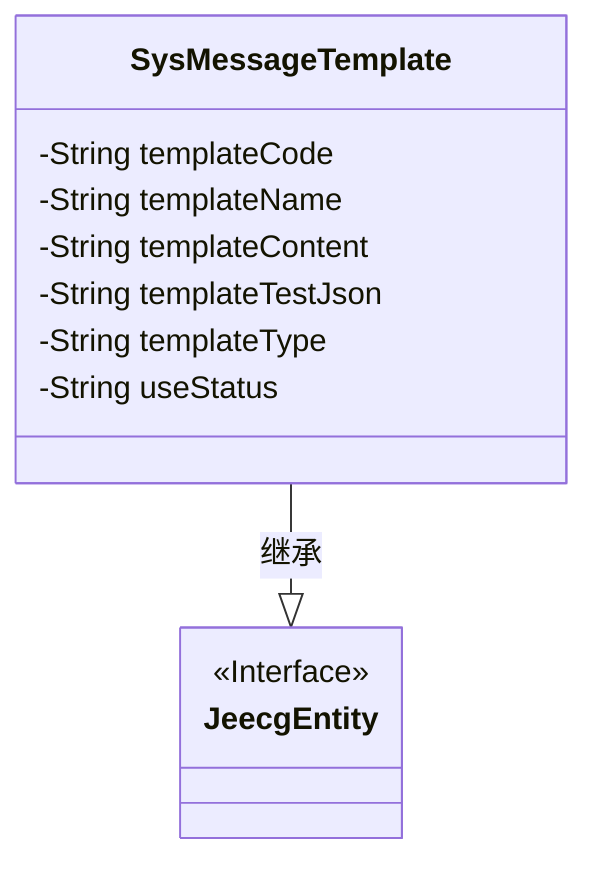
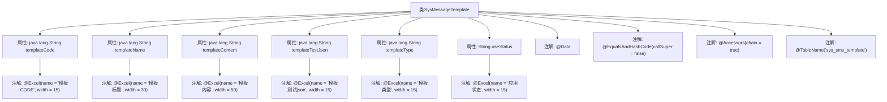

# 基础信息

|      |      |
|------|------|
| 名称 | SysMessageTemplate |
| 编码语言 | .java |
| 代码路径 | JeecgBoot/jeecg-boot/jeecg-module-system/jeecg-system-biz/src/main/java/org/jeecg/modules/message/entity/SysMessageTemplate.java |
| 包名 | org.jeecg.modules.message.entity |
| 依赖项 | ['org.jeecg.common.system.base.entity.JeecgEntity', 'org.jeecgframework.poi.excel.annotation.Excel', 'com.baomidou.mybatisplus.annotation.TableName', 'lombok.Data', 'lombok.EqualsAndHashCode', 'lombok.experimental.Accessors'] |
| 概述说明 | SysMessageTemplate类包含模板CODE、标题、内容、测试json、类型及应用状态字段。 |

# 说明

SysMessageTemplate类是一个用于管理系统消息模板的类，包含多个关键字段。其中，模板CODE用于唯一标识每个模板，标题字段用于描述模板的简短名称，内容字段则存储模板的具体消息内容。测试json字段用于存储与模板相关的测试数据，以便进行验证和调试。类型字段用于区分不同类型的消息模板，而应用状态字段则用于标识模板的当前状态，如启用或禁用。这些字段共同构成了SysMessageTemplate类的核心功能，使其能够有效地管理和处理系统消息模板。

# 类列表 Class Summary

| 名称   | 类型  | 说明 |
|-------|------|-------------|
| SysMessageTemplate | class | SysMessageTemplate类包含模板CODE、标题、内容、测试json、类型及应用状态字段。 |

## 类 SysMessageTemplate

|      |      |
|------|------|
| 访问范围 | @Data;@EqualsAndHashCode(callSuper = false);@Accessors(chain = true);@TableName("sys_sms_template");public |
| 类型 | class |
| 名称 | SysMessageTemplate |
| 说明 | SysMessageTemplate类包含模板CODE、标题、内容、测试json、类型及应用状态字段。 |

### UML类图

类图描述：`SysMessageTemplate` 类继承自 `JeecgEntity` 接口，包含了多个私有属性，如 `templateCode`、`templateName`、`templateContent` 等，用于存储短信模板的相关信息。这些属性通过 `@Excel` 注解进行标记，表示它们在 Excel 中的显示格式。类图清晰地展示了类与接口之间的继承关系及其内部结构。

### 内部方法调用关系图

**描述：**  
这段代码定义了一个名为 `SysMessageTemplate` 的类，该类继承自 `JeecgEntity`。类中包含多个属性，如 `templateCode`、`templateName`、`templateContent` 等，每个属性都使用了 `@Excel` 注解来定义其在Excel中的显示名称和宽度。此外，类上还使用了 `@Data`、`@EqualsAndHashCode`、`@Accessors` 和 `@TableName` 等注解，分别用于生成getter/setter方法、重写equals和hashCode方法、支持链式调用以及指定数据库表名。

### 字段列表 Field List

| 名称  | 类型  | 说明 |
|-------|-------|------|
| templateName | java.lang.String | Excel模板标题字段定义，宽度30，类型为字符串。 |
| templateTestJson | java.lang.String | Excel模板测试json字段定义为私有字符串类型。 |
| templateContent | java.lang.String | Excel模板内容字段，宽度50，类型为字符串。 |
| templateCode | java.lang.String | Excel模板字段"模板CODE"定义为私有字符串变量。 |
| templateType | java.lang.String | Excel模板类型字段，类型为字符串，宽度15。 |
| useStatus | String | Excel表格中应用状态字段为字符串类型，宽度为15。 |

### 方法列表 Method List

| 名称  | 类型  | 说明 |
|-------|-------|------|

