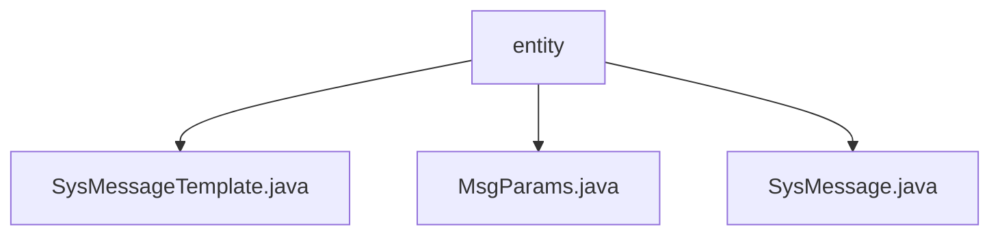

# 基础信息

|      |      |
|------|------|
| 名称 | entity |
| 编码语言 | .java |
| 代码路径 | JeecgBoot/jeecg-boot/jeecg-module-system/jeecg-system-biz/src/main/java/org/jeecg/modules/message/entity |
| 包名 | JeecgBoot.jeecg-boot.jeecg-module-system.jeecg-system-biz.src.main.java.org.jeecg.modules.message.entity |
| 概述说明 | SysMessageTemplate类管理消息模板，含CODE、标题、内容等字段。MsgParams类管理消息参数，含消息类型、接收方等字段。SysMessage类记录系统消息，含推送内容、接收人等字段。 |

# 说明

## 概述
该代码模块主要用于管理和处理系统消息，包括消息模板的定义、消息参数的传递以及系统消息的记录与追踪。模块由三个核心类组成：`SysMessageTemplate`、`MsgParams` 和 `SysMessage`。这些类共同协作，确保系统消息的准确传递、模板的管理以及消息发送过程的记录与监控。

## 主要业务场景
1. **消息模板管理**：通过`SysMessageTemplate`类，系统能够定义和管理不同类型的消息模板。每个模板通过唯一的模板CODE进行标识，并包含标题、内容、测试数据、类型和应用状态等字段。这些模板用于生成标准化的系统消息，确保消息内容的一致性和可复用性。

2. **消息参数传递**：`MsgParams`类用于管理消息处理过程中的关键参数，包括消息类型、接收方、模板码和测试数据。这些参数确保消息能够根据模板生成，并准确地发送给指定的接收方，同时支持在测试环境中进行验证和调试。

3. **系统消息记录与追踪**：`SysMessage`类用于记录系统消息的详细信息，包括推送内容、参数、接收人、失败原因、发送次数、状态、时间、标题、方式和备注等。通过这些字段，系统能够全面追踪消息的发送状态、失败原因以及发送次数等信息，便于后续的监控和问题排查。

### 包内部结构视图

流程图描述了在 `entity` 文件夹下的三个文件：`SysMessageTemplate.java`、`MsgParams.java` 和 `SysMessage.java`。这些文件均位于 `org/jeecg/modules/message/entity` 路径下，展示了它们与父文件夹 `entity` 的层级关系。

# 文件列表 File List

| 名称   | 类型  | 说明 |
|-------|------|-------------|
| [MsgParams.java](MsgParams.md) | file | MsgParams类包含消息类型、接收方、模板码和测试数据字段。 |
| [SysMessage.java](SysMessage.md) | file | SysMessage类包含推送内容、参数、接收人、状态、时间等字段。 |
| [SysMessageTemplate.java](SysMessageTemplate.md) | file | SysMessageTemplate类包含模板CODE、标题、内容、测试json、类型及应用状态字段。 |

