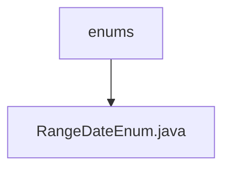

# 基础信息

|      |      |
|------|------|
| 名称 | enums |
| 编码语言 | .java |
| 代码路径 | JeecgBoot/jeecg-boot/jeecg-module-system/jeecg-system-biz/src/main/java/org/jeecg/modules/message/enums |
| 包名 | JeecgBoot.jeecg-boot.jeecg-module-system.jeecg-system-biz.src.main.java.org.jeecg.modules.message.enums |
| 概述说明 | 输入信息为空，无法生成概要描述。 |

# 说明

内容为空，无法提供总结描述。请提供具体内容以便进行详细描述。

### 包内部结构视图

该流程图展示了路径中的层级关系，`enums` 是文件夹，`RangeDateEnum.java` 是该文件夹下的一个文件。路径结构简洁明了，反映了文件在项目中的具体位置。

# 文件列表 File List

| 名称   | 类型  | 说明 |
|-------|------|-------------|
| [RangeDateEnum.java](RangeDateEnum.md) | file | 输入信息为空，无法生成概要描述。 |

