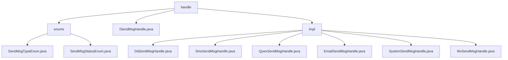

# 基础信息

|      |      |
|------|------|
| 名称 | handle |
| 编码语言 | .java |
| 代码路径 | JeecgBoot/jeecg-boot/jeecg-module-system/jeecg-system-biz/src/main/java/org/jeecg/modules/message/handle |
| 包名 | JeecgBoot.jeecg-boot.jeecg-module-system.jeecg-system-biz.src.main.java.org.jeecg.modules.message.handle |
| 概述说明 | JeecgBoot框架的消息发送模块，支持短信、邮件、微信等多渠道发送，管理消息类型和状态，确保可靠传递。 |

# 说明

## 概述
该代码模块属于JeecgBoot框架的`jeecg-module-system`模块，主要处理与消息发送相关的业务逻辑。模块通过定义枚举类来管理消息发送的类型和状态，确保消息处理的一致性和可维护性。此外，模块实现了多通道消息发送系统，支持通过多种通信平台（如钉钉、企业微信、微信、短信、邮件等）进行消息发送。模块中的各个类均实现了`ISendMsgHandle`接口，确保统一的处理逻辑和扩展性，并提供了消息发送状态记录、定时发送、变量替换等高级功能，以满足多样化的业务场景需求。

## 主要业务场景
1. **消息发送类型管理**：通过`SendMsgTypeEnum`枚举类，定义消息发送的不同类型（如短信、邮件、站内信等），以便在业务逻辑中根据类型选择合适的消息发送方式。
2. **消息发送状态管理**：通过`SendMsgStatusEnum`枚举类，定义消息发送过程中的不同状态（如成功、失败、处理中等），用于跟踪消息发送的执行结果，确保消息处理流程的透明性和可控性。
3. **钉钉消息发送**：通过`DdSendMsgHandle`类，用户能够指定接收者、消息标题和内容，利用`dingtalkService`将消息准确传递到指定接收者，适用于企业内部通知、任务提醒等场景。
4. **短信发送**：`SmsSendMsgHandle`类专门用于处理短信发送，适用于需要通过短信通知用户的场景，如验证码发送、订单状态提醒等。
5. **企业微信消息发送**：`QywxSendMsgHandle`类通过集成企业微信服务，支持在企业微信中发送消息，适用于企业内部的即时通信和通知。
6. **邮件发送**：`EmailSendMsgHandle`类支持多种邮件发送需求，包括指定接收人、抄送人、定时发送以及邮件内容的变量替换，适用于邮件通知、营销邮件等场景。
7. **系统消息发送**：`SystemSendMsgHandle`类支持通过系统渠道发送消息，并记录消息发送状态，适用于系统内部通知和状态跟踪。
8. **微信消息发送**：`WxSendMsgHandle`类专门用于发送微信消息，适用于微信公众号消息推送、用户通知等场景。

该模块通过灵活的架构设计和丰富的功能支持，能够满足企业或系统在不同场景下的消息发送需求，确保消息的可靠传递和高效管理。

### 包内部结构视图

该流程图展示了`handle`目录下的层级结构，包含`enums`、`ISendMsgHandle.java`和`impl`三个主要节点。`enums`下包含两个枚举类文件，`impl`下则包含了多个实现类文件，分别处理不同类型的消息发送。整体结构清晰，反映了消息处理模块的文件组织方式。

# 文件列表 File List

| 名称   | 类型  | 说明 |
|-------|------|-------------|
| [ISendMsgHandle.java](ISendMsgHandle.md) | file | 无内容提供，无法生成概要描述。 |
| [impl](impl/_module.md) | package | 系统消息处理类支持多种渠道发送消息，确保消息可靠传递和状态跟踪。 |
| [enums](enums/_module.md) | package | 内容为空，无法总结。 |

