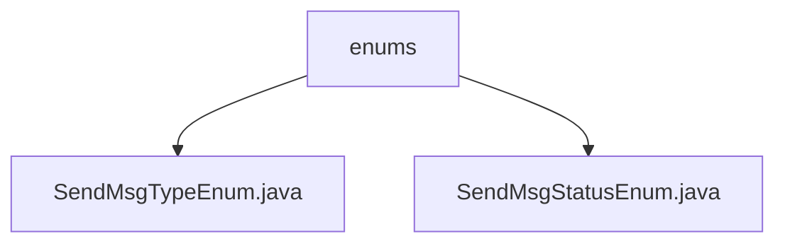

# 基础信息

|      |      |
|------|------|
| 名称 | enums |
| 编码语言 | .java |
| 代码路径 | JeecgBoot/jeecg-boot/jeecg-module-system/jeecg-system-biz/src/main/java/org/jeecg/modules/message/handle/enums |
| 包名 | JeecgBoot.jeecg-boot.jeecg-module-system.jeecg-system-biz.src.main.java.org.jeecg.modules.message.handle.enums |
| 概述说明 | 内容为空，无法总结。 |

# 说明

## 概述
该代码模块属于JeecgBoot框架的`jeecg-module-system`模块，主要处理与消息发送相关的业务逻辑。模块中包含枚举类，用于定义消息发送的类型和状态，确保消息处理的一致性和可维护性。

## 主要业务场景
1. **消息发送类型管理**：通过`SendMsgTypeEnum`枚举类，定义消息发送的不同类型（如短信、邮件、站内信等），以便在业务逻辑中根据类型选择合适的消息发送方式。
2. **消息发送状态管理**：通过`SendMsgStatusEnum`枚举类，定义消息发送过程中的不同状态（如成功、失败、处理中等），用于跟踪消息发送的执行结果，确保消息处理流程的透明性和可控性。
3. **消息处理流程**：结合消息类型和状态，实现消息发送的统一处理逻辑，支持多种消息发送方式的状态管理和类型区分，提升系统的扩展性和灵活性。

### 包内部结构视图

该流程图展示了`enums`文件夹与其内部两个文件`SendMsgTypeEnum.java`和`SendMsgStatusEnum.java`之间的层级关系。`enums`作为父节点，包含了两个子节点，分别代表不同的枚举类型文件。这种结构清晰地反映了文件在项目中的组织方式。

# 文件列表 File List

| 名称   | 类型  | 说明 |
|-------|------|-------------|
| [SendMsgTypeEnum.java](SendMsgTypeEnum.md) | file | 内容为空，无法生成概要描述。 |
| [SendMsgStatusEnum.java](SendMsgStatusEnum.md) | file | 内容为空，无法生成概要描述。 |

