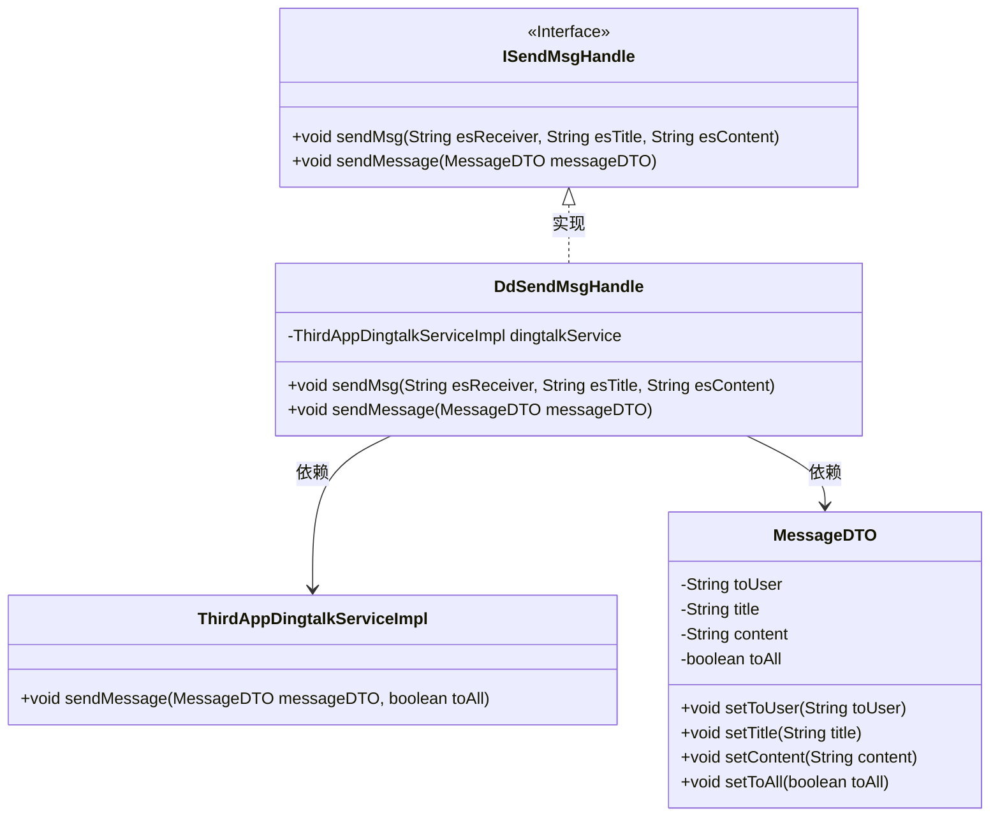
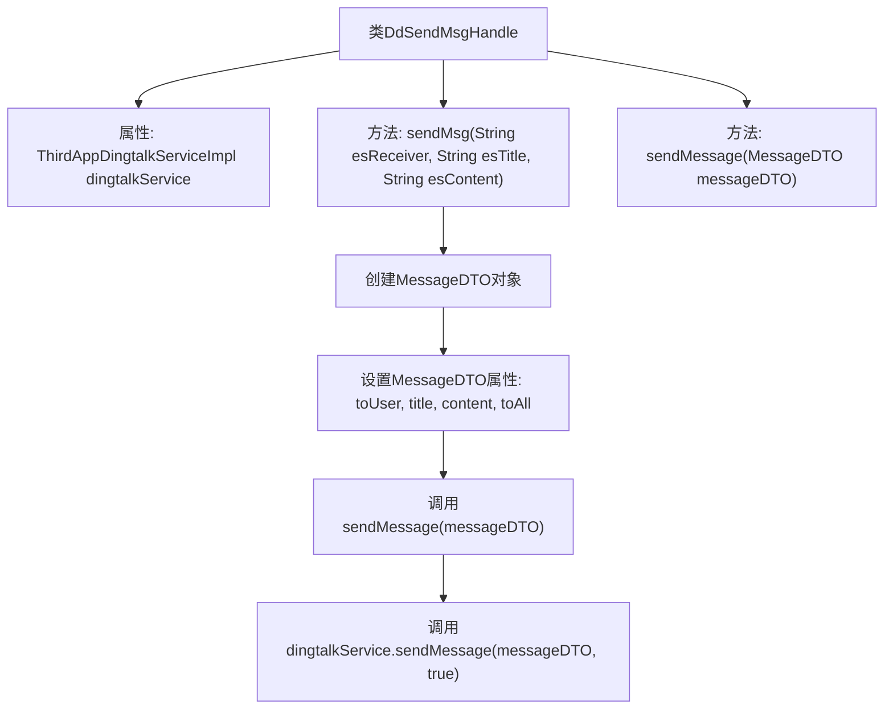
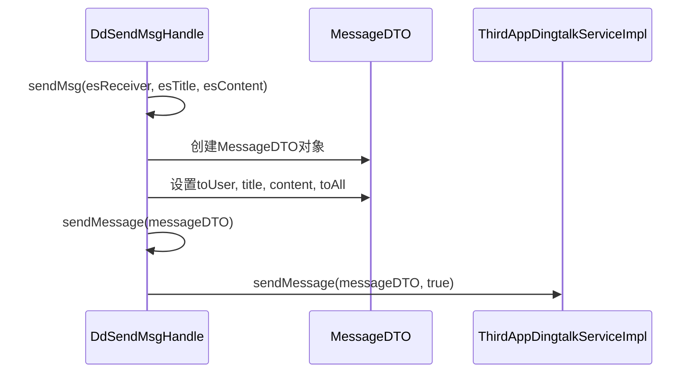

# 基础信息

|      |      |
|------|------|
| 名称 | DdSendMsgHandle |
| 编码语言 | .java |
| 代码路径 | JeecgBoot/jeecg-boot/jeecg-module-system/jeecg-system-biz/src/main/java/org/jeecg/modules/message/handle/impl/DdSendMsgHandle.java |
| 包名 | org.jeecg.modules.message.handle.impl |
| 依赖项 | ['lombok.extern.slf4j.Slf4j', 'org.jeecg.common.api.dto.message.MessageDTO', 'org.jeecg.modules.message.handle.ISendMsgHandle', 'org.jeecg.modules.system.service.impl.ThirdAppDingtalkServiceImpl', 'org.springframework.beans.factory.annotation.Autowired', 'org.springframework.stereotype.Component'] |
| 概述说明 | DdSendMsgHandle类通过dingtalkService发送消息，支持设置接收者、标题和内容。 |

# 说明

DdSendMsgHandle类利用dingtalkService实现消息发送功能，允许用户指定接收者、消息标题和具体内容。该功能通过集成dingtalkService，确保消息能够准确传递到指定接收者，支持自定义标题和内容，满足多样化的消息发送需求。

# 类列表 Class Summary

| 名称   | 类型  | 说明 |
|-------|------|-------------|
| DdSendMsgHandle | class | DdSendMsgHandle类通过dingtalkService发送消息，支持指定接收者、标题和内容。 |

## 类 DdSendMsgHandle

|      |      |
|------|------|
| 访问范围 | @Slf4j;@Component("ddSendMsgHandle");public |
| 类型 | class |
| 名称 | DdSendMsgHandle |
| 说明 | DdSendMsgHandle类通过dingtalkService发送消息，支持指定接收者、标题和内容。 |

### UML类图

这段代码定义了一个名为 `DdSendMsgHandle` 的类，该类实现了 `ISendMsgHandle` 接口。`DdSendMsgHandle` 类通过 `ThirdAppDingtalkServiceImpl` 服务来发送消息，并使用了 `MessageDTO` 类来封装消息内容。`ISendMsgHandle` 接口定义了发送消息的两个方法，`DdSendMsgHandle` 类实现了这些方法，并在 `sendMessage` 方法中调用了 `ThirdAppDingtalkServiceImpl` 的 `sendMessage` 方法来实际发送消息。整个设计体现了依赖注入和接口实现的原则，确保了代码的灵活性和可扩展性。

### 内部方法调用关系图

这段代码定义了一个名为`DdSendMsgHandle`的类，该类实现了`ISendMsgHandle`接口，用于发送消息。类中包含两个主要方法：`sendMsg`和`sendMessage`。`sendMsg`方法接收接收者、标题和内容作为参数，创建一个`MessageDTO`对象并设置其属性，然后调用`sendMessage`方法。`sendMessage`方法则通过`dingtalkService`将消息发送出去。流程图展示了类内部的方法调用关系，时序图则详细描述了方法执行的顺序和对象之间的交互。

### 字段列表 Field List

| 名称  | 类型  | 说明 |
|-------|-------|------|
| dingtalkService | ThirdAppDingtalkServiceImpl | 自动注入Dingtalk服务实现类实例。 |

### 方法列表 Method List

| 名称  | 类型  | 说明 |
|-------|-------|------|
| sendMessage | void | 重写sendMessage方法，调用dingtalkService发送消息并启用参数。 |
| sendMsg | void | 方法sendMsg发送微信消息，设置接收者、标题、内容并调用发送。 |

