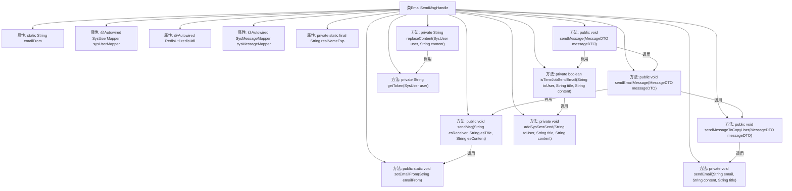

# 基础信息

|      |      |
|------|------|
| 名称 | EmailSendMsgHandle |
| 编码语言 | .java |
| 代码路径 | JeecgBoot/jeecg-boot/jeecg-module-system/jeecg-system-biz/src/main/java/org/jeecg/modules/message/handle/impl/EmailSendMsgHandle.java |
| 包名 | org.jeecg.modules.message.handle.impl |
| 依赖项 | ['com.baomidou.mybatisplus.core.conditions.query.LambdaQueryWrapper', 'lombok.extern.slf4j.Slf4j', 'org.apache.commons.lang3.ObjectUtils', 'org.jeecg.common.api.dto.message.MessageDTO', 'org.jeecg.common.constant.CommonConstant', 'org.jeecg.common.constant.enums.MessageTypeEnum', 'org.jeecg.common.system.util.JwtUtil', 'org.jeecg.common.util.RedisUtil', 'org.jeecg.common.util.SpringContextUtils', 'org.jeecg.common.util.oConvertUtils', 'org.jeecg.config.StaticConfig', 'org.jeecg.modules.message.entity.SysMessage', 'org.jeecg.modules.message.handle.ISendMsgHandle', 'org.jeecg.modules.message.mapper.SysMessageMapper', 'org.jeecg.modules.system.entity.SysUser', 'org.jeecg.modules.system.mapper.SysUserMapper', 'org.springframework.beans.factory.annotation.Autowired', 'org.springframework.mail.javamail.JavaMailSender', 'org.springframework.mail.javamail.MimeMessageHelper', 'org.springframework.stereotype.Component', 'javax.mail.MessagingException', 'javax.mail.internet.MimeMessage', 'java.io.UnsupportedEncodingException', 'java.net.URLEncoder', 'java.util.List', 'java.util.Set'] |
| 概述说明 | EmailSendMsgHandle类实现邮件发送，支持接收人、抄送人、定时发送及内容变量替换。 |

# 说明

EmailSendMsgHandle类实现了邮件发送功能，支持多种邮件发送需求。该类能够接收邮件的主要接收人和抄送人信息，并支持定时发送功能，允许用户指定邮件发送的具体时间。此外，该类还支持邮件内容的变量替换功能，能够根据不同的变量值动态生成邮件内容，提高邮件发送的灵活性和个性化程度。通过这些功能，EmailSendMsgHandle类能够满足多样化的邮件发送场景需求。

# 类列表 Class Summary

| 名称   | 类型  | 说明 |
|-------|------|-------------|
| EmailSendMsgHandle | class | EmailSendMsgHandle类实现邮件发送功能，支持接收人、抄送人、定时发送及内容变量替换。 |

## 类 EmailSendMsgHandle

|      |      |
|------|------|
| 访问范围 | @Slf4j;@Component("emailSendMsgHandle");public |
| 类型 | class |
| 名称 | EmailSendMsgHandle |
| 说明 | EmailSendMsgHandle类实现邮件发送功能，支持接收人、抄送人、定时发送及内容变量替换。 |

### UML类图

```mermaid
classDiagram
    class EmailSendMsgHandle {
        -static String emailFrom
        -SysUserMapper sysUserMapper
        -RedisUtil redisUtil
        -SysMessageMapper sysMessageMapper
        -static final String realNameExp
        +static void setEmailFrom(String emailFrom)
        +void sendMsg(String esReceiver, String esTitle, String esContent)
        +void sendMessage(MessageDTO messageDTO)
        +void sendEmailMessage(MessageDTO messageDTO)
        +void sendMessageToCopyUser(MessageDTO messageDTO)
        -void sendEmail(String email, String content, String title)
        -String replaceContent(SysUser user, String content)
        -String getToken(SysUser user)
        -boolean isTimeJobSendEmail(String toUser, String title, String content)
        -void addSysSmsSend(String toUser, String title, String content)
    }

    class ISendMsgHandle {
        <<Interface>>
        +void sendMsg(String esReceiver, String esTitle, String esContent)
        +void sendMessage(MessageDTO messageDTO)
    }

    class SysUser {
        +String username
        +String email
        +String realname
        +String password
    }

    class MessageDTO {
        +String content
        +String title
        +String toUser
        +String copyToUser
        +Set~String~ toEmailList
        +Set~String~ ccEmailList
    }

    class SysMessage {
        +String esTitle
        +String esContent
        +String esReceiver
        +String esSendStatus
        +int esSendNum
        +String esType
    }

    class StaticConfig {
        +String getEmailFrom()
        +Boolean getTimeJobSend()
    }

    class SpringContextUtils {
        +static Object getBean(String beanName)
        +static ~T~ getBean(Class~T~ clazz)
    }

    class JavaMailSender {
        +MimeMessage createMimeMessage()
        +void send(MimeMessage message)
    }

    class MimeMessageHelper {
        +void setFrom(String from)
        +void setTo(String to)
        +void setSubject(String subject)
        +void setText(String text, boolean html)
        +void setCc(String cc)
    }

    class RedisUtil {
        +void set(String key, String value)
        +void expire(String key, long timeout)
    }

    class SysUserMapper {
        +List~SysUser~ selectList(LambdaQueryWrapper~SysUser~ query)
    }

    class SysMessageMapper {
        +void insert(SysMessage sysMessage)
    }

    class JwtUtil {
        +static String sign(String username, String password)
        +static long EXPIRE_TIME
    }

    class MessageTypeEnum {
        +static String getType()
    }

    class CommonConstant {
        +static String LOGIN_TOKEN
        +static String PREFIX_USER_TOKEN
    }

    class oConvertUtils {
        +static boolean isEmpty(String str)
    }

    class ObjectUtils {
        +static boolean isEmpty(Object obj)
        +static boolean isNotEmpty(Object obj)
    }

    EmailSendMsgHandle ..|> ISendMsgHandle : 实现
    EmailSendMsgHandle --> SysUserMapper : 依赖
    EmailSendMsgHandle --> RedisUtil : 依赖
    EmailSendMsgHandle --> SysMessageMapper : 依赖
    EmailSendMsgHandle --> StaticConfig : 依赖
    EmailSendMsgHandle --> SpringContextUtils : 依赖
    EmailSendMsgHandle --> JavaMailSender : 依赖
    EmailSendMsgHandle --> MimeMessageHelper : 依赖
    EmailSendMsgHandle --> JwtUtil : 依赖
    EmailSendMsgHandle --> MessageTypeEnum : 依赖
    EmailSendMsgHandle --> CommonConstant : 依赖
    EmailSendMsgHandle --> oConvertUtils : 依赖
    EmailSendMsgHandle --> ObjectUtils : 依赖
    MessageDTO --> SysUser : 依赖
    SysMessageMapper --> SysMessage : 依赖
    SysUserMapper --> SysUser : 依赖
    JwtUtil --> CommonConstant : 依赖
    MimeMessageHelper --> JavaMailSender : 依赖
```

### 描述
该代码定义了一个`EmailSendMsgHandle`类，实现了`ISendMsgHandle`接口，用于处理邮件发送的逻辑。类中包含了多个方法，如发送邮件、替换邮件内容、获取用户Token等。`EmailSendMsgHandle`类依赖了多个外部类，如`SysUserMapper`、`RedisUtil`、`SysMessageMapper`等，用于获取用户信息、存储Token、保存消息等。邮件发送过程中，使用了`JavaMailSender`和`MimeMessageHelper`来处理邮件的创建和发送。代码中还涉及了多个工具类，如`JwtUtil`、`CommonConstant`等，用于生成Token和处理常量。

### 内部方法调用关系图

这段代码的流程图展示了`EmailSendMsgHandle`类的结构和主要方法之间的调用关系。`EmailSendMsgHandle`类负责处理邮件的发送逻辑，包括设置发件人邮箱、发送邮件、处理邮件内容、获取用户Token等功能。流程图清晰地展示了各个方法之间的调用顺序和依赖关系，帮助理解邮件的发送流程及其内部逻辑。

### 字段列表 Field List

| 名称  | 类型  | 说明 |
|-------|-------|------|
| emailFrom | String | 定义静态字符串变量emailFrom。 |
| redisUtil | RedisUtil | 自动注入RedisUtil工具类实例。 |
| sysUserMapper | SysUserMapper | 自动注入SysUserMapper对象。 |
| realNameExp = "{REALNAME}" | String | 定义常量realNameExp，值为"{REALNAME}"。 |
| sysMessageMapper | SysMessageMapper | 自动注入SysMessageMapper实例。 |

### 方法列表 Method List

| 名称  | 类型  | 说明 |
|-------|-------|------|
| setEmailFrom | void | 设置发送邮件的发件人地址。 |
| getToken | String | 生成用户token并存入Redis，设置1小时超时。 |
| sendMessage | void | 发送消息前检查定时任务，避免重复发送邮件。 |
| sendMsg | void | Java方法通过Spring发送邮件，配置发件人并处理异常。 |
| addSysSmsSend | void | 私有方法添加系统短信发送，设置标题、内容、接收者等信息并插入数据库。 |
| sendEmailMessage | void | 发送邮件方法，根据接收人和邮箱列表发送邮件，处理抄送人。 |
| isTimeJobSendEmail | boolean | 检查配置并发送定时邮件。 |
| replaceContent | String | 方法替换内容中的用户名和登录令牌，返回更新后的内容。 |
| sendEmail | void | 该方法使用JavaMailSender发送邮件，设置发件人、收件人、抄送人、主题和内容。 |
| sendMessageToCopyUser | void | 发送邮件给抄送用户，处理邮件内容和标题，记录日志并发送。 |

