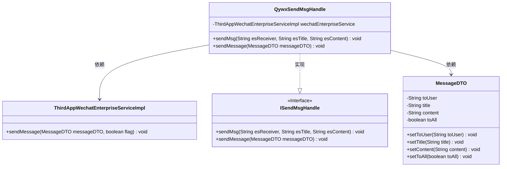
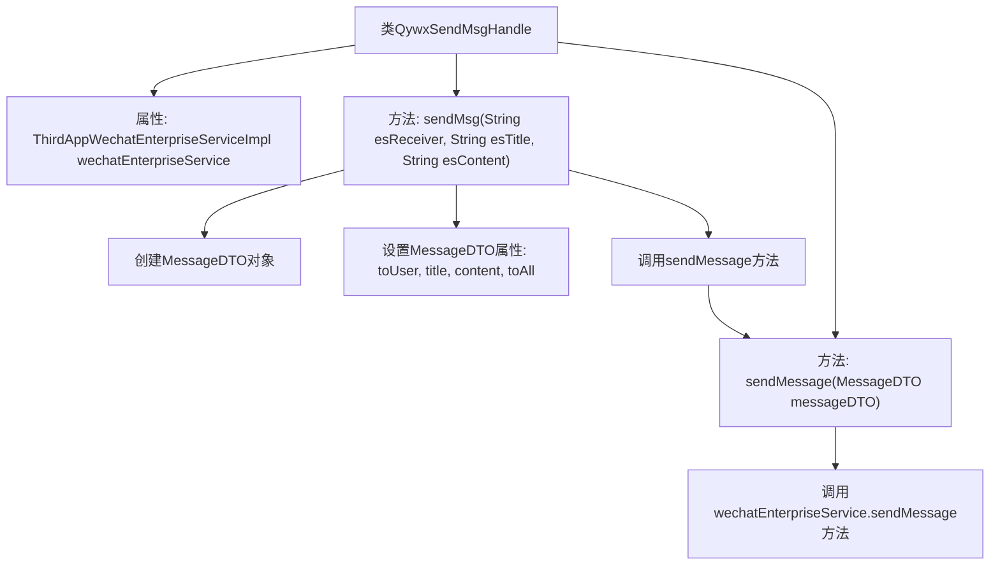

# 基础信息

|      |      |
|------|------|
| 名称 | QywxSendMsgHandle |
| 编码语言 | .java |
| 代码路径 | JeecgBoot/jeecg-boot/jeecg-module-system/jeecg-system-biz/src/main/java/org/jeecg/modules/message/handle/impl/QywxSendMsgHandle.java |
| 包名 | org.jeecg.modules.message.handle.impl |
| 依赖项 | ['lombok.extern.slf4j.Slf4j', 'org.jeecg.common.api.dto.message.MessageDTO', 'org.jeecg.modules.message.handle.ISendMsgHandle', 'org.jeecg.modules.system.service.impl.ThirdAppWechatEnterpriseServiceImpl', 'org.springframework.beans.factory.annotation.Autowired', 'org.springframework.stereotype.Component'] |
| 概述说明 | QywxSendMsgHandle类实现ISendMsgHandle接口，通过wechatEnterpriseService发送微信消息。 |

# 说明

QywxSendMsgHandle类实现了ISendMsgHandle接口，利用wechatEnterpriseService来发送微信消息。该类的核心功能是通过企业微信服务进行消息传递，确保消息能够准确发送到指定接收者。通过实现ISendMsgHandle接口，QywxSendMsgHandle类具备了处理消息发送的基本能力，并与企业微信服务进行无缝集成。

# 类列表 Class Summary

| 名称   | 类型  | 说明 |
|-------|------|-------------|
| QywxSendMsgHandle | class | QywxSendMsgHandle类实现ISendMsgHandle接口，通过wechatEnterpriseService发送微信消息。 |

## 类 QywxSendMsgHandle

|      |      |
|------|------|
| 访问范围 | @Slf4j;@Component("qywxSendMsgHandle");public |
| 类型 | class |
| 名称 | QywxSendMsgHandle |
| 说明 | QywxSendMsgHandle类实现ISendMsgHandle接口，通过wechatEnterpriseService发送微信消息。 |

### UML类图

这段代码描述了一个企业微信消息发送处理器 `QywxSendMsgHandle`，它实现了 `ISendMsgHandle` 接口，并通过 `ThirdAppWechatEnterpriseServiceImpl` 服务来发送消息。`QywxSendMsgHandle` 类包含两个方法：`sendMsg` 用于发送消息模板，`sendMessage` 用于实际发送消息。`MessageDTO` 类用于封装消息的相关信息，如接收者、标题、内容和是否发送给所有人。

### 内部方法调用关系图

这段代码描述了一个名为`QywxSendMsgHandle`的类，该类实现了`ISendMsgHandle`接口，并包含两个主要方法：`sendMsg`和`sendMessage`。`sendMsg`方法用于初始化消息对象`MessageDTO`并设置其属性，然后调用`sendMessage`方法。`sendMessage`方法则通过`wechatEnterpriseService`发送消息。整个流程展示了从消息创建到最终发送的完整过程。

### 字段列表 Field List

| 名称  | 类型  | 说明 |
|-------|-------|------|
| wechatEnterpriseService | ThirdAppWechatEnterpriseServiceImpl | 自动注入微信企业服务实现类。 |

### 方法列表 Method List

| 名称  | 类型  | 说明 |
|-------|-------|------|
| sendMsg | void | 重写sendMsg方法，设置并发送微信消息模板。 |
| sendMessage | void | 重写sendMessage方法，调用微信企业服务发送消息。 |

