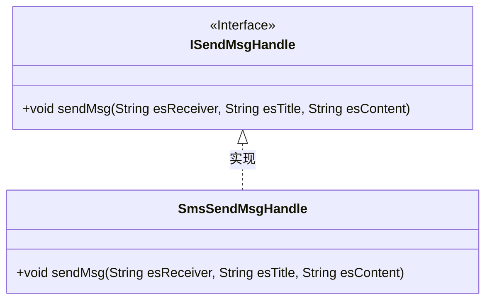
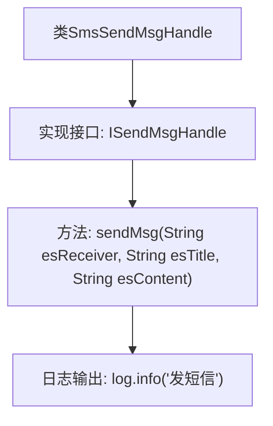

# 基础信息

|      |      |
|------|------|
| 名称 | SmsSendMsgHandle |
| 编码语言 | .java |
| 代码路径 | JeecgBoot/jeecg-boot/jeecg-module-system/jeecg-system-biz/src/main/java/org/jeecg/modules/message/handle/impl/SmsSendMsgHandle.java |
| 包名 | org.jeecg.modules.message.handle.impl |
| 依赖项 | ['lombok.extern.slf4j.Slf4j', 'org.jeecg.modules.message.handle.ISendMsgHandle'] |
| 概述说明 | SmsSendMsgHandle类实现ISendMsgHandle接口，提供短信发送功能。 |

# 说明

SmsSendMsgHandle类实现了ISendMsgHandle接口，专门用于提供发送短信的功能。该类通过实现接口中的方法，确保能够处理短信发送的相关操作，从而满足系统对短信发送的需求。

# 类列表 Class Summary

| 名称   | 类型  | 说明 |
|-------|------|-------------|
| SmsSendMsgHandle | class | SmsSendMsgHandle类实现ISendMsgHandle接口，提供发送短信功能。 |

## 类 SmsSendMsgHandle

|      |      |
|------|------|
| 访问范围 | @Slf4j;public |
| 类型 | class |
| 名称 | SmsSendMsgHandle |
| 说明 | SmsSendMsgHandle类实现ISendMsgHandle接口，提供发送短信功能。 |

### UML类图

**描述：**  
该代码展示了一个简单的类图，其中 `SmsSendMsgHandle` 类实现了 `ISendMsgHandle` 接口。`ISendMsgHandle` 接口定义了一个 `sendMsg` 方法，而 `SmsSendMsgHandle` 类则具体实现了该方法，用于发送短信。类图清晰地展示了接口与实现类之间的层级关系，符合面向对象设计的原则。

### 内部方法调用关系图

这段代码定义了一个名为 `SmsSendMsgHandle` 的类，该类实现了 `ISendMsgHandle` 接口。`SmsSendMsgHandle` 类中包含一个 `sendMsg` 方法，该方法接收三个参数：`esReceiver`、`esTitle` 和 `esContent`。在 `sendMsg` 方法中，代码通过 `log.info` 方法输出日志信息“发短信”。该类的设计主要用于处理短信发送的逻辑，并通过日志记录发送操作。

### 字段列表 Field List

| 名称  | 类型  | 说明 |
|-------|-------|------|

### 方法列表 Method List

| 名称  | 类型  | 说明 |
|-------|-------|------|
| sendMsg | void | 重写sendMsg方法，记录发送短信日志。 |

