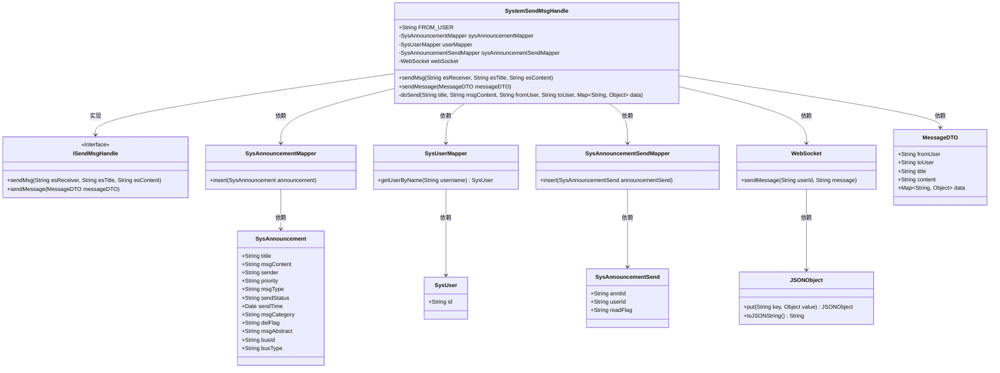
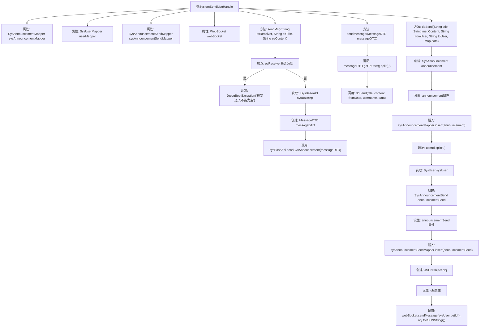

# 基础信息

|      |      |
|------|------|
| 名称 | SystemSendMsgHandle |
| 编码语言 | .java |
| 代码路径 | JeecgBoot/jeecg-boot/jeecg-module-system/jeecg-system-biz/src/main/java/org/jeecg/modules/message/handle/impl/SystemSendMsgHandle.java |
| 包名 | org.jeecg.modules.message.handle.impl |
| 依赖项 | ['com.alibaba.fastjson.JSONObject', 'org.jeecg.common.api.dto.message.MessageDTO', 'org.jeecg.common.constant.CommonConstant', 'org.jeecg.common.constant.WebsocketConst', 'org.jeecg.common.exception.JeecgBootException', 'org.jeecg.common.system.api.ISysBaseAPI', 'org.jeecg.common.util.SpringContextUtils', 'org.jeecg.common.util.oConvertUtils', 'org.jeecg.common.constant.enums.Vue3MessageHrefEnum', 'org.jeecg.modules.message.handle.ISendMsgHandle', 'org.jeecg.modules.message.websocket.WebSocket', 'org.jeecg.modules.system.entity.SysAnnouncement', 'org.jeecg.modules.system.entity.SysAnnouncementSend', 'org.jeecg.modules.system.entity.SysUser', 'org.jeecg.modules.system.mapper.SysAnnouncementMapper', 'org.jeecg.modules.system.mapper.SysAnnouncementSendMapper', 'org.jeecg.modules.system.mapper.SysUserMapper', 'org.springframework.stereotype.Component', 'javax.annotation.Resource', 'java.util.Date', 'java.util.Map'] |
| 概述说明 | 系统消息处理类支持多平台消息发送，并记录发送状态。 |

# 说明

系统消息处理类实现了消息发送功能，支持通过系统、企业微信和钉钉等渠道发送消息，并能够记录每条消息的发送状态。该功能确保了消息的可靠传递和状态跟踪，适用于多种通信平台的需求。

# 类列表 Class Summary

| 名称   | 类型  | 说明 |
|-------|------|-------------|
| SystemSendMsgHandle | class | 系统消息处理类，实现消息发送功能，支持系统、企业微信、钉钉消息，并记录发送状态。 |

## 类 SystemSendMsgHandle

|      |      |
|------|------|
| 访问范围 | @Component("systemSendMsgHandle");public |
| 类型 | class |
| 名称 | SystemSendMsgHandle |
| 说明 | 系统消息处理类，实现消息发送功能，支持系统、企业微信、钉钉消息，并记录发送状态。 |

### UML类图

**描述：**
`SystemSendMsgHandle` 类实现了 `ISendMsgHandle` 接口，负责处理系统消息的发送。它依赖于多个 Mapper 类（如 `SysAnnouncementMapper`、`SysUserMapper`、`SysAnnouncementSendMapper`）来操作数据库，并通过 `WebSocket` 发送实时消息。`sendMsg` 方法用于发送系统消息，而 `sendMessage` 方法则用于处理 `MessageDTO` 对象并调用 `doSend` 方法进行实际的消息发送。`doSend` 方法负责创建和插入 `SysAnnouncement` 和 `SysAnnouncementSend` 记录，并通过 `WebSocket` 发送消息给指定用户。

### 内部方法调用关系图

**描述**：该代码定义了一个名为`SystemSendMsgHandle`的类，负责处理系统消息的发送。类中包含两个主要方法：`sendMsg`和`sendMessage`，分别用于发送系统消息和处理消息DTO。`sendMsg`方法首先检查接收者是否为空，若为空则抛出异常，否则通过`ISysBaseAPI`发送系统公告。`sendMessage`方法遍历接收者列表，调用`doSend`方法发送消息。`doSend`方法创建并设置`SysAnnouncement`对象，插入数据库，并为每个接收者创建`SysAnnouncementSend`记录，最后通过WebSocket发送消息。

### 字段列表 Field List

| 名称  | 类型  | 说明 |
|-------|-------|------|
| FROM_USER="system" | String | 定义常量FROM_USER，值为"system"。 |
| sysAnnouncementSendMapper | SysAnnouncementSendMapper | 私有资源注入系统公告发送映射器。 |
| webSocket | WebSocket | 声明了一个私有的WebSocket资源变量。 |
| userMapper | SysUserMapper | 私有字段userMapper，类型为SysUserMapper。 |
| sysAnnouncementMapper | SysAnnouncementMapper | 私有成员变量sysAnnouncementMapper注入SysAnnouncementMapper类型。 |

### 方法列表 Method List

| 名称  | 类型  | 说明 |
|-------|-------|------|
| sendMsg | void | 方法发送消息，检查接收者非空，调用系统API发送公告。 |
| sendMessage | void | 重写sendMessage方法，拆分接收者并逐一发送消息。 |
| doSend | void | 发送系统公告并标记用户阅读状态，插入数据库并通知用户。 |

