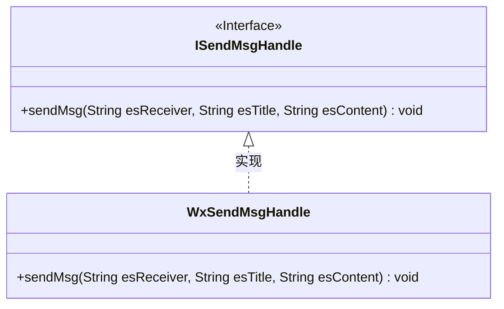
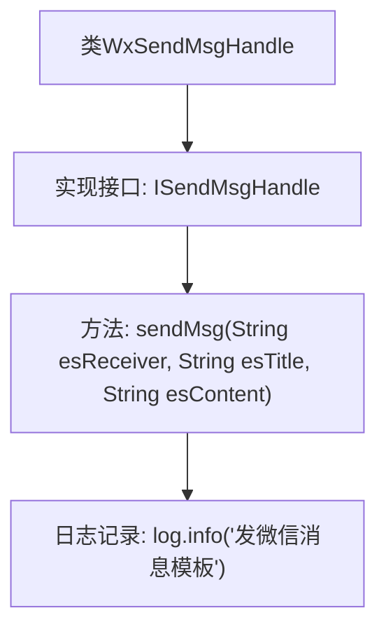

# 基础信息

|      |      |
|------|------|
| 名称 | WxSendMsgHandle |
| 编码语言 | .java |
| 代码路径 | JeecgBoot/jeecg-boot/jeecg-module-system/jeecg-system-biz/src/main/java/org/jeecg/modules/message/handle/impl/WxSendMsgHandle.java |
| 包名 | org.jeecg.modules.message.handle.impl |
| 依赖项 | ['lombok.extern.slf4j.Slf4j', 'org.jeecg.modules.message.handle.ISendMsgHandle'] |
| 概述说明 | WxSendMsgHandle类实现ISendMsgHandle接口，用于发送微信消息。 |

# 说明

WxSendMsgHandle类实现了ISendMsgHandle接口，专门用于发送微信消息。该类通过实现接口中定义的方法，确保能够处理并发送微信消息的功能。

# 类列表 Class Summary

| 名称   | 类型  | 说明 |
|-------|------|-------------|
| WxSendMsgHandle | class | WxSendMsgHandle类实现ISendMsgHandle接口，发送微信消息。 |

## 类 WxSendMsgHandle

|      |      |
|------|------|
| 访问范围 | @Slf4j;public |
| 类型 | class |
| 名称 | WxSendMsgHandle |
| 说明 | WxSendMsgHandle类实现ISendMsgHandle接口，发送微信消息。 |

### UML类图

**描述：**  
该代码展示了一个简单的类图，其中 `ISendMsgHandle` 是一个接口，定义了 `sendMsg` 方法。`WxSendMsgHandle` 类实现了 `ISendMsgHandle` 接口，并提供了 `sendMsg` 方法的具体实现。`WxSendMsgHandle` 类通过实现接口来确保具备发送消息的功能，代码中使用 `@Slf4j` 注解来简化日志记录操作。

### 内部方法调用关系图

这段代码定义了一个名为 `WxSendMsgHandle` 的类，该类实现了 `ISendMsgHandle` 接口。类中包含一个 `sendMsg` 方法，该方法接收三个参数：`esReceiver`、`esTitle` 和 `esContent`。在方法内部，代码通过 `log.info` 记录了一条信息“发微信消息模板”。该流程图展示了类的结构、方法的实现以及日志记录的步骤。

### 字段列表 Field List

| 名称  | 类型  | 说明 |
|-------|-------|------|

### 方法列表 Method List

| 名称  | 类型  | 说明 |
|-------|-------|------|
| sendMsg | void | 重写sendMsg方法，记录发送微信消息模板日志。 |

