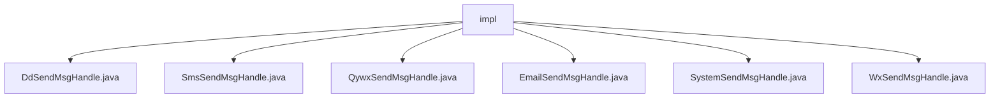

# 基础信息

|      |      |
|------|------|
| 名称 | impl |
| 编码语言 | .java |
| 代码路径 | JeecgBoot/jeecg-boot/jeecg-module-system/jeecg-system-biz/src/main/java/org/jeecg/modules/message/handle/impl |
| 包名 | JeecgBoot.jeecg-boot.jeecg-module-system.jeecg-system-biz.src.main.java.org.jeecg.modules.message.handle.impl |
| 概述说明 | 系统消息处理类支持多种渠道发送消息，确保消息可靠传递和状态跟踪。 |

# 说明

## 概述
该代码模块是一个多通道消息发送系统，旨在通过多种通信平台（如钉钉、企业微信、微信、短信、邮件等）实现消息的发送功能。模块中的各个类均实现了`ISendMsgHandle`接口，确保统一的处理逻辑和扩展性。通过集成不同的服务（如`dingtalkService`、`wechatEnterpriseService`等），模块能够支持多种消息发送需求，并提供了消息发送状态记录、定时发送、变量替换等高级功能，以满足多样化的业务场景需求。

## 主要业务场景
1. **钉钉消息发送**：通过`DdSendMsgHandle`类，用户能够指定接收者、消息标题和内容，利用`dingtalkService`将消息准确传递到指定接收者，适用于企业内部通知、任务提醒等场景。
2. **短信发送**：`SmsSendMsgHandle`类专门用于处理短信发送，适用于需要通过短信通知用户的场景，如验证码发送、订单状态提醒等。
3. **企业微信消息发送**：`QywxSendMsgHandle`类通过集成企业微信服务，支持在企业微信中发送消息，适用于企业内部的即时通信和通知。
4. **邮件发送**：`EmailSendMsgHandle`类支持多种邮件发送需求，包括指定接收人、抄送人、定时发送以及邮件内容的变量替换，适用于邮件通知、营销邮件等场景。
5. **系统消息发送**：`SystemSendMsgHandle`类支持通过系统渠道发送消息，并记录消息发送状态，适用于系统内部通知和状态跟踪。
6. **微信消息发送**：`WxSendMsgHandle`类专门用于发送微信消息，适用于微信公众号消息推送、用户通知等场景。

该模块通过灵活的架构设计和丰富的功能支持，能够满足企业或系统在不同场景下的消息发送需求，确保消息的可靠传递和高效管理。

### 包内部结构视图

该流程图展示了`impl`文件夹下的多个消息处理类文件，包括`DdSendMsgHandle.java`、`SmsSendMsgHandle.java`、`QywxSendMsgHandle.java`、`EmailSendMsgHandle.java`、`SystemSendMsgHandle.java`和`WxSendMsgHandle.java`。这些类文件都位于同一层级，直接归属于`impl`文件夹，用于处理不同类型的消息发送逻辑。

# 文件列表 File List

| 名称   | 类型  | 说明 |
|-------|------|-------------|
| [WxSendMsgHandle.java](WxSendMsgHandle.md) | file | WxSendMsgHandle类实现ISendMsgHandle接口，用于发送微信消息。 |
| [QywxSendMsgHandle.java](QywxSendMsgHandle.md) | file | QywxSendMsgHandle类实现ISendMsgHandle接口，通过wechatEnterpriseService发送微信消息。 |
| [DdSendMsgHandle.java](DdSendMsgHandle.md) | file | DdSendMsgHandle类通过dingtalkService发送消息，支持设置接收者、标题和内容。 |
| [SystemSendMsgHandle.java](SystemSendMsgHandle.md) | file | 系统消息处理类支持多平台消息发送，并记录发送状态。 |
| [EmailSendMsgHandle.java](EmailSendMsgHandle.md) | file | EmailSendMsgHandle类实现邮件发送，支持接收人、抄送人、定时发送及内容变量替换。 |
| [SmsSendMsgHandle.java](SmsSendMsgHandle.md) | file | SmsSendMsgHandle类实现ISendMsgHandle接口，提供短信发送功能。 |

