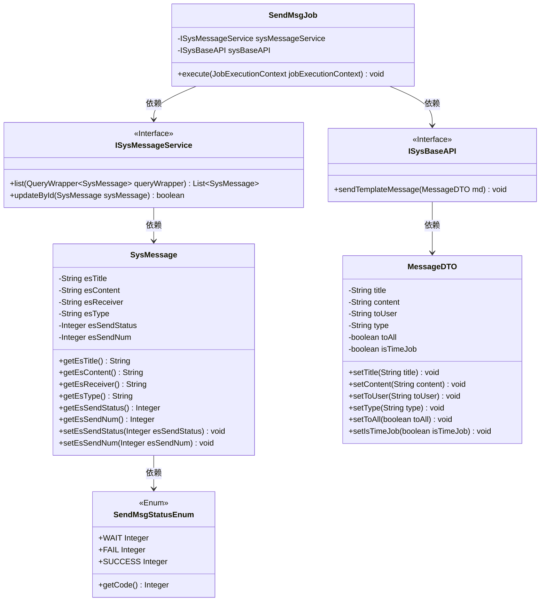
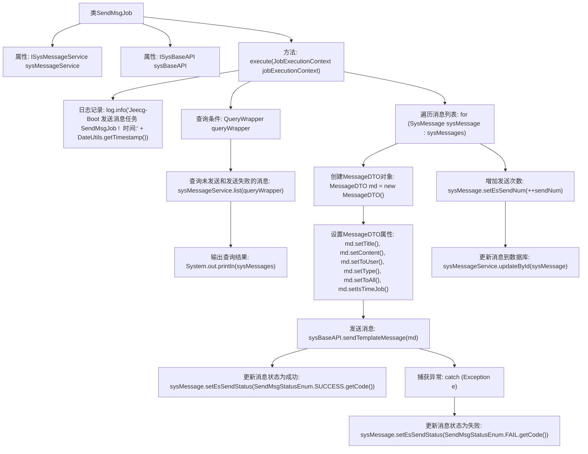

# 基础信息

|      |      |
|------|------|
| 名称 | SendMsgJob |
| 编码语言 | .java |
| 代码路径 | JeecgBoot/jeecg-boot/jeecg-module-system/jeecg-system-biz/src/main/java/org/jeecg/modules/message/job/SendMsgJob.java |
| 包名 | org.jeecg.modules.message.job |
| 依赖项 | ['com.baomidou.mybatisplus.core.conditions.query.QueryWrapper', 'lombok.extern.slf4j.Slf4j', 'org.jeecg.common.api.dto.message.MessageDTO', 'org.jeecg.common.system.api.ISysBaseAPI', 'org.jeecg.common.util.DateUtils', 'org.jeecg.modules.message.entity.SysMessage', 'org.jeecg.modules.message.handle.enums.SendMsgStatusEnum', 'org.jeecg.modules.message.service.ISysMessageService', 'org.quartz.Job', 'org.quartz.JobExecutionContext', 'org.quartz.JobExecutionException', 'org.springframework.beans.factory.annotation.Autowired', 'java.util.List'] |
| 概述说明 | SendMsgJob类负责处理未发送或失败的消息，调用sysBaseAPI发送模板消息并更新状态。 |

# 说明

SendMsgJob类负责处理未发送或发送失败的消息。它通过调用sysBaseAPI接口来发送模板消息，并在发送完成后更新消息的发送状态，确保消息的发送过程得到有效管理和跟踪。

# 类列表 Class Summary

| 名称   | 类型  | 说明 |
|-------|------|-------------|
| SendMsgJob | class | SendMsgJob类处理未发送或失败的消息，调用sysBaseAPI发送模板消息，并更新发送状态。 |

## 类 SendMsgJob

|      |      |
|------|------|
| 访问范围 | @Slf4j;public |
| 类型 | class |
| 名称 | SendMsgJob |
| 说明 | SendMsgJob类处理未发送或失败的消息，调用sysBaseAPI发送模板消息，并更新发送状态。 |

### UML类图

**描述：**  
`SendMsgJob`类是一个定时任务类，负责处理消息发送任务。它依赖于`ISysMessageService`接口来查询和更新消息状态，并依赖于`ISysBaseAPI`接口来发送消息。`SysMessage`类表示消息实体，包含消息的标题、内容、接收者等信息。`MessageDTO`类是消息数据传输对象，用于封装发送消息所需的数据。`SendMsgStatusEnum`枚举类定义了消息发送的状态。整体流程包括查询未发送的消息、发送消息并更新消息状态。

### 内部方法调用关系图

这段代码定义了一个`SendMsgJob`类，用于处理消息发送任务。代码首先记录日志，然后查询未发送或发送失败的消息，遍历这些消息并尝试发送。发送成功后，更新消息状态为成功，并增加发送次数；如果发送失败，则更新消息状态为失败。最后，将发送结果回写到数据库。

### 字段列表 Field List

| 名称  | 类型  | 说明 |
|-------|-------|------|
| sysMessageService | ISysMessageService | 自动注入系统消息服务实例。 |
| sysBaseAPI | ISysBaseAPI | 自动注入系统基础API接口实例。 |

### 方法列表 Method List

| 名称  | 类型  | 说明 |
|-------|-------|------|
| execute | void | Jeecg-Boot发送消息任务，查询未发送和失败消息，根据类型发送并更新状态。 |

