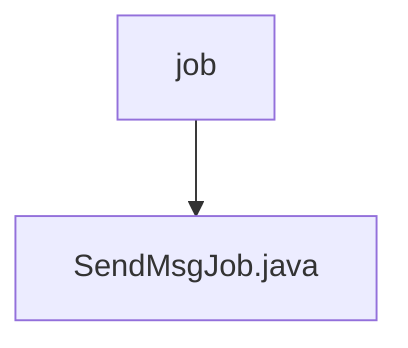

# 基础信息

|      |      |
|------|------|
| 名称 | job |
| 编码语言 | .java |
| 代码路径 | JeecgBoot/jeecg-boot/jeecg-module-system/jeecg-system-biz/src/main/java/org/jeecg/modules/message/job |
| 包名 | JeecgBoot.jeecg-boot.jeecg-module-system.jeecg-system-biz.src.main.java.org.jeecg.modules.message.job |
| 概述说明 | SendMsgJob类负责处理未发送或失败的消息，调用sysBaseAPI发送模板消息并更新状态。 |

# 说明

SendMsgJob类负责处理未发送或发送失败的消息。它通过调用sysBaseAPI接口来发送模板消息，并在发送完成后更新消息的发送状态，确保消息的发送过程得到有效管理和跟踪。

### 包内部结构视图

该流程图展示了路径层级关系，其中`job`为父节点，`SendMsgJob.java`为其子节点。路径结构清晰，反映了文件在项目中的位置和层级关系。

# 文件列表 File List

| 名称   | 类型  | 说明 |
|-------|------|-------------|
| [SendMsgJob.java](SendMsgJob.md) | file | SendMsgJob类负责处理未发送或失败的消息，调用sysBaseAPI发送模板消息并更新状态。 |

